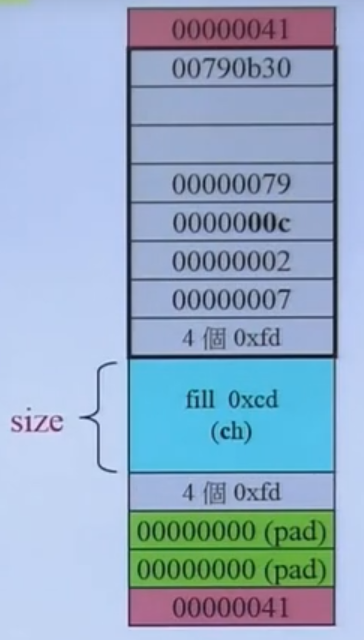

# 基础

+ 语句statement，分号semicolon、函数function（函数名、函数体、必须包含main）、花括号curly brace，类型type（数据和操作），编译compiling和执行executing，声明declare

+ 标准I/O库`iostream`：定义了四种对象，输入流：`cin`，输出流：`cout，cerr，clog`。系统会关联四种对象和出现运行的窗口。
+ 指令`#include`和头文件必须出现在同一单行、函数外；
+ 输出操作符`<<`；输入：左边操作数-输出流对象；右边操作数-需打印的值。返回左边操作数（输出流）。
+ 输入操作符`>>`：输入：左边操作数-输入流对象；右边操作数-从输入流里读取数据后存放的地方。返回左边操作数。
+ 当输入流作为条件时，相当于测试流的状态，如果没遇到错误，有效；当遇到文件尾（windows Ctrl+Z,linux Ctrl+D）或无效输入时，无效。
+ 调制器`endl`：结束当前行，并冲洗flush与设备相关的buffer，使程序的输出全部被写入到输出流中。
+ 名字空间`namespace`：可以避免我们定义的名字和其他库里的名字相同时导致的冲突。定义在标准库里的名字都在`std`名字空间下。
+ 范围操作符`::`：std::cout。从std空间使用cout：`using std::cout;`，头文件里不应使用using。
+ 注释：单行`//`，成对`/*  */`，不可嵌套
+ 文件重定向：文件作为输入 <infile；输出到文件 >outfile

# 变量

+ 对象的类型决定了对其可执行的操作，**C++在编译时会进行类型检查**，是一种静态语言，所以变量必须先声明后使用。**分开定义和声明，使得C++支持分开编译**，一个文件定义，多个文件声明。
  
  + **声明**declaration：确定类型和名字，使得程序知道这个变量，可以通过extern获得一个不是定义的声明。使用其他文件的变量需要声明该变量。
  + **定义**definition：一种声明，此外还**分配内存**、提供初值。只能一次。
  
+ 初始化：加`int a{10};`的初始化（list initialization）是更严格的初始化（如丢失信息的初始化会报错）。

+ 混合类型compound type：技巧从右往左读。

  + 指针pointer：解引用`*p`，p必须不为空指针nullptr。如果类型不知道，可以使用`void*`。
  + 引用lvalue reference（别名`int &b=a`，绑定后，不能再绑定其他变量，必须初始化），指针的别名`int *&a=p`。

+ 类型别名：`typedef 原类型 别名`；`using 别名 原类型`。 

  ```c
  typedef char *pstring;
  const pstring cstr = 0; //const修饰的pstring，cstr是一个指向char的常量指针
  ```

+ `auto`类型修饰符：让编译器从**变量的初始化**中推测变量的类型，使用auto必须初始化。`auto a = i`；`for(auto &c:s1)`遍历字符串是s1。

+ `decltype`获取变量类型。里面加括号`decltype((i))`，是一个**引用类型**。

+ 自定义类型，struct和class。

## 左值与右值

+ 左值：**占用了一定内存**，且拥有可辨认的地址的对象。可取地址，赋值。
+ 右值：左值以外的所有对象。**不能取地址**，赋值。比如立即数。
+ 左值引用：对左值的引用。加const可引用右值。可以绑定**临时常量**。
+ 右值引用：对右值的引用；**对象移动、完美转发**。**能够绑定到临时变量**。
  + 对象移动：目的是减少对象拷贝，为了能够调到移动构造函数，std::move。
  + 完美转发：

```c++
const int &r = 5;		//5是右值，r是左值引用，临时左值的引用。
*(v + 1) = 2;			//指针解引用可以把右值转化为左值
A a = A();				//临时右值对象，赋值给a,
Foo (Foo && other);		//移动构造函数，创建对右值的引用，调用结束后，右值引用销毁。
A&& a_ref4 = A();  		// Ok 右值引用，绑定临时对象。
```


## 柔性数组

长度为0的数组，用在结构体中，放在最后，不占用内存，可以动态地确定最后需要的数组长度，

```c++
struct buf{
    int length;
    char arr[0];
}
struct buf* p=(struct buf *)malloc(sizeof(buf)+LENGTH);
p->length=LENGTH;
free(p);				//只需释放一次，如果是指针，则需要释放两次。
```


# 操作符


# 函数

**使用前，必须先声明**

+ 参数个数可变：

```c++
void func(initializer_list<int> a);//传递`initializer_list<T>`类型的参数。
void func(int a,...)//省略符形参`...`。
```

- [x] lambda表达式：

```c++
[函数对象参数] (操作符重载函数参数) mutable 或 exception 声明 -> 返回值类型 {函数体};
[x,&y](){y=x;cout<<x<<y;}//x传值，y传引用
```

## 重载与重写

+ 重载：**函数名相同，函数的参数列表不同**。

- [ ] 操作符重载：不能重载的操作符：`::`、`.`、`.*`、`?:`。

+ 重写：类的继承中，子类重写父类的虚函数，函数名和参数列表一样。

# 修饰符

## const

**作用于类型**，确定其能否修改，如加变量加const修饰，使得**变量的值不能改变**，所以**必须初始化**。

+ ~~const变量的**生命周期限于单个文件内**，当要在多个文件使用时，且其初始化不是一个常数表达式时，可以使用`extern`关键字。~~

```c++
//file_1.h 声明这个变量在其他地方定义和初始化，必须使用extern，
extern const int bufferSize;
//file_1.cpp 包含file_1.h头文件，定义和初始化发生在该文件里，extern可写可不写，写了更便于阅读
extern const int bufferSize = func(); //
//使用文件file_2.cpp里包含file_1.h，这样就可以使用bufferSize；
```

+ 非const引用表明可以**通过引用修改绑定的变量**，所以不可以将**非const引用绑定到const变量**。必须使用**const引用绑定const变量**。

```c++
const int a = 100; //常量表达式
int &b = a; //error 非const引用绑定到const变量,必须使用一个reference to const
const int &b = a; //ok a reference to const 简称 const reference, 
//所有引用都不能指向其他对象，相当于一个int* const; const int &b 相当于 const int* const b; 
const int &c = 0.5; //ok const引用绑定所有const变量或const表达式，先是0.5变为临时int常量，c再绑定到该临时常量
```

+ 1）指针可以指向const或非const变量，表示**能否通过指针修改所指对象**；2）指针也可以为const或非const，表示**指针自己能否修改**。

```c++
const int* p; // 1） p指向常量变量, 不可以通过p修改指向的变量。指针to const，low-level const.
int* const p; // 2） 常量指针p，指针本身不能改变，只能指向初始化的对象。const指针，top-level const
```

+ 常量表达式，其值在编译时刻就可以知道。加了const且值编译时可知的变量或表达式，使用`constexpr`检查一个变量是否为常量表达式。当我们觉得一个表达式应该是常量表达式，就使用constexpr定义。

```c++
constexpr int size = 100; 
constexpr int *p = nullptr; //constexpr修饰的p，指针p是常量。
```

## static

延长生命周期，c++放弃了file static，即全局变量加static将变量仅限于该文件。

+ **作用域**scope：起始于名字的声明，结束由变量所在的块末端。
+ **生命周期**lifetime：程序执行过程中，对象存在的一段时间。

```c++
void add(){//函数外无法访问cnt
    static int cnt=0;//作用域开始；第一次初始化，生命周期开始；默认初始化为0；
    cnt++;
}//作用域结束；程序结束，生命周期结束。
```


# 类class 

struct默认为public，class默认为private。

```c++
class A{
public: //访问说明符，成员公开的，整个程序可调用
    A()=default;//要求编译器生成默认的构造函数
    A(int a, int b):data1(a),data2(b){}//初始化列表
    explicit A(int a):A(a, 0){}//委托构造,加explicit限制隐式调用构造，产生对象
    ~A(){}//默认的析构函数
private://只能通过成员函数或友元函数访问。封装
friend A add(const A&a,const A&b);//友元函数
    int data1, data2;
protected://只有自己和子类可以访问，
}
```

+ 成员函数被调用时，可以通过**隐式的参数this**获取调用该函数的对象。

+ const member function：**const放在函数参数列表后面**，修改的是隐藏的this指针，即不允许修改对象。
+ 可以基于const对函数进行重载。

## 构造和析构

+ 构造函数（初始化数据）、析构函数（销毁数据）、赋值操作和拷贝构造函数，如果不写，编译器都会产生默认的函数。
+ 尽量使用初始值列表，这样初始化的速度更快
+ 当有成员有指针或引用时，需要自己写赋值和拷贝构造，否则指针和引用会指向共用的地址。使得这块地址的操作不只限于自己。
+ 委托构造函数：使用已有的构造函数完成构造工作。
+ 给构造函数加`explicit`，**限制隐式调用构造**产生对象。

## 静态成员

+ 静态成员变量：**对象不包含静态成员变量**。需在类外定义该变量。
+ 静态成员函数：不**包含this指针**。可以使用对象调用静态函数，获取静态变量。

```c++
class A{
    static int get_id(){return id++;}//定义在类外，不需要static
    static int id; //如果不使用，则可以内部定义static constexpr int id = 30;
}
int A::id = 1;//定义并初始化静态成员；
```

+ 静态成员使用场景：可以为不完全类型。

```c++
class A{
    static A a; //不完全类型
}
```

## 继承

+ 防止继承的发生，在类名后面加`final`关键字。
+ 构造时：先调用父类的构造函数，再调用子类的构造函数。
+ 析构时：先调用子类的析构函数，在调用父类的析构函数。
+ 子类会继承所有父类的函数，成员变量等，**如果子类重载了父类的函数，则发生了覆盖(name hiding)，父类的函数同名的函数不存在，只存在子类重载的函数**。

```c++
class A{
    public:
    A(){cout<<"A"<<endl;}
    ~A(){cout<<"~A"<<endl;}
    void f1(){cout<<"A f1()"<<endl;}
};
class B:public A{
    public:
    B(){cout<<"B"<<endl;}
    ~B(){cout<<"~B"<<endl;}
    void f1(int x){cout<<"B f1()"<<endl;}	//A里的f1()函数name hiding,
};
B b; 		//输出：A,B====~B,~A;
b.f1()		//error，没有匹配函数
```

```c++
class A{};
class B:public A{};
class C:public A{};
class D:public B,public C{};
```

### 多态

+ 虚函数`virtual`。当类里有一个函数加了该关键字，该类就多一个**虚函数表指针**，指向需函数表。**虚函数表里的函数只包括虚函数**。
+ 如果虚函数函数体改为`=0`;则为**纯虚函数，类变为抽象类，抽象类无法实例化**，子类必须重写所有父类纯虚函数，才能实例化对象。
+ 虚函数表存放：

```c++
class A{
    public:
    //virtual void f0()=0;  					//纯虚函数
    virtual void f1(){cout<<"A:f1()"<<endl;}	//虚函数
    virtual ~A(){cout<<"~A"<<endl;}
};
class B:public A{
    public:
    virtual void f1(){cout<<"A:f1()"<<endl;}	//虚函数,关键字virtual可不加
    virtual ~B(){cout<<"~B"<<endl;}
};

typedef void (*VFPTR)();
void print(VFPTR* p){							//遍历虚函数表
    for(int i=0;p[i]!=nullptr;i++){
        printf("========%p========\n",p[i]);
        p[i]();
    }
}
```

菱形继承

## 运算符重载

仿函数，函数对象，

```c++
if(a<b) //优先级：成员函数的重载运算符>全局重载函数
//call A class <
if(less<pair<int,int>>()(x,y))//调用库内置的重载函数。
auto f=less<int>();
f(3,4);
if(x<y) //调用当前文件写的全局重载函数
//call pair<int,int> globle <
```

## 模板

+ 类模板、函数模板、成员模板、特化

```c++
//类模板,使用时需要提供T1和T2
template <typename T1, typename T2> // typename可为class
class A {
    T1 data1;T2 data2;
public:
    A(T1 d1, T2 d2) : data1(d1), data2(d2) {}
    //const必须要，因为调用者可能是const引用,会导致const&给非const&;无法匹配
    bool operator<(const A<T1, T2> &b) const { 
        cout << "A<T1,T2>" << endl;
        return data1 < b.data1;
    }
};
//全特化,（偏特化,只特化一部分参数）:实现特殊化的服务
template <> class A<double, double> {
    double data1;double data2;
public:
    A(double d1, double d2) : data1(d1), data2(d2) {}
    bool operator<(const A &b) const {
        cout << "A<double, double>" << endl;
        return data2 < b.data2;
    }
};
//函数模板；使用时会根据参数列表推到出T
template <class T> const T &mymin(const T &a, const T &b) {
    return a < b ? a : b; //使用类T重载的小于操作函数
}
```


# 智能指针

**内存泄漏**指由于疏忽或错误造成程序**未能释放已经不再使用的内存**。

**智能指针离开作用域，释放所指向的内容**。

+ **unique_ptr** ：通过**指针占有并管理另一对象**，并在 **`unique_ptr` 离开作用域时释放该对象**。
  + 智能指针用关联的删除器释放对象时机：1）智能指针销毁，2）发生了赋值。
  + `unique_ptr` 亦可以不占有对象，该情况下称它为*空 (empty)*。

```c++
template<class T,class Deleter = std::default_delete<T> > class unique_ptr;
std::unique_ptr<std::FILE, void (*)(std::FILE*) > fp(std::fopen("demo.txt", "r"), close_file); 	//设定删除器
std::unique_ptr<D, std::function<void(D*)>> p(new D, [](D* ptr){								//设定lambda删除器
	std::cout << "destroying from a custom deleter...\n";
    delete ptr;
});  // p 占有 D
```

+ **shared_ptr**：通过指针**保持对象共享所有权的智能指针**。多个 shared_ptr 对象可占有同一对象。下列情况之一出现时销毁对象并解分配其内存：
  + 最后剩下的占有对象的 shared_ptr 被销毁；
  + 最后剩下的占有对象的 shared_ptr 被通过 operator= 或 reset() 赋值为另一指针。


# 输入输出IO

+ IO类型的对象不可以赋值。iostream（基础）、fstream（文件）、sstream（字符串）；读写IO对象会修改对象，所以不能为const。
+ 可以通过stream的状态iostate获取当前状态。
+ output buffer管理：buffer刷新（程序结束、buffer满、使用endl或unitbuf、相关联的流发生读写）。程序crash，buffer不会刷新。
+ 文件流fstream：`fstream in(file),.open(),.close()`,对象销毁时自动调用close()。
+ 文件模式：in、out、app接着尾写、ate文件尾、trunc截断、binary二进制。

**重定向**，可以利用文件fstream类读入文件数据，然后使用`fstream>>i`读取数据。或者使用freopen("in","r",stdin)重定向标准输入流


# STL

相比于OOP面向对象编程，GP泛化编程：分离数据的存储（**容器**）和在数据上的操作（**算法**），通过**迭代器**进行沟通。


## 容器


```c++
class container{
public:
    using value_type      = typename _Container::value_type;
    using reference       = typename _Container::reference;
    using const_reference = typename _Container::const_reference;
    using size_type       = typename _Container::size_type;
    using container_type  = _Container;
}
```

## 分配器allocator

除了申请所需要的内存容量，malloc还会添加一些head，和用于对齐的内存。这样在释放内存时，不需要知道释放的大小。

+ new调用malloc，再调用构造函数。

+ delete最后调用free，delete在free之前调用析构函数，所以`delete`、 `delete[]`不同。

```c++
template<class _Ty>
class allocator{
publlic:
    pointer allocate(size_type _N, const void *);	//申请_N的内存，底层malloc
    void deallocate(void _FARQ *_P, size_type);		//从首地址_P释放size_type的内存。底层free
}
```




## 迭代器


## 顺序容器

### vector

```c++
template <class _Myvec> class _Vector_const_iterator : public _Iterator_base {};
template <class _Myvec> class _Vector_iterator : public _Vector_const_iterator<_Myvec> {};
template <class _Val_types> class _Vector_val : public _Container_base {};
template <class _Ty, class _Alloc = allocator<_Ty>>class vector{
private:
    template <class> friend class _Vb_val;
    friend _Tidy_guard<vector>;
};
```

### stack

```c++
//使用deque实现的，声明里默认容器的参数为deque
template <class _Ty, class _Container = deque<_Ty>> class stack; 
//定义，类里包括一个deque c私有成员变量。
template <class _Ty, class _Container> 
class stack {
public:
    //stack.top()返回的是引用或const引用
    _NODISCARD reference top() noexcept(noexcept(c.back())) { return c.back();}
    _NODISCARD const_reference top() const noexcept(noexcept(c.back())) { return c.back();}
protected:
    _Container c{};
};
```

### queue

```c++
//使用decltype 将lambda 和 proority_queue结合
auto cmp = [](int left, int right) { return (left ^ 1) < (right ^ 1); };
std::priority_queue<int, std::vector<int>, decltype(cmp)> q3(cmp);
//如果返回true，第一个参数come before第二个参数，
```


## 关联容器

元素通过关键字进行存储和检索，支持高效地查找。

### map

```c++
template <class _Kty, class _Ty, class _Pr = less<_Kty>, class _Alloc = allocator<pair<const _Kty, _Ty>>>
class map : public _Tree<_Tmap_traits<_Kty, _Ty, _Pr, _Alloc, false>> {...};
```


# 常见宏

+ 生成dll文件`__declspec(dllexport)`：导出函数的头文件里，其他文件导入该dll`__declspec(dllimport)`：在准备使用导出的dll时需要的。
+ 调用协议常用场合：
  + `__stdcall`：Windows API默认的函数调用协议。
  + `__cdecl`：C/C++默认的函数调用协议。
  + `__fastcall`：适用于对性能要求较高的场合。

+ 编译器区分：
  + `_MSC_VER`：微软的编译器，`__GNUC__`：gcc编译器，`__BORLANDC__`：Turbo C
+ 其他：

|      宏       |   说明   |
| :-----------: | :------: |
| DECLTYPE(exp) | 推断类型 |
|               |          |
|               |          |

# 预处理

在c++项目中编译c代码

```c++
#ifdef __cplusplus
extern "C"{
#endif
//c代码 以c进行编译
#ifdef __cplusplus
}
#endif
```


