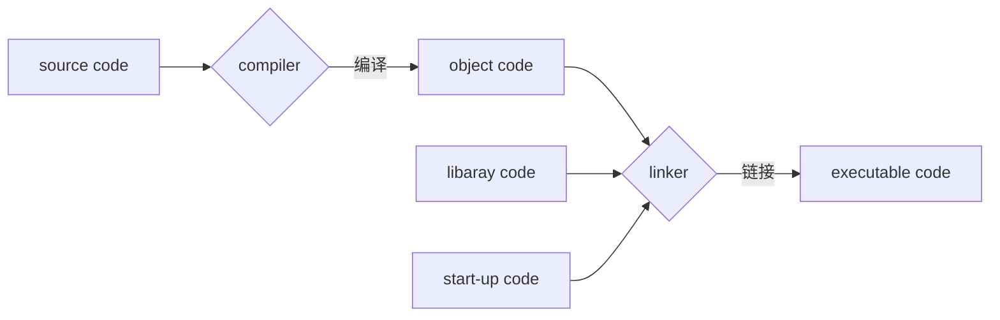

## 基础

### 编译过程



+ 编写好源代码文件，使用编译器进行编译，得到目标文件（如写的当个文件得到的可执行文件），用链接器将目标文件和其他必要文件（如启动模块、用到的库等）链接起来，共同构成一个可执行文件。有的系统将两者合并为一个。

+ 编译预处理指令preprocessor directive，编译器在编译之前做的工作，如#include将所包含的头文件内容拷贝到引用文件里。
+ 头文件，通常头文件包含编译所需所有信息（如函数），通常函数的实现在编译好的库文件里。
+ 声明declaration（变量使用之前必须声明）、标识符identifier、赋值assignment、语句statement、实参actual argument（传入的变量）、形参formal argument（函数里使用的变量）、转义字符escape sequence。

### 数据类型

8bit=1byte、计算机位宽 64-bit words

|    type     | sizeof() |         max（位数）          |          format           |
| :---------: | :------: | :--------------------------: | :-----------------------: |
|    char     |    1     |           127（3）           |     %c、%s（字符串）      |
|    short    |    2     |          32767（5）          |            %hd            |
| int（long） |    4     |       2147483647（10）       | %d（%ld）、%i、%p（指针） |
|  unsigned   |    4     |       4294967295（10）       |            %u             |
|  long long  |    8     |  9223372036854775807（19）   |           %lld            |
|    float    |    4     | 3.402823e+038、1.175494e-038 |     %f（%e、%a、%g）      |
|   double    |    8     | 1.797693e+308、2.225074e-308 |            %f             |

注：unsigned可与其他整型类型组合，如unsigned long；除了int类型，其他整型类型int可以省略；有的系统中int和long是不一样的。

#### 整形

|   十进制   |             十六进制              |              八进制              |
| :--------: | :-------------------------------: | :------------------------------: |
| %d （100） | 表示前缀0x（0x64），输出格式%[#]x | 表示前缀0（0144），输出格式%[#]o |

注：[#]表示输出是添加前缀0x或0；

+ 常量整型的类型为其存储需要的最小类型，int->unsigned->long->unsigned long->……；如果需要强制用long存储小的数，可假`l或L`后缀，其他类型类似，如`ULL`。
+ short、long、long long可以和int、unsigned组合成各种类型的格式，如unsigned long long（%llu）;这些都可以和十六进制或八进制组合，如%lx，表示长整型的十六进制。
+ _Bool类型实际上是一种整型，0-false，1-true；但其只需要1bit的内存。
+ 由于相同的整型名字在不同系统上有差异，因此提供可移植的类型，如`stdint.h`里的`int32_t`；`inttypes.h`则为一些整型格式定义了一些宏。
+ `limits.h`定义了各种整型类型的大小范围的宏；

#### 字符

+ 双引号`“”`表示字符串，单引号`‘’`表示字符；转义字符八进制数`\0dd`、十六进制数`\xdd`，d为对应进制可能的数字。转义字符加`\`；输出%为`%%`；
+ 字符串结尾有零字符`\0`，所以真实长度=字符串的长度+1；
+ `strlen`统计字符串的长度，`sizeof`统计变量所占的内存byte数；
+ 读取输入的所有可能字符：char c=getchar()；打印单个字符putchar(c)；
+ `ctype.h`提供一些对字符的一些操作函数。

#### 浮点型

+ 指数表示法：3.1415E10；E可为小写e，输出指数格式：`%e`；`%a`为以2指数表示的格式：`0xa.1fp10`；浮点类型除了float和double，还有long double。
+ `float.h`定义了浮点型大小范围的一些宏，如FLT_MIN、FLT_MANT_DIG（小数部分，尾数）、FLT_DIG（最小有效小数位数）。double对应的宏为DBL，long double为LDBL。

### 操作符

|             赋值、=             |             从右往左，修改左值为右值，a=b=c=10;              |
| :-----------------------------: | :----------------------------------------------------------: |
| 算术运算符+、-、*、/、++、--、% |  （符号运算+、-，++、--；从右往左）可与赋值符结合 ，如a+=b;  |
|     求bytes运算sizeof，`，`     |                 sizeof(type)，`,`从左往右，                  |
|    循环for、while、do while     | 控制语句if、else if、else、switch、case、default、continue、break、goto，条件运算?: |
|  关系表达式<、>、=、>=、<=、!=  |                 逻辑运算 ：与&&、或\|\|、非!                 |
|   取地址&、间接操作*（指针）    |                                                              |
|             位运算              |           补码~、与&、或\|、异或^；左移<<、右移>>            |

注：i++，先赋值，后自增；++i，先自增，再赋值。关系运算符的优先级低于算术运算符；其他优先级为从左往右。

+ 表达式中和函数参数中，char、short自动转为int ,float转为double；表达式中有各种级别的变量时，低级自动转为更高级的；赋值或输出时为给定的类型。还可以在变量前加(type)进行强制转换。
+ 位域bit fields：在一个int整型数据设置的相连位组成的集合。

### 函数

+ 函数**原型**声明函数的名字、返回类型、参数列表（形参）；使用时传入的参数为实参。
+ 确保不传递参数时，参数列表里可加void，进行检查。
+ **函数使用前必须声明**，没有声明，编译会猜，所以只报warning；链接器会查找其实现，如果找不到会报error。

### 数组和指针

+ 数组相当于一个指针，其地址为第一个元素的地址。下标从0开始，声明`int a[10]`，初始化`{1,2}`；多维数组`int a[10][10]`。
  + a表示二维数组的首地址，a[0]为一个长度为10的int数组，a[0]为其首地址，所以a=a[0]==&a\[0][0]。a指向的是10个int大小的对象，a+1会跳过10个int大小的内存；a[0]指向的是int类型对象a[0]+1仅跳过一个int大小的内存。
  + 二维数组`a[][]`相当于数组指针`int (*p)[10]`；二维指针`int **p`相当于指针数组。a++只能用于指针，不能用于数组。
  + 长度可变的数组，定义在一个函数中，前面不加static或extern，只能声明，不能声明时赋值；
  + 与向函数传递常量类似，可以利用Compound Literals向函数传递数组，如(int [2]){10,20}

```c
int a[3][10];  
//[]的优先级高于*。
int *p[10]   /*指针数组，10个int指针构成的数组*/  p[1]=a[1];  //p++指向a[1][1]
int (*p)[10] /*数组指针，指向数组长度为10的指针*/  p=a;p++; //p++指向a[1],p++跨过长度为10的数组。
int globle;//函数外的变量
int arr[globle]; //函数外的数组，error: variably modified 'arr' at file scope
void f(){
    int arr[globle]; //编译通过。
}
```

+ 指针加一，指针会加一个**存储单元**storage unit的byte数，声明指针时，需要指明其类型。
+ **指针使用前必须初始化**，因为指针是对指向的内存进行操作，如果没有指向某个空间，则操作肯定无法实现。
### 指针+const

  + 指针是const（**const在*后面**），int * const p；指针不改变，不能指向其他变量。
  + 所指是const（**const在*前面**），const int*  p；不能通过p修改其所指向变量的值，变量自身和指针都可以变。
  + 指针没加const，则表示可以通过指针修改变量，所以**const变量的地址不应该赋值给非const指针**。
  + const指针可以赋值给非const指针，但是这样是不安全的，因为可以使用新指针修改const值。
  + 将非const指针赋予const指针，在一维指针上是安全的，但在二维上可能变得不安全，

```c
int* const p = &i;                 const int *q = &j;
p++;     /*Error*/                 *q = 10;  //Error
*p = 10; /*OK*/                    q++;j=10; //OK
const int a; int *p=&a; //warning: assignment discards 'const' qualifier from pointer target typ，C++会报错。
const int **pp2;
int *p1;
const int n = 13;
pp2 = &p1; // allowed, but const qualifier disregarded
*pp2 = &n; // valid, both const, but sets p1 to point at n
*p1 = 10; // valid, but tries to change const n
```

+ 指针也可以指向函数。`type (* func)(argument)`。

### 字符串

+ 代码里的字符串存储在静态存储类中。`char *p=“hello”`；p指向"hello"的地址。`char a[]="hello"`；则将字符串拷贝到数组arr里。如果允许p修改字符串，则其他使用该字符串的地方的值也会被改变，所以*p应该为const。
+ `gets(str)`读取整行，丢掉换行符，gets不会检查输入行是否匹配提供的内存大小，不安全；`puts(str)`输出字符串，并自动换行。
+ `fgets(str,len,stdin)`通过第二个参数进行检查，读入换行符；`fputs(str,stdin)`不会自动换行。
+ `gets_s(str,len)`从标准输入读入，不存储换行符。
+ `sprintf(str,"a=%d",a)`将格式化字符输出到str。
+ `string.h`提供了一些字符串处理函数。strlen、strcat、strncat、strcmp、strncmp、strcpy、strncpy、strchr等

### 内存管理

C为数据存储提供了多种存储方式storage class，在storage duration（生存周期）通过标识符来获取对象，通过scope和linkage确定哪些程序部分可以利用它（可见性）。

+ **作用域scope**，描述了一个可以获取标识符的程序范围。可分为block（函数内）、function（goto 标签）、function prototype（函数参数）和file（全局变量，函数外）4种作用域。编译器将多文件程序里每个文件（头文件和实现文件）视为translation unit，则多个文件可视为由多个翻译单元组成的单个文件。
+ **关联linkage**，前三种作用域的变量没有关联，文件域的变量可有外部关联（其他文件也可访问）或内部关联（使用static）。
+ **生存周期storage duration**，可分为四种：
  + static storage duration：存在于整个程序运行期间，包括全局变量、static修饰的局部变量（在局部域里或通过指针进行访问）。编译的时候确定。
  + thread storage duration：存在于单个线程运行期间。如_Thread_local修饰的变量。
  + automatic storage duration（栈）：其他scope内的变量一般为自动分配内存。
  + allocated storage duration（堆）：内存分配，运行时分配。
    + `malloc(size)`申请size个byte大小的内存、`calloc(num,sizeof())`申请内存并初始化0，`free()`释放内存。
  
#### 存储类型Storage Classes

  + `register`变量存储在cpu的寄存器里，变量前加register关键字，不一定成功。
  + static with external linkage：全局变量定义在一个文件，另一个文件使用，需要在要使用的文件里用extern表明是外部变量。在函数内使用`extern`，会被忽略，因为全局变量本来就是整个文件可见的，所以无需声明，直接使用即可，但可读性好，类似的强调使用局部变量，可加`auto`。全局变量被自动初始化为0，如果初始化，只能**用常量表达式进行初始化**。
    + 声明Declarations：只声明了一个对象。
    + 定义Defination：声明了对象，分配了空间，并进行了初始化。
    + 定义声明defining declaration：即声明，分配了空间，可以进行初始化。
    + 引用声明referencing declaration：只声明，没有分配空间，其定义在之前已经做好了，如extern修饰的变量，不可以进行初始化。
  + static with internal linkage ：加`static`修饰的全局变量，表示变量只能在该文件范围内使用，函数也可以加static表示内部函数。

|        Storage Class         | Duration  | Scope | Linkage  |                   How Declared                   |
| :--------------------------: | :-------: | :---: | :------: | :----------------------------------------------: |
|          automatic           | Automatic | Block |   None   |                    In a block                    |
|           register           | Automatic | Block |   None   |       In a block with the keyword register       |
| static with external linkage |  Static   | File  | External |             Outside of all functions             |
| static with internal linkage |  Static   | File  | internal | Outside of all functions with the keyword static |
|    static with no linkage    |  Static   | Block | External |        In a block with the keyword static        |

### 多文件

+ `#include`：将文件的全部文本内容插入到#include所在位置。

+ 双引号`""`：当前目录->编译器指定目录；尖括号`<>`：编译器指定目录。

+ 编译多个文件：

  | file1.c                                   | file2.c                                                      |
  | :---------------------------------------- | :----------------------------------------------------------- |
  | int main() {<br>func();<br>return 0;<br>} | #include<stdio.h><br>void func() {<br>printf("file1.c func\n");<br>} |

  > 1. `gcc file1.c file2.c`，warning: implicit declaration of function ‘func’；去掉warning需要在file1.c里声明要使用的函数，即加一条void func();，为了减少每次使用都要加声明，可使用第二种方法。
  >
  > 2. 在file1.c里加入#include"file2.c"；因为编译预处理#include会将file2.c里的内容拷贝到file1.c里；如果还是用第一条语句则会报错：multiple definition of func；只编译file1.c即可，即`gcc file1.c`。
  > 3. 还可以在file2.h里声明void func();函数，在file2.c里实现func()函数的功能。在要使用func的文件和实现func的文件里都引用file2.h，在使用的文件引用头文件，**使得编译器能够检查调用方式是否正确（如参数）**；在实现的文件引用头文件，**使编译器检查对外提供的函数声明是否和其定义一致**。
  >
  > 第三中情况的的指令为：`gcc file1.c `；会报undefined reference to ’func‘；使用`-c`表示只编译，没问题；这是因为链接器未找到func的实现。所以我们需要使用`gcc file1.c file2.c`。


### 输入输出

+ `printf`输出格式控制、%与转换符间；printf返回成功打印的字符个数

|    flag    |              -（靠左）、+、#、0(填充0)、space               |
| :--------: | :---------------------------------------------------------: |
| digit（*） | 数字，控制最小位宽，可以用`*`来接受一个变量（"`%*d`",5,30） |
|   .digit   |    小数点+数字，%f控制小数位数、%g有效位数、%s字符串位数    |
|     z      |                      表示一个size_t值                       |

+ `scanf`通过whitespace（空格、换行、tab）将字符串分为不同的段；即其会跳过这些空白符。返回其成功读入的字符数，如果读入的不符合要求，则不会读入，返回0；

|   *   | 跳过对应的输入（%*d，跳过一个整数） |
| :---: | :---------------------------------: |
| digit |           读取的最大位宽            |

+ 输入可分为立即unbuffer输入和buffer输入。
  + 区别为是否经过buffer。对于buffer输入，在输入Enter时，程序才可接受到输入。unbuffered应用场景为游戏按键输入等。需要立即读入。
  + buffered的输入可分为full buffered和line-buffered的输入，full buffered应用的场景是文件输入，命令输入则是line-buffered。
  + `conio.h`提供了unbuffered输入的一些函数，如echoed（在屏幕上显示）的输入getche()；unechoed输入getch()；
+ 各操作系统对文件的处理方式不同，但我们可以利用C的标准I/O库屏蔽掉这些差异。
  + C将输入输出映射为流stream，通过处理流来操作文件（包括I/O设备），打开文件的操作将文件与一个流相关联。
  + 用Ctrl+Z表示文件的结束。或者用数字表明文件大小，这样输入知道何时文件结束；对于标准输入，用EOF（-1）来表示文件结束。对于命令行，Unix用Ctrl+D表示EOF，或者用Ctrl+Z表示，实际中可能会使整个程序结束。
+ 重定向；1.命令行重定向，`test.exe <in.txt >out.txt`；

### 文件处理

+ c语言可以通过两种方式来处理文件：文本文件（使用二进制表示文本）、二进制文件（使用二进制表示机器语言或数据）。

  >+ c自动打开三个文件，标准输入stdin（输入设备），标准输出stdout和标准错误输出（输出设备）；
  >+ 文件打开`fp=fopen("file","r")`，模式`r只读,w重写,a接着写,b二进制`；`fclose(fp)`文件关闭。
  >+ 对文本文件的读写：`getc(fp)`读取、`fputc(c,pt)`写入。类似操作标准I/O的函数，在对文件的操作函数都能找到对应的，如`fprintf()`、`fscanf()`、`fgets()`、`fputs()`，相比多一个文件指针参数。
  >+ 对文本文件的查找：`fseek(fp,offset,mode)`，mode可以为文件开始SEEK_SET、当前位置SEEK_CUR、文件末尾SEEK_END。`ftell(fp)`告诉当前文件指针的位置，距文件头的byte数。替代函数`fgetpos(fp,&pos)`和`fsetpos(fp,pos)`；
  >+ `ungetc(c,fp)`向文件里回写一个字符。
  >+ 对于二进制文件的读写：`fwrite(buffer,size,num,fp)`从buffer中写num个size大小的对象到fp，`fread()`；

### 结构体

+ 结构体声明`struct name {data};`；定义`struct name var`。初始化`struct name var={value}`；获取成员`变量.或指针->`。
+ 联合union，在一个内存中存储混合类型。即变量可以为多个类型。一次只能为一个类型。
+ 枚举：enum，第一个默认为0，

### 预处理

+ 翻译程序的第一步工作：处理源文件里的字符，如转义字符、删除反斜杠`\`，合并成一行、注释。

+ 显示常量：`#define macro  body`：用macro来表示body，程序中使用了macro的地方，会用body来替换。macro不可重定义。 body是由token（由空格分开的words）组成的串，所以`2*3`（1个）和`2 * 3`（3个）是不同的。

  + 可以定义常量，也可以定义函数。

    ```c
    #define f(x) (x*x)    //原封不动的复制到使用宏的地方，避免宏替换后，运算顺序发生变化，不要将复杂的表达式弄到宏里，这样复杂表达式会执行多次，如函数，f(g(x))
    ```

  + `#`将token变为字符串。如`#define PSQR(x) printf("The square of " #x " is %d.\n",((x)*(x)))`。

  + `##`将两个token结合起来，如`#define XNAME(n) x ## n`。

  + 参数可变的宏：`#define PR(...) printf(__VA_ARGS__)`。

+ 文件包含：`#include`：头文件里包括常量、宏函数、函数声明、结构定义、类型定义。

+ 其他指令：`#undef`取消之前定义的宏，`#if、#else、#elif、#ifdef、#ifndef、#endif`条件编译，`#line`重定义line和文件（即修改预定义的LINE和FILE），`#error`发布一条error信息，`#pragma`向编译器发指令（_Pragma预处理操作符）。

+ 预先定义的宏：`__func__`是预定义的标识符。生命周期为函数范围内，

  | \__DATA__ | 预处理日期 |     \__FILE__     |      源文件名      |
  | :-------: | :--------: | :---------------: | :----------------: |
  | \__LINE__ | 源文件行数 |     \__STDC__     | 设为1表示符合C标准 |
  | \__TIME__ |    时间    | \__STDC_VERSION__ |       C标准        |

+ 泛型编程`_Generic`，如`_Generic(x, int: 0, float: 1, double: 2, default: 3)`。根据类型来选择操作。

+ `inline`函数：必须在一个文件里，一般在声明原型时就定义好，放在文件前面。

+ _Noreturn函数：`exit()`；断言assert：assert.h，不满足条件，触发断言；`stdarg.h`多参数传递`func(int a,...)`；

### 


