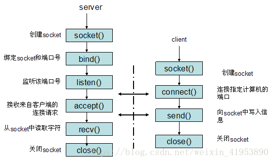

# 1. 基础

## 文件权限

```bash
lrwxrwxrwx.   1 root root    7 May 10  2019 lib -> usr/lib
#文件类型+权限 硬链接数 文件所属用户 所属组 文件大小 修改时间 文件名
# 三个组的权限可用三位的八进制数表示，如示例可表示为777
```

> **r读，w写，x执行**，d目录，l链接文件，->链接，-表示没有该权限，分为**三组**，分别说明文件的 **所属用户，所属组用户，其他用户** 可以对文件的操作权限，示例表示：文件为目录，所属用户权限：rwx，所属组：r-x（不可写），其他用户：r-x（不可写）

# 2. vim

vim 键盘图[(来源菜鸟教程)](https://www.runoob.com/linux/linux-vim.html)：


配置：set xxx = xxx，获取 set xxx ?

>分为三种模式，分别是 `视图模式`、`(底线)命令模式` 和 `输入模式` 
>
>+ 启动 vi/vim，便进入了<font color=red>视图模式</font>
>+ 按 <kbd>i</kbd>、<kbd>a</kbd>、<kbd>o</kbd>切换到<font color=red>输入模式</font>；按 <kbd>ESC</kbd> 回到视图模式 
>+ 在视图描述下按 <kbd>:</kbd> 切换到<font color=red>命令模式</font>，可以输入更多命令

## 视图模式

> ---
>
> + 移动光标：<kbd>h</kbd>左，<kbd>j</kbd>下，<kbd>k</kbd>上，<kbd>l</kbd>右；如图所示，gg文件头，G文件尾
> + 剪切：<kbd>x</kbd>字符，<kbd>d</kbd>行，dw删除单词，d$删除行尾，
> + 复制：<kbd>y</kbd>光标所在的字符，yy负责当前行。
> + 粘贴：<kbd>p</kbd>后，<kbd>P</kbd>前
> + 撤销：<kbd>u</kbd>，回退<kbd>Ctrl</kbd>+<kbd>r</kbd>。U撤销一行中所有操作
> + 格式化：<kbd>=</kbd>，缩进：<kbd><</kbd>，<kbd>></kbd>。
> + 光标停留在函数上，按<kbd>Shift</kbd>+<kbd>k</kbd>查看函数man手册

## 命令模式 

> ---
>
> + ` q ` 退出，` w ` 保存
> + `:set number`设置行号
> + `/`向后查找，`?`向前查找，查找停留在光标上单词<kbd>shift</kbd>+<kbd>*</kbd>，<kbd>n</kbd>下一个、<kbd>N</kbd>上一个
> + 分屏：`vs`竖屏，`sp`横屏，切换<kbd>Ctrl</kbd>+<kbd>w</kbd>，再按`hjkl`进行切换。

# 3. 命令

命令帮助手册：man

输出重定向 `>`、追加`>>`，管道`|`，前者的输出作为后者的输入

## 基本

|    命令    |            功能            |
| :--------: | :------------------------: |
| time、date | 统计命令执行时间，当前时间 |
|            |                            |
|            |                            |


## 用户管理

|        命令        |                        功能                        |
| :----------------: | :------------------------------------------------: |
|   whoami、who、w   |              当前用户、用户登录信息等              |
|      su、exit      |    swith user；用于变更为其他使用者的身份、退出    |
|        sudo        |          以root用户执行操作，然后退出root          |
| groupadd、groupdel |                     添加删除组                     |
|      usermod       |                 modify修改用户账户                 |
|  useradd、userdel  |                    添加删除用户                    |
|       passwd       |                      修改密码                      |
|       chmod        |                    修改文件权限                    |
|       chown        | change owner；用于设置**文件所有者**和文件关联组。 |
|       chgrp        |                  修改文件所属的组                  |

## 软件管理

|          命令          |                     功能                     |
| :--------------------: | :------------------------------------------: |
|          rpm           |     redhat package manager；用于管理套件     |
|       systemctl        |       查看、关闭、开启、设置自启动服务       |
|        ps、top         | process status；命令用于显示当前进程的状态， |
|          kill          |                   终止进程                   |
|        jobs、fg        |                   后台程序                   |
| reboot、shutdown、init |           系统重启、关机、界面切换           |
|         strace         |              跟踪查询的系统调用              |

## 文件管理

+ /dev/zero 该设备可以无穷尽地提供空字符。

+ /dev/null  可以向它输入任何数据，但数据不会保存。

|     命令      |                         功能                         |
| :-----------: | :--------------------------------------------------: |
|      pwd      |     print work directory；命令用于显示工作目录。     |
| cp、mv、mkdir |     复制文件、移动文件（修改文件名）、创建文件夹     |
|     file      |                     显示文件类型                     |
|      tar      |            打包（压缩-z）多个文件，解包-x            |
|     gzip      |                    压缩和解压缩-d                    |
|      wc       |                 统计文件字符数等信息                 |
|      dd       |        使用指定的块，复制和convert出一个文件         |
|     find      | 查找、find [目录] -name "pattern"， name、size、type |
|     grep      |            检索、grep -r "pattern" [目录]            |
|               |                                                      |


## 网络

|   命令    |                   功能                   |
| :-------: | :--------------------------------------: |
| ifconfig  |  网络信息configure a network interface   |
| firewalld |                  防火墙                  |
|   wget    |           从指定url下载东西，            |
|    nc     | netcat ,测试 linux 的 tcp 和 udp 端口 nc |
|  netstat  |    网络状态，netstat -apn \|grep port    |

### 防火墙

```shell
systemctl status firewalld
firewall-cmd --list-ports
firewall-cmd --permanent --zone=public --add-port=8080/tcp 
firewall-cmd --permanent --zone=public --remove-port=8080/tcp 
```


### ftp

```shell
# 文件传输协议，默认协议21/tcp，配置文件：/etc/vsftpd/vsftpd.conf，
`安装服务后，如果连接不上，检查防火墙firewall`
ftp host		`连接主机
help			`查看帮助
!dir[ldir]		`本地文件夹内容
lcd				`本地进入
```


## 字符串

| 命令 |                  功能                  |
| :--: | :------------------------------------: |
| echo |           用于字符串的输出。           |
| grep | 正则表达式；查找文件里符合条件的字符串 |
|      |                                        |


# 4. shell

```shell
`声明解析器，#！ 约定标记,
#! /bin/bash
# ./test.sh如果无法执行，添加执行权限 chmod +x ./test.h，linux默认会在PATH中查找可执行程序，需要添加当前路径 ./

`变量，变量名=
var="test"
`提取变量、局部变量、环境变量、shell变量
echo $var 		# 可选${var}， echo打印输出
readonly var 	# 修改变量属性
`字符串 单引号（里面的变量无效、里面不能用单引号） 或 双引号
echo ${#str}	# 获取长度
`数组、
arr=(val1...)
x=arr[n]		# 取数组数组
@ 当前所有

#循环控制
for f in *
do 
...
done
```

# 5. gdb调试

在编译时要加上`-g`选项，生成的目标文件才能用gdb进行调试；其作用为，**在目标文件中加入源代码的信息**。在调试时目标文件必须**保证gdb也能找到源文件**。

- [x] 直接回车，相当于重复上一个命令。
- [x] 观察点是当程序**访问某一存储单元**时中断，

```shell
gcc -g main.c -o main
gdb main #调试
# 命令包括
help			# 帮助命令，如help list
# -----信息-----
list(l)			# 显示源文件对应的函数或行(10)，1个参数，开始行，两个参数【s,e】起始和终止，继续list输出后面的代码
backtrace(bt)	# 查看函数调用的栈帧，
info(i)			# 查看变量值，如locals,breakpoints,watchpoints,registers
disable、delete # 禁用、删除断点
frame(f)		# 跳到其他栈帧，查看信息
print(p)		# 打印变量的值
set 			# 设置某个变量的值，set var sum=0也可以使用print a=b 间接设置
display			# 显示某个值，使得每次停下来都显示该值。undisplay取消
x/7b input		# x打印命令、/7b 表示+7组，b表示字节；Examine memory: x/FMT ADDRESS.
# -----执行-----
quit(q)			# 退出gdb
start 			# 开始执行（默认在main函数设置了临时断点）
next(n)			# 逐条语句地执行，或者缩写n
step(s)			# 进入函数，逐行执行
finish			# 跳出当前函数
continue(c)		# 连续执行
run(r)			# 重新执行
si				# 逐条指令地执行
# -----断点-----breakpoint
break(b)		# 跳出循环，并执行到断点，如执行到9行，break 9 [if sum!=0]
# -----观察点-----Watchpoint
watch			# 检测内存 检测input的第5个元素，watch input[5]
# -----观察点-----汇编 
disassemble		  # 反汇编当前函数或者指定的函数,生成汇编代码

objdump -dS a.out  		`把C代码和汇编代码穿插起来显示 编译时需要加-g
```

# 6. MakeFile

管理和组织代码工程的编译和链接。[参考文章](https://seisman.github.io/how-to-write-makefile/overview.html)

规则包含两个部分，一个是**依赖关系**，一个是**生成目标的方法**。将文件中的第一个目标文件（target）作为最终的目标文件。

make执行时，会检查**目标文件** 与 **依赖** 最后修改时间的关系，来确定目标文件是否需要重新编译

```makefile
#targets : prerequisites ; command
#    command
#    ...
include file1.make
#**********************目标、依赖、规则********************************
foo.o: foo.c defs.h       # foo模块  依赖
    cc -c -g foo.c        # 规则

#**********************变量********************************
obj = a.o b.o c.o d.o
out.o: $(obj)
	gcc -o out.o $(obj)
	
#**********************模式匹配********************************
%.o:%.c
	gcc -c $< -o $@
# makefile中的自动变量，
# $< 第一个依赖 $^ 所有依赖
# $@ 目标

#**********************函数********************************
src=$(wildcard ./*.c) 					#查找当前目录下的所有.c文件
obj=$(patsubst ./%.c, ./%.o, $(src)) 	#替换 src变量中.c文件名 为.o文件名

#**********************伪标签********************************
.PHONY:clean							#伪标签，而不把clean当作目标文件
clean: 
    rm edit $(objects)
VPATH = src:../headers #冒号分割
```

**自动推导**，可以自动把.c文件加入到对应的.o文件的依赖中。且编译命令也可省略。

make命令会在当前目录下按顺序找寻文件名为“GNUmakefile”、“makefile”、“Makefile”的文件。指定需要加`-f`

**引用其它的Makefile**：`include <filename>`

文件搜索：默认会在当前目录下搜索文件，可以用使用VPATH进行扩展。


# 7. IO

每个进程在Linux内核中都有一个`task_struct`结构体来维护进程相关的信息，称为进程控制块  ， `task_struct`中有一个指针指向`files_struct`结构体，称为**文件描述符表**，其中每个表项包含一个指向已打开的文件的指针，  

由open返回的文件描述符一定是**该进程尚未使用的最小描述符**。  

有缓冲的IO：C标准I/O库函数 ，printf  、scanf，读写位置记录在用户空间IO缓冲区中的位置。

无缓冲的IO：open、 read、 write、 close  。读写位置记录在内核，

```shell
`fgetc() 可能一次读取了1024个字节到IO缓冲区，所以内核中读写位置为1024，FILE中的为1
#从终端设备读，通常以行为单位，读到换行符就返回了。
#读常规文件是不会阻塞的，不管读多少字节， read一定会在有限的时间内返回。从终端设备或网络读则不一定，如果从终端输入的数据没有换行符，调用read读终端设备就会阻塞，
# 如果在open一个设备时指定了O_NONBLOCK标志， read/write就不会阻塞。
#ioctl用于向设备发控制和配置命令。
#mmap可以把磁盘文件的一部分直接映射到内存，这样文件中的位置直接就有对应的内存地址，对文件的读写可以直接用指针来做而不需要read/write函数。
```

## 文件操作

```c
/***********************文件描述符********************************************************/
int open(const char *pathname, int flags, mode_t mode);
/* 打开文件，
 * return: 成功：文件描述符，指向打开的文件 O_RDONLY O_WRONLY O_RDWR O_CREAT O_EXCL
           失败：-1
 * mode: 新文件被创建时的权限
 */

/***********************文件、目录读取********************************************************/
off_t lseek(int fd, off_t offset, int whence);
/* 将文件描述里的偏置（文件指针）移动到whence+offset  SEEK_SET\SEEK_CUR\SEEK_END
 * return: 距离文件头的偏置
 */
int access(const char *pathname, int mode);/*测试用户对文件的权限 R_OK, W_OK, X_OK, F_OK*/
int chmod(const char *path, mode_t mode);/* 改变文件的权限  chmod(argv[1], 0755);*/
int chown(const char *path, uid_t owner, gid_t group);/*改变文件所属者 chown(argv[1], 116, 125);*/
int link(const char *oldpath, const char *newpath);/* 创建文件连接（硬）*/
int symlink(const char *target, const char *linkpath);/* 创建符号*/
int unlink(const char *pathname);  /* 消除链接，作用：删除文件名 ，临时文件*/
int stat(const char *pathname, struct stat *statbuf);/* 文件信息*/
ssize_t readlink(const char *pathname, char *buf, size_t bufsiz);/* 读取软链接文件里的内容放到buf*/
int truncate(const char *path, off_t length);
/* 截断文件path,文件大于length,后面的丢失，小于则扩展\0.文件的offset不会改变*/
int rename(const char *oldpath, const char *newpath);/*重命名*/

int chdir(const char *path); /*改变目录*/
char *getcwd(char *buf, size_t size);/*当前程序的目录*/
int mkdir(const char *pathname, mode_t mode);/*创建目录*/
DIR *opendir(const char *name);/*打开目录*/
struct dirent *readdir(DIR *dirp);/*读目录*/

/***********************修改文件描述符和权限********************************************************/
int dup(int oldfd);
/* 创建一个新的文件描述符，指向oldfd，取最小未使用的描述符id
 * return: 成功，最小的文件描述符
           失败，-1
 */
int dup2(int oldfd, int newfd);
/* 将newfd的值复制给 oldfd的复制ret，所以ret指向oldfd指向的文件。newfd原指向的文件会关闭，newfd指向oldfd指向的文件。
 */

int fcntl(int fd, int cmd, ... /* arg */ );
/* 修改文件符的权限，在文件已经打开的情况下 F_GETFD 获取文件状态 F_SETFD
 */
int flags = fcntl(fd, F_GETFL, 0);
fcntl(fd, F_SETFL, flags | O_NONBLOCK);			//设置非阻塞文件描述符
```

# 8. 内存模型


## 库

### 静态库

库文件名都是以lib开头的，静态库以.a作为后缀，  如`libMytest.a`，与位置有关

```shell
#编译
gcc -c *.c -I /include				# -I 头文件目录 -c编译
#打包
ar rcs libX.a *.o					# 打包，c不显示warring，s创建索引，r替代或插入新文件 
#查看
nm libMyClc.a   					#列出文件里里符号
#使用
gcc main.c libX.a -I include/ 		#使用静态库，需要调用者、打包的库、头文件 
gcc main.c -I include -L lib -l X 	#另一种使用库的方法-L 库的目录，-l 库的名称 
`链接器可以从静态库中只取出需要的部分来做链接。
`直接打包为一个文件，所以速度快，程序大，更新需重新打包
```

### 动态库

库文件名都是以lib开头的，静态库以.so作为后缀，  如`libMytest.so`，与位置无关的代码。

```shell
#编译
gcc -c -fPIC *.c -I .		#PIC表示生成位置无关代码的目标文件
#打包
gcc -shared -o libX.so *.o
# 使用
gcc main.c libX.so -I include/
# 查看
ldd a.out  					#ldd命令查看可执行文件依赖于哪些共享库,可以发现自己的库无法找到libX.so => not found
export LD_LIBRARY_PATH=.    #添加搜索目录
`绝对地址保存在一个地址表中，而指令通过地址表做间接寻址，因此避免了将绝对地址写死在指令中，这也是一种避免硬编码的策略。  
`运行时，动态库查找路径顺序：LD_LIBRARY_PATH、/etc/ld.so.cache、/usr/lib、/lib
`运行时，动态链接器将动态库加载到内存 /lib64/ld-linux-x86-64.so.2
`如果想不用每次都导入，可以将其加入到/lib, 或自动导入
`修改动态链接器的配置文件/etc/ld.so.conf 在其中添加绝对路径
```

# 9. 程序

## 代码

### 汇编代码

```assembly
.section .data	#.xxx 助记符， section表示为一个段 .data表示data段，可读可写
.section .text	#代码段
.globl _start	#.globl告诉汇编器 _start链接时会用到，要在目标文件的符号表中给它特殊标记
_start: 		#_start代表一个符号，即一个地址，程序启动位置

movl $1, %eax 	# 指令
...
```

### C内联汇编

平台独有的指令不会出现在c里面，所以gcc提供了一种扩展语法，可以在C代码中使用内联汇编（Inline Assembly）

```c
__asm__("movl $1, %eax\n\t" 	//指令间通过\n\t隔开
		"movl $4, %ebx\n\t"
		"int $0x80");
//与C的变量建立关联
/*__asm__(assembler template
        : output operands 				// optional
        : input operands				// optional 
        : list of clobbered registers   // optional 
        );
 */
#include <stdio.h>
int main()
{
    int a = 10, b;
    __asm__("movl %1, %%eax\n\t"	//%1作为输入，对应a
            "movl %%eax, %0\n\t"	//%0作为输出，对应b
            :"=r"(b) 				// output 将寄存器r里的值给b
            :"r"(a) 				// input 将为a分配一个寄存器
            :"%eax" 				// clobbered register 执行时会修改eax，在此期间不要用eax保存其它值
    	);
    printf("Result: %d, %d\n", a, b);
    return 0;
}
```

### 汇编生成可执行文件

```shell
as hello.s -o hello.o   #汇编器 翻译为机器指令
ld hello.o -o hello		#连接器 将多个目标链接为一个可执行文件，将目标文件中的相对地址符 改为加载时的内存地址
```

+ linux可执行文件采用**ELF**格式，有三种不同的类型，目标文件、可执行文件、共享库。
  + ELF header：体系架构、操作系统等信息，后两部分在文件中的位置。
  + section header table：所有section部分的信息。汇编和链接时。
  + program header table：所有segment部分的信息，加载时。segment是指在程序**运行时加载到内存的具有相同属性的区**
    **域**，由一个或多个Section组成。

```shell
readelf file.o		# 读取elf文件信息
hexdump -C file.xx 	# 以二进制查看文件
objdump	-d file.o	# 反汇编
```

```shell
.data			`数据段，以后原封不动的加载到内存
.bss			`全局变量
.shstrtab		`保存着各Section的名字， 
.strtab			`保存着程序中用到的符号的名字。
.rel.text 		`告诉链接器 指令中的哪些地方需要重定位  
.symtab			`是符号表，每个符号所对应的编号
.text			`代码段
```

在目标文件中，符号地址都是**相对于该符号所在Section的相对地址**  。

因为MMU的权限保护机制是以页为单位的，  不同权限的段需要加载到不同的页


## 程序执行过程

### 函数启动

+ 汇编程序：一个汇编程序的 汇编过程

```shell
as hello.s -o hello.o	`将汇编文件 汇编成 目标文件，
ld hello.o -o hello		`使用链接器链接成 可执行文件，即使是单个目标文件也需要链接
ld --verboase 	#查看链接器的信息
```

每个**汇编程序都要提供一个_start符号并且用.globl声明**，作为整个程序的入口地址，

+ c语言：

```shell
gcc -E 		`预处理
gcc -S 		`编译不汇编assembly，汇编代码，
gcc -c 		`汇编，目标文件
gcc 		`全过程、
gcc -o 		`指定输出文件名称
gcc -v 		`查看详细的编译过程
# gcc main.o -o main 的链接过程相当于
ld /usr/lib/crt1.o /usr/lib/crti.o main.o -o main -lc -dynamiclinker /lib/ld-linux.so.2
```

1. **gcc编译产生的目标文件不会有_start**，整个程序的入口点是**crt1.o**中提供的**_start**。它首先做一些初始化工作（Startup Routine），然后**调用C代码中提供的main函数**。用gcc链接目标文件时，gcc其实是调用`ld`将目标文件crt1.o和我们的hello.o链接在一起。然后由启动例程调用main，相当于`exit(main(argc, argv))`。
2. 还用到其他目标文件，如`crti.o`，**其包含crt1.o使用的main符号**，未链接之前，main的地址是未知的，在我们提供main函数后（地址），链接器可以替换指令中那些未知地址。


### 函数调用

操作系统为进程分配一块**栈空间来存储函数栈帧**，**esp寄存器总是指向栈顶，ebp指向栈底**；在x86平台上这个栈是从高地址向低地址增长的。调用过程：

> 1. 将栈顶**增长**满足参数的字节（减某个偏移量），然后将传入的参数**从右向左依次压入栈**（通过栈顶指针加上某个偏移获取变量）。
> 2. 压入调用完函数后的下一条指令地址，esp的减4（压入的地址）。
> 3. 修改程序计数器eip（被调函数的地址），开始执行被调用函数的指令。
> 4. 在被调用函数的汇编代码中，前一段是：压入ebp的值（esp减4），然后将esp的值给ebp，即当前函数栈的栈底，在当前函数中时，不会变化，所以**函数的参数（减）和局部变量（加）都是通过ebp的值加上一个偏移量来访问的**。
> 5. 函数返回时：把ebp值给esp（回到栈底），将保存的 调用函数的ebp值给ebp寄存器（调用函数的ebp），将保存的下一条指令地址，给eip。

### 变量

结构体的成员在储存时，会有对齐操作。

```shell
`.rodata段和.text段通常合并到一个Segment中 ，它们都为只读数据
`.data和.bss在加载时合并到一个Segment中，  可读可写
`volatile限制优化。
`extern 声明外部变量。
`static 声明本地
`变量使用必须声明，为了不在每个使用文件中都声明一次，可使用头文件。
```

## 进程

其结构体`task_struct`定义在`/usr/src/kernels/4.18.0-193.el8.x86_64/include/linux/sched.h`中。

```c
/***********************产生子进程********************************************************/
pid_t fork(void);
/* 复制一个新进程，子进程和父进程在隔离的内存空间中运行
 * return: 成功：子进程返回0，父进程返回子进程的pid
 *         失败：-1
 */

int execl(const char *path, const char *arg, .../* (char  *) NULL */);
/* 使用新的进程镜像process image替代当前进程镜像
 * path: 执行程序的路径 
 * arg:  执行程序的参数，第一个一般为路径，必须以null指针结束
 * return： 只有失败时才返回 -1
 */
int execv(const char *path, char *const argv[]);//数组形式 
//char *argvv[] = {"ls", "-l", NULL};execv("/bin/ls", argvv);
//excelp excele等增加了搜索，如果没有/

/***********************阻塞等待子进程********************************************************/
pid_t wait(int *wstatus);
/* 获取子进程的状态改变信息，可以用来释放子进程的资源，否则子进程变为僵尸进程zombie
 * 阻塞等待子进程。
 * wstatus: 传出参数，获取子进程状态
 * WIFEXITED(status)非0 正常退出 WEXITSTATU(status) 退出信息 
 * WIFSIGNALED(status)非0 异常终止 WTERMSIG(status) 异常信号
 */
pid_t waitpid(pid_t pid, int *wstatus, int options);
/* pid -1 任意子进程；pid>0 指定进程；pid<-1 任意子进程组id=|pid|；
 * options: WNOHANG 不阻塞
 * return: 成功：pid 失败：-1，0-子进程未结束
 */

```

### 进程组

```c
int setgid(gid_t gid);
int setpgid(pid_t pid, pid_t pgid);

//会话，只能是子进程，会丢去原有的终端
pid_t setsid(void);

//守护进程 后端运行，daemon, 如vsftpd
```

### 锁

```c
int fcntl(int fd, int cmd, ... /* arg */ );
/* F_SETLK
*/
struct flock {
    short l_type;    /* Type of lock: F_RDLCK, F_WRLCK, F_UNLCK */
    short l_whence;  /* How to interpret l_start: SEEK_SET, SEEK_CUR, SEEK_END */
    off_t l_start;   /* Starting offset for lock */
    off_t l_len;     /* Number of bytes to lock */
    pid_t l_pid;     /* PID of process blocking our lock(set by F_GETLK and F_OFD_GETLK) */
    ...
};

```


## 进程间通信IPC

### 管道

内核创建的缓冲区，半双工，只能从一端读、一端写。只能在有公共祖先的进程间通信。

```c
int pipe(int pipefd[2]);
/* 两个文件描述符，pipefd[0]指向读端，pipefd[1]指向写端，管道缓存写段写入的数据。直到读端读走。
 * return: 成功 0 失败 -1
 */
```

使用管道时，需要关闭**读进程**的**写端**文件描述符，和关闭**写进程**的**读端**文件描述符


### 共享内存

```c
//创建内存映射区，文件的权限>=映射区的权限，且必须包含读权限
void *mmap(void *addr, size_t length, int prot, int flags, int fd, off_t offset);
/* 创建在当前进程空间中创建一个虚拟映射
 * addr 内存空间中创建映射的地址，设为NULL，系统决定 length 大小
 * return： 成功，映射空间的地址
            失败，MAP_FAILED -1
 * 映射内容：文件fd中的offset后的内容 offset必须为页4K的整数倍
 * prot: 映射空间的权限保护 PROT_EXEC PROT_READ PROT_WRITE PROT_NONE
 * flag: 是否同步磁盘空间和映射空间的内容 MAP_SHARED MAP_PRIVATE 通信时表示：两个进程是否共享，私有
 */
int munmap(void *addr, size_t length);
/*释放映射区域*/

//可以使用/dev/zero作为临时文件，其可以无限提供，/dev/null无限接受
//利用MAP_ANONYMOUS可以取消文件
mmap(NULL,4,PORT_READ|PORT_WRITE,MAP_SHARED|MAP_ANONYMOUS,-1,0)
```

+ 非血缘关系：进程间可以通过**相同的文件**创建一个共享的映射区

### 本地socket

```c
/******************服务端*************************/
#define SERV_ADDR  "serv.socket"
lfd = socket(AF_UNIX, SOCK_STREAM, 0);

servaddr.sun_family = AF_UNIX;
strcpy(servaddr.sun_path,SERV_ADDR);

len = offsetof(struct sockaddr_un, sun_path) + strlen(servaddr.sun_path);
unlink(SERV_ADDR);                              /* 确保bind之前serv.sock文件不存在,bind会创建该文件 */
Bind(lfd, (struct sockaddr *)&servaddr, len);   /* 参3不能是sizeof(servaddr) */
Listen(lfd, 20);

while(1){
    len = sizeof(cliaddr);
    cfd = Accept(lfd, (struct sockaddr *)&cliaddr, (socklen_t *)&len);

    len -= offsetof(struct sockaddr_un, sun_path);      /* 得到文件名的长度 */
    cliaddr.sun_path[len] = '\0';                       /* 确保打印时,没有乱码出现 */
    while ((size = read(cfd, buf, sizeof(buf))) > 0){
        ....
    }
}
/******************客户端*************************/
#define SERV_ADDR "serv.socket"
#define CLIE_ADDR "clie.socket"
cfd = Socket(AF_UNIX, SOCK_STREAM, 0);

cliaddr.sun_family = AF_UNIX;
strcpy(cliaddr.sun_path,CLIE_ADDR);
len = offsetof(struct sockaddr_un, sun_path) + strlen(cliaddr.sun_path);

unlink(CLIE_ADDR);
Bind(cfd, (struct sockaddr *)&cliaddr, len);

servaddr.sun_family = AF_UNIX;
strcpy(servaddr.sun_path,SERV_ADDR);
len = offsetof(struct sockaddr_un, sun_path) + strlen(servaddr.sun_path);

Connect(cfd, (struct sockaddr *)&servaddr, len);
while (fgets(buf, sizeof(buf), stdin) != NULL) {
    write(cfd, buf, strlen(buf));
}
```


## 信号

信号四要素：名字、编号、默认处理动作、对应的事件。

**屏蔽信号集**：屏蔽某个信号，不处理。

**未决信号集**：信号产生了，还未被处理。

处理方法：1）默认动作、2）忽略（不做动作，未决信号会修改）、3）捕捉。

```c
/***********************产生信号********************************************************/
int kill(pid_t pid, int sig);
/* 发送信号sig给pid，
 * pid: >0 具体pid, <-1 gpid=|pid|的进程, 0 组类的所有进程, -1 有权限发送的进程
 */
int sigqueue(pid_t pid, int sig, const union sigval value);
/* 包含参数的信号发送
 */
union sigval {
    int   sival_int;
    void *sival_ptr;
};

int raise(int sig);		//给自己发信号
void abort(void); 		//终止

unsigned int alarm(unsigned int seconds);
/* 每个进程只有一个定时器，seconds秒后发送信号，默认动作 终止进程
 * return: 之前剩余的秒数，之前没有定时器，0 
 */
int getitimer(int which, struct itimerval *curr_value);
int setitimer(int which, const struct itimerval *new_value, struct itimerval *old_value);
/* which:ITIMER_REAL, ITIMER_VIRTUAL用户cpu
 * new_value:新定时间隔
 * old_value:上一次剩余时间
 */
struct itimerval {
    struct timeval it_interval; /* Interval for periodic timer 两次定时任务的间隔 */
    struct timeval it_value;    /* Time until next expiration 定时的时长*/
};
struct timeval {
    time_t      tv_sec;         /* seconds */
    suseconds_t tv_usec;        /* microseconds */
};


/***********************信号集********************************************************/
int sigemptyset(sigset_t *set);						//清0
int sigfillset(sigset_t *set);						//置1
int sigaddset(sigset_t *set, int signum);			//添加信号signum到集合
int sigdelset(sigset_t *set, int signum);			//从集合中删除signum
int sigismember(const sigset_t *set, int signum);	//判断信号signum是否在集合中
int sigpending(sigset_t *set);						//读取 未决信号集 状态
int sigprocmask(int how, const sigset_t *set, sigset_t *oldset); //修改阻塞信号集
/* how: SIG_BLOCK-阻塞信号集，SIG_UNBLOCK-解除屏蔽，SIG_SETMASK-
 * set: 需要操作的集合
 * oldset: 原来的集合状态
 */

/***********************信号处理********************************************************/
typedef void (*sighandler_t)(int);
sighandler_t signal(int signum, sighandler_t handler);
/* 注册信号signum的处理函数handler
 * handler: SIG_IGN 忽略；SIG_DFL 默认
 */
int sigaction(int signum, const struct sigaction *act, struct sigaction *oldact);
/* 信号捕捉
 */
struct sigaction {
    void     (*sa_handler)(int);						//回调函数
    void     (*sa_sigaction)(int, siginfo_t *, void *); //获取信号的信息
    sigset_t   sa_mask;									//处理期间的屏蔽集合
    int        sa_flags;								//默认 自动屏蔽本信号 SA_SIGINFO
    void     (*sa_restorer)(void);
};

int pause(void);		//自动挂起，信号被捕捉，且捕捉函数返回 return -1 errno=ENTER
int sigsuspend(const sigset_t *mask); 
```

|   信号   |          说明          |
| :------: | :--------------------: |
| SIGCHILD | 子进程结束，发送的信号 |
|          |                        |
|          |                        |

## 线程

各自的栈空间不一样。其他基本相同，LWP   `ps -Lf pid`。

编译使用`-pthread`

```c
pthread_t pthread_self(void);		//获取线程id
int pthread_create(pthread_t *thread, const pthread_attr_t *attr, void *(*start_routine) (void *), void *arg);
/* 创建一个新线程，执行start_routine
 * return: 	成功 0；失败：错误号 使用char *strerror(int errnum);得到具体信息
 * thread: 			创建的线程id
 * attr:			属性
 * start_routine:	调用函数
 * arg:				调用函数的参数
*/
void pthread_exit(void *retval); 					//将单个线程退出
int pthread_join(pthread_t thread, void **retval);	//阻塞等待子线程thread。回收
int pthread_detach(pthread_t thread);				//线程分离，不在需要join
int pthread_cancel(pthread_t thread);				//杀死线程
void pthread_testcancel(void);						//创造一个取消点，使得线程被杀死时，可以立即杀死

/******************************线程属性***********************/
//通过属性设置新线程的特性
int pthread_attr_init(pthread_attr_t *attr);
int pthread_attr_setdetachstate(pthread_attr_t *attr, int detachstate);
int pthread_attr_setstack(pthread_attr_t *attr, void *stackaddr, size_t stacksize);
int pthread_attr_destroy(pthread_attr_t *attr);
```

### 锁

```c
/*****************互斥锁**************************/
int pthread_mutex_init(pthread_mutex_t *restrict mutex, const pthread_mutexattr_t *restrict attr);
/* 锁创建
 * mutex: 锁id,
 * attr: 属性，可以应用到进程 PTHREAD_PROCESS_SHARED
 */
int pthread_mutex_lock(pthread_mutex_t *mutex);		//加锁阻塞
int pthread_mutex_trylock(pthread_mutex_t *mutex);	//加锁 不阻塞
int pthread_mutex_unlock(pthread_mutex_t *mutex);	//解锁

int pthread_mutex_destroy(pthread_mutex_t *mutex);

/*****************读写锁：读共享，写独占，写优先级高**************************/
int pthread_rwlock_init(pthread_rwlock_t *restrict rwlock, const pthread_rwlockattr_t *restrict attr);
int pthread_rwlock_wrlock(pthread_rwlock_t *rwlock);	//写加锁
int pthread_rwlock_trywrlock(pthread_rwlock_t *rwlock);
int pthread_rwlock_rdlock(pthread_rwlock_t *rwlock);	//读加锁
int pthread_rwlock_tryrdlock(pthread_rwlock_t *rwlock);
int pthread_rwlock_unlock(pthread_rwlock_t *rwlock);	//解锁

/*****************条件变量**************************/
int pthread_cond_init(pthread_cond_t *restrict cond, const pthread_condattr_t *restrict attr);
int pthread_cond_wait(pthread_cond_t *restrict cond, pthread_mutex_t *restrict mutex);
/* 阻塞等待条件满足，释放锁已有的锁，
 */
int pthread_cond_signal(pthread_cond_t *cond); 		//唤醒线程
int pthread_cond_broadcast(pthread_cond_t *cond);

/*****************信号量**************************/
int sem_init(sem_t *sem, int pshared, unsigned int value);
int sem_wait(sem_t *sem);			//信号量减一
int sem_trywait(sem_t *sem);
 int sem_post(sem_t *sem);			//信号量加一
```

### 线程池

```c

```


# 10. socket编程

## 结构体

```c
#include<arpa/inet.h>
struct sockaddr_in {
  __kernel_sa_family_t  sin_family;     /* Address family               */
  __be16                sin_port;       /* Port number                  */
  struct in_addr {						/* Internet address             */
        __be32  s_addr;
  };       

  /* Pad to size of `struct sockaddr'. */
  unsigned char __pad[16-sizeof(short int)-sizeof(unsigned short int)-sizeof(struct in_addr)];
};

const char *inet_ntop(int af, const void *src, char *dst, socklen_t size);
int inet_pton(int af, const char *src, void *dst);
/* 将ip地址从文本转为二进制形式
 * return 1 成功 0、 src 错误、 -1 af 错误
 * af:   地址族 AF_INET or AF_INET6
 * src:  文本地址
 * dst:  二进制传出地址
 */

uint16_t htons(uint16_t hostshort);
uint32_t ntohl(uint32_t netlong);
/* 将本地与网络字节序（大端）大小端的转换，l和s分别表示长整型和短整型
 * hostshort: 需要转换的数
 */
```

## 协议

```c
/*头文件
  #include <sys/types.h>   
  #include <sys/socket.h>
*/
int socket(int domain, int type, int protocol);		
/* 创建套接字 
 * retrun: 文件描述符，返回当前进程最小的未使用的文件描述符。
		   错误：-1
 * domain:    设置通信域communication domain, 			 AF_INET——IPv4、AF_LOCAL
 * type:   	  设置通信语义communication semantics, 		SOCK_STREAM——可靠字节流tcp，SOCK_DGRAM——数据报udp
 * protocol:  设置通信协议，如果只存在一个protocol支持type,则protocol=0，
 */

int bind(int socket, const struct sockaddr *address, socklen_t address_len);
/* 绑定ip地址到一个socket 
 * retrun: 0  成功
           -1 失败
 * socket:      之前创建的套接字文件描述符
 * address:     包含ip地址的结构体
 * address_len: 地址结构体的长度
 */

int listen(int socket, int backlog);
/* 监听连接，并且限制连接发起的队列。
 * retrun: 0  成功
           -1 失败
 * socket:  套接字文件描述符
 * backlog: 限制连接队列的大小。
 */

int connect(int socket, const struct sockaddr *address, socklen_t address_len);
int accept(int socket, struct sockaddr *restrict address, socklen_t *restrict address_len);
/* 发起、接受一个新的连接
 * retrun: 0  成功
           -1 失败
 * socket:  	套接字文件描述符
 * address: 	目的端的地址，或者作为传出地址
 * address_len: 结构体的长度
 */

ssize_t recv(int socket, void *buffer, size_t length, int flags);
ssize_t send(int socket, const void *buffer, size_t length, int flags);
/* 接受或发送一个新的连接，创建新的套接字，分配新的文件描述符,有时可以用read和write替代#include<unistd.h>
 * retrun: 0  成功
           -1 失败
 * buffer:		信息存储的地方，地址或传出参数
 * length: 		信息的长度，传出参数
 * flags:		信息接受类型，MSG_PEEK-查看不读取，MSG_WAITALL-等待信息全部到达
 */

int setsockopt(int sockfd, int level, int optname, const void *optval, socklen_t optlen);
/* 修改socket的属性
 */
```

### tcp



```c
/*********************************服务端****************************/
sfd = socket(AF_INET, SOCK_STREAM, 0);							//tcp

struct sockaddr_in ser_addr;  									//服务器本机地址
ser_addr.sin_family = AF_INET;
ser_addr.sin_port = htons(SER_PORT);							//SER_PORT自定义端口
ser_addr.sin_addr.s_addr = htonl(INADDR_ANY);

bind(sfd, (struct sockaddr *)&ser_addr, sizeof(ser_addr));    	//绑定地址，服务端
listen(sfd, 128);												//开始监听，服务端
fd = accept(sfd, (struct sockaddr *)&cli_addr, &cli_len);		//接受连接，服务端
while(1){
    int n = read(fd,buf,sizeof(buf));
    //........
    write(fd,buf,strlen(buf));
}
close(sfd);close(fd);

/*********************************客户端****************************/
int cfd = socket(AF_INET, SOCK_STREAM, 0);

struct sockaddr_in ser_addr;  									//服务器地址
ser_addr.sin_family = AF_INET;
ser_addr.sin_port = htons(SER_PORT);							//SER_PORT自定义端口
inet_pton(AF_INET, SER_IP, &ser_addr.sin_addr.s_addr);			//字符地址转为网络字节序

connect(cfd, (struct sockaddr *)&ser_addr, sizeof(ser_addr)); 	//发起连接，客户端

while(1){
    int n = read(cfd,buf,sizeof(buf));
    //........
    write(cfd,buf,strlen(buf));
}
close(cfd);
```

### udp


```c
ssize_t sendto(int sockfd, const void *buf, size_t len, int flags, const struct sockaddr *dest_addr, socklen_t addrlen);
/* sockfd:套接字 buf:发送数据地址，len:长度 
 * flags:
 * dest_addr: 目标地址 addrlen: 长度
 */
ssize_t recvfrom(int sockfd, void *buf, size_t len, int flags, struct sockaddr *src_addr, socklen_t *addrlen);
/* src_addr addrlen 传入传出参数
 */


/******************服务端***********************/
sockfd = socket(AF_INET, SOCK_DGRAM, 0);
bind(sockfd, (struct sockaddr *)&serv_addr, sizeof(serv_addr));
while(1){
	n = recvfrom(sockfd, buf, BUFSIZ,0, (struct sockaddr *)&clie_addr, &clie_addr_len);
    .....
    n = sendto(sockfd, buf, n, 0, (struct sockaddr *)&clie_addr, sizeof(clie_addr));
}

/******************客户端***********************/
sockfd = socket(AF_INET, SOCK_DGRAM, 0);
while(1){
    n = sendto(sockfd, buf, strlen(buf), 0, (struct sockaddr *)&servaddr, sizeof(servaddr));
    ....
    n = recvfrom(sockfd, buf, BUFSIZ, 0, NULL, 0);
}


```

### 广播

发送广播地址：`.255`，交换机将发送给连接的所有人，接受端的端口号应该和广播者的端口一样。

```c
/*****************广播发起者**********************/
sockfd = socket(AF_INET, SOCK_DGRAM, 0);
bind(sockfd, (struct sockaddr *)&serveraddr, sizeof(serveraddr));

int flag = 1;														//修改属性
setsockopt(sockfd, SOL_SOCKET, SO_BROADCAST, &flag, sizeof(flag));

inet_pton(AF_INET, "192.168.42.255", &clientaddr.sin_addr.s_addr);		//广播地址设定
clientaddr.sin_port = htons(CLIENT_PORT);

while(1){
	sendto(sockfd, buf, strlen(buf), 0, (struct sockaddr *)&clientaddr, sizeof(clientaddr));
}
/*****************接受者**********************/
confd = socket(AF_INET, SOCK_DGRAM, 0);
inet_pton(AF_INET, "0.0.0.0" , &localaddr.sin_addr.s_addr); 		//接受ip
localaddr.sin_port = htons(CLIENT_PORT);
len = recvfrom(confd, buf, sizeof(buf), 0, NULL, 0);
```

### 组播

组播地址：本地：`239.0.0.0～239.255.255.255`，全网：`224.0.2.0～238.255.255.255`。

```c
/*****************广播者**********************/
sockfd = socket(AF_INET, SOCK_DGRAM, 0);
serveraddr.sin_addr.s_addr = htonl(INADDR_ANY);
serveraddr.sin_port = htons(SERVER_PORT);
bind(sockfd, (struct sockaddr *)&serveraddr, sizeof(serveraddr));

struct ip_mreqn group;
inet_pton(AF_INET, "239.0.0.2", &group.imr_multiaddr);     /* 设置组地址 */
inet_pton(AF_INET, "0.0.0.0", &group.imr_address);   /* 本地任意IP */
group.imr_ifindex = if_nametoindex("eth0");          /* 给出网卡名,转换为对应编号: eth0 --> 编号  命令:ip ad */
setsockopt(sockfd, IPPROTO_IP, IP_MULTICAST_IF, &group, sizeof(group));

inet_pton(AF_INET, "239.0.0.2", &clientaddr.sin_addr.s_addr);
clientaddr.sin_port = htons(CLIENT_PORT);
while(1){
	sendto(sockfd, buf, strlen(buf), 0, (struct sockaddr *)&clientaddr, sizeof(clientaddr));
}
/*****************客户端**********************/
confd = socket(AF_INET, SOCK_DGRAM, 0);
inet_pton(AF_INET, "0.0.0.0" , &localaddr.sin_addr.s_addr);
localaddr.sin_port = htons(CLIENT_PORT);
bind(confd, (struct sockaddr *)&localaddr, sizeof(localaddr));

struct ip_mreqn group;  
inet_pton(AF_INET, "239.0.0.2", &group.imr_multiaddr);    /* 设置组地址 */
inet_pton(AF_INET, "0.0.0.0", &group.imr_address);        /* 使用本地任意IP添加到组播组 */
group.imr_ifindex = if_nametoindex("eth0");               /* 通过网卡名-->编号 ip ad */

setsockopt(confd, IPPROTO_IP, IP_ADD_MEMBERSHIP, &group, sizeof(group));/* 设置client 加入多播组 */
len = recvfrom(confd, buf, sizeof(buf), 0, NULL, 0);
```


## 多进程

```c
/*****************多进程处理多个连接*****************/
//服务器端口设置。。。socket bind listen
while(1){
    cfd = accept(sfd, (struct sockaddr *)&cli_addr, &cli_len); 	//阻塞接受连接
    pid = fork();												//产生子进程
    if(pid==0){
        close(sfd);												//关闭主进程的socket文件描述符
        child_work();											//子线程处理连接
    }else{
        close(cfd);												//关闭子进程的socket文件描述符
        signal(SIGCHILD, do_wait) 								//回收子进程
    }											
}
```

## 多路IO复用

一次监听多个文件描述符/套接字等。避免用户对所有连接进行轮询查询，轮询交给内核，减少用户态和内核态的频繁切换。

内部实现时，被监听的IO为非阻塞的，以便内核能够轮询所有被监听的IO。

### select

`readfds`、`writefds`、`errorfds` 是三个文件**描述符集合**。`select` 会遍历每个集合的前 `nfds` 个描述符，分别找到可以读取、可以写入、发生错误的描述符，统称为“就绪”的描述符。然后用找到的子集替换参数中的对应集合，返回所有就绪描述符的总数。

**fd_set 文件描述符集合**，由于文件描述符 `fd` 是一个从 0 开始的无符号整数，所以可以使用 `fd_set` 的**二进制每一位**来表示一个文件描述符。所以能够监听的个数受到限制。一般为1024。

缺点：

1. 性能，拷贝集合、用户内核态转换，内核遍历nfds个描述符。nfds为监听描述符中最大的描述符。
2. 数量限制。
3. 只支持水平触发。

```c
int select(int nfds, fd_set *readfds, fd_set *writefds, fd_set *exceptfds, struct timeval *timeout);
/* 监听多个文件描述符
 * return: 成功：返回监听描述符 有变化的个数  失败 -1
 * nfds: 							最大文件描述符+1
 * readfds,writefds,exceptfds:		读、写、异常事件，传入传出参数
 * timeout:							超时
 */
void FD_ZERO(fd_set *set);				//清空
void FD_SET(int fd, fd_set *set);		//添加
void FD_CLR(int fd, fd_set *set);		//删除	
int  FD_ISSET(int fd, fd_set *set);		//判断

/********************例子**********************************/
listenfd = socket(AF_INET, SOCK_STREAM, 0);
maxfd = listenfd;
fd_set allset;
FD_ZERO(&allset);
FD_SET(listenfd, &allset);
...
while(1){
    rset = allset;																	//保存之前的监听集合
    num = select(maxfd+1, &rset, NULL, NULL, NULL);									//阻塞，等待事件
    if(num<0)exit(1);
    if (FD_ISSET(listenfd, &rset)){
        connfd = Accept(listenfd, (struct sockaddr *)&clie_addr, &clie_addr_len);	//连接事件
        FD_SET(connfd, &allset);													//添加监听
    }
    for(/*遍历文件描述符fd*/){															//其他读事件
        if(FD_ISSET(fd, &rset)){
            /*处理处理其他读数据*/
            if(/*fd close*/)FDCLR(fd, &allset); /*关闭该文件描述符*/
        }   
    }
}

```

### poll

poll 和 select 几乎没有区别。poll 在用户态通过**数组**方式**传递**文件描述符，在内核会转为**链表**方式**存储**，**没有最大数量的限制** 。有事件则修改描述符的revents，

```c
int poll(struct pollfd *fds, nfds_t nfds, int timeout);
/* 和select类似
 * return: 成功：revents不为0的个数。0 timeout -1失败
 * fds: 文件描述符数组 
 * nfds:数组大小
*/
struct pollfd {
    int   fd;         /* file descriptor */
    short events;     /* requested events */ //POLLIN POLLOUT
    short revents;    /* returned events */
};

/******************例子****************************/
struct pollfd client[OPEN_MAX];
client[0].fd = listenfd;					//监听描述符
client[0].events = POLLIN;
while(1){
    nready = poll(client, maxi+1, -1);		//监听的前几个描述符
    if (client[0].revents & POLLIN) {		//有新连接
        connfd = Accept(listenfd, (struct sockaddr *)&cliaddr, &clilen);
        
        client[x].fd = connfd;				//未占用数组位置，放入新的连接描述符client[x].fd < 0
        client[x].events = POLLIN;
    }  
    for (i = 1; i <= maxi; i++) {
        if ((sockfd = client[i].fd) < 0)	//无事件
                continue;
        if (client[i].revents & POLLIN) {	//其他描述符有事件
            client[i].fd = -1;				//该连接关闭
        }
}
```

### epoll

特点：

- 使用**红黑树**存储文件描述符集合
- 使用**队列**存储就绪的文件描述符
- 每个文件描述符只需在添加时传入一次；通过事件更改文件描述符状态

`epoll` 实例内部存储：

- 监听列表：所有要监听的文件描述符，使用红黑树
- 就绪列表：所有就绪的文件描述符，使用链表

`epoll_create`：创建句柄，会占用一个文件描述符，结束时，需要关闭该文件描述符。

`epoll_ctl`：将需要监听的描述符fd加到epfd中去。并为其关联一个回调函数event。

`epoll_wait`：阻塞等待事件发生。

```c
int epoll_create(int size); 
/*创建一个epoll
 * return: 成功：文件描述符，指向红黑树的树根，失败：-1
 * size: 监听的文件描述符的个数，忽略。
*/

int epoll_ctl(int epfd, int op, int fd, struct epoll_event *event);
/* 对红黑树的操作
 * epfd: 	树id
 * op:		操作：EPOLL_CTL_ADD, EPOLL_CTL_MOD, EPOLL_CTL_DEL
 * fd:		文件描述符
 * event:	文件描述符需要监听的事件
 */
typedef union epoll_data {
    void        *ptr;		
    int          fd;		
    uint32_t     u32;
    uint64_t     u64;
} epoll_data_t;
struct epoll_event {
    uint32_t     events;      /* Epoll events */ //EPOLLIN、EPOLLOUT
    epoll_data_t data;        /* User data variable */
};

int epoll_wait(int epfd, struct epoll_event *events, int maxevents, int timeout);
/* 阻塞回调，发生对应事件后执行对应的操作
 * return: 成功：事件的个数
 * epfd: 		树id
 * events:		各事件的数组首地址，传入传出参数
 * maxevents: 	数组大小
 */

/******************例子*********************************/
fd = epoll_create(OPEN_MAX);
tep.events = EPOLLIN; tep.data.fd = listenfd;
res = epoll_ctl(efd, EPOLL_CTL_ADD, listenfd, &tep);	
for ( ; ; ) {
    nready = epoll_wait(efd, ep, OPEN_MAX, -1);
    for (i = 0; i < nready; i++) {												//监听描述符
        if (ep[i].data.fd == listenfd) {
            connfd = Accept(listenfd, (struct sockaddr *)&cliaddr, &clilen);	//新连接
            tep.events = EPOLLIN; tep.data.fd = connfd;
            res = epoll_ctl(efd, EPOLL_CTL_ADD, connfd, &tep);
        } else { 																//其他连接
            res = epoll_ctl(efd, EPOLL_CTL_DEL, sockfd, NULL);					//删除
        }
    }
```

**水平触发**LT（默认）：缓冲区数据未处理完，没有新的事件也会触发。

**边沿触发**ET：即使未处理完，阻塞等待下一次事件，所以会遗留越来越多的数据在缓冲区。

+ 可以重复读取数据，再调用，则可达到`LT`的功能

**边沿触发为什么不能使用阻塞io**：

+ 多路复用返回的描述符一定不会阻塞（已经检测到事件发生），如果到达的数据量大于缓冲区，比如`read(fd, buf, sizeof(buf)))` 里的buf为1024B，到达的数据为64KB，则一次read后读取1KB数据，由于数据未取完，1）水平触发再次触发系统调用select，继续read，所以read和select都调用了64次。2）边沿触发，则epool会等待下一次接受数据。可能导致缓冲区数据会越堆越多。
+ 为了减少系统调用，应该将描述符设为非阻塞，通过循环的方式读取完所有数据（返回EWOULDBLOCK），这样select系统调用1次，read调用65次。
+ 注意：通过轮询的方式读取完数据，一定不能使用阻塞，否则程序将在read处阻塞。等待新数据，或则自己提前跳出循环。

### 反应堆模型

```c
struct myevent_s {
    int fd;                                                 //要监听的文件描述符
    int events;                                             //对应的监听事件
    void *arg;                                              //泛型参数
    void (*call_back)(int fd, int events, void *arg);       //回调函数
    int status;                                             //是否在监听:1->在红黑树上(监听), 0->不在(不监听)
    char buf[BUFLEN];
    int len;
    long last_active;                                       //记录每次加入红黑树 g_efd 的时间值
};	
/************************************************/
//相比之前，在向客户端写数据时，多了检测。
//同时将事件数据的指针指向myevent_s结构体，直接调用
for (i = 0; i < nfd; i++) {
    /*使用自定义结构体myevent_s类型指针, 接收 联合体data的void *ptr成员*/
    struct myevent_s *ev = (struct myevent_s *)events[i].data.ptr;
    if ((events[i].events & EPOLLIN) && (ev->events & EPOLLIN)) {           //读就绪事件，回调函数
        ev->call_back(ev->fd, events[i].events, ev->arg);
    }
}

```

