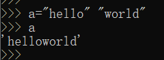
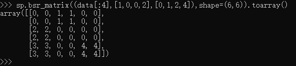
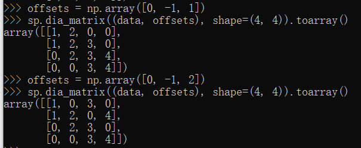

# [官方文档](https://docs.python.org/zh-cn/3/)

# 1. 基础

## 解析器

安装的python可执行文件，`python filename`。`-c`命令行模式，`-m`模块 

> 命令行参数：解释器把脚本名与其他参数转化为字符串列表存到 `sys` 模块的 `argv` 变量里。
>
> 声明文件的编码，文件的 **第一** 行要写成特殊注释。格式`# -*- coding: encoding -*-`
>
> 拼接行：用不在字符串或注释内的反斜杠（`\`）拼接为一个逻辑行。
>
> 以空白符分隔的**多个相邻字符串或字节串字面值**，可用不同引号标注，等同于合并操作。
>
> 


## 模块

```python
import model
from model import name as n
model.__name__
```

**模块**：以 `.py`结尾的文件，文件名即为模块名，通过全局变量 `__name__` 可以获取模块名（即字符串）。

> 为了保证运行效率，每次解释器会话只导入一次模块。如果更改了模块内容，必须重启解释器；
>
> 脚本方式执行模块时，会把`__name__` 赋值为 `"__main__"`，所以可以将模块中`if __name__=="__main__"`的部分用作测试。
>
> 为了快速加载模块，Python 把模块的编译版缓存在 `__pycache__` 目录中。Python 对比编译版本与源码的修改日期，查看它是否已过期，是否要重新编译，此过程完全自动化。
>
> 内置函数 [`dir(model)`](https://docs.python.org/zh-cn/3/library/functions.html#dir) 用于查找模块定义的名称。没有参数时，[`dir()`](https://docs.python.org/zh-cn/3/library/functions.html#dir) 列出当前定义的名称：

**包**：Python 只把含 `__init__.py` 文件的目录当成包。

- [x] 模块搜索路径

1. 解释器首先查找名为 model 的**内置模块**。
2. 解释器再从 [`sys.path`](https://docs.python.org/zh-cn/3/library/sys.html#sys.path) 变量中的目录列表里查找 `model.py` 文件。


# 2. 函数

函数内的第一条语句是字符串时，该字符串就是**文档字符串**。

## 参数

- 函数执行时会引入一个**symbol table**，用于存储函数的局部变量。但是**引用**的搜索顺序为`local、 enclosing functions、global`的symbol table、最后built-in names。
- 调用函数时会将**实际参数（实参）**加入到被调用函数的局部符号表中，当参数为列表等复杂对象时，**传递的是对象的 *引用* 而不是对象的值**）。
- 给参数的默认值如果是变量，则值为变量作用域里的值，如果是列表等，则是引用，多次调用会默认变量的修改值。

```python
def f(l=[])  #如果f对l做了操作，会使l累积之前的操作
```

- `kwarg=value` 形式的 **关键字参数** ，关键字参数必须跟在位置参数后面。
- `*name` 形参接收一个 元组，该**元组包含形参列表之外的位置参数**；形参为 `**name` 形式时，接收一个字典；
- 可以使用 **`/` 和 `*`** 来显示地确定参数是按何种方式（[仅]位置、[仅]关键字）传递。

```python
def f(*name,**key_value)
def f(pos1, pos2, /, pos_or_kwd, *, kwd1, kwd2):
```

+ 用 `*` 操作符**把实参从列表或元组解包**出来，可以用 `**` 操作符可以解**字典**关键字参数。

```python
print(*[1,2,3])
def f(key1,key2)
f(**{"key1": "value1", "key2": "value2"})
```


## 函数注解

函数注解 是可选的用户自定义函数类型的元数据**完整信息**。字典的形式存放在函数的 `__annotations__` 属性中；

- 形参标注：形参名后加冒号，跟一个表达式。返回值标注：加符号 `->`，跟一个表达式

```python
def f(ham: str, eggs: str = 'eggs') -> str:
```

## 内置函数

[参考](https://www.runoob.com/python/python-built-in-functions.html)

| 函数       | 说明                                                         |
| ---------- | ------------------------------------------------------------ |
| `eval()`   | 函数用来执行一个字符串表达式，并返回表达式的值。可以用来将字符串变为数值。 |
| `zip()`    | 将可迭代的对象作为参数，将对象中对应的元素打包成一个个元组，然后返回由这些元组组成的列表。 |
| `filter()` | 用于过滤序列，过滤掉不符合条件的元素，返回由符合条件元素组成的新列表。 |
| `super()`  | 调用父类(超类)的一个方法。super(Class, self).xxx             |


# 3. 类class


# 包

## 1. numpy

[中文文档](https://www.numpy.org.cn/reference/)

### 创建数组

| 创建数组                                                     | 描述                                                        |
| ------------------------------------------------------------ | ----------------------------------------------------------- |
| [array](https://numpy.org/devdocs/reference/generated/numpy.array.html#numpy.array)(object[, dtype, copy, order, subok, ndmin]) | 创建一个数组。                                              |
| [eye](https://numpy.org/devdocs/reference/generated/numpy.eye.html#numpy.eye)(N[, M, k, dtype, order]) | 返回一个二维数组，对角线上1，其他地方为0。                  |
| [full](https://numpy.org/devdocs/reference/generated/numpy.full.html#numpy.full)(shape, fill_value[, dtype, order]) | 返回给定形状和类型的新数组，并用fill_value填充。ones，zeros |
| [full_like](https://numpy.org/devdocs/reference/generated/numpy.full_like.html#numpy.full_like)(a, fill_value[, dtype, order, …]) | 返回形状和类型与给定数组相同的完整数组。                    |
| [arange](https://numpy.org/devdocs/reference/generated/numpy.arange.html#numpy.arange)([start,] stop[, step,][, dtype]) | 返回给定间隔内的均匀间隔的值。                              |
| [linspace](https://numpy.org/devdocs/reference/generated/numpy.linspace.html#numpy.linspace)(start, stop[, num, endpoint, …]) | 返回指定间隔内的等间隔数字。                                |
|                                                              |                                                             |

### 属性

| 属性                                                         | 描述             |
| ------------------------------------------------------------ | ---------------- |
| [ndarray.T](https://numpy.org/devdocs/reference/generated/numpy.ndarray.T.html#numpy.ndarray.T) | 转置数组。       |
| [ndarray.shape](https://numpy.org/devdocs/reference/generated/numpy.ndarray.shape.html#numpy.ndarray.shape) | 数组维度的元组。 |
| [ndarray.ndim](https://numpy.org/devdocs/reference/generated/numpy.ndarray.ndim.html#numpy.ndarray.ndim) | 数组维数。       |
| [ndarray.size](https://numpy.org/devdocs/reference/generated/numpy.ndarray.size.html#numpy.ndarray.size) | 数组中的元素数。 |

### 拼接数组

| 方法                                                         | 描述                                   |
| ------------------------------------------------------------ | -------------------------------------- |
| [concatenate](https://numpy.org/devdocs/reference/generated/numpy.concatenate.html#numpy.concatenate)((a1, a2, …) | 沿现有轴连接一系列数组。               |
| [stack](https://numpy.org/devdocs/reference/generated/numpy.stack.html#numpy.stack)(arrays[, axis, out]) | 沿新轴连接一系列数组。                 |
| [column_stack](https://numpy.org/devdocs/reference/generated/numpy.column_stack.html#numpy.column_stack)(tup) | 将一维数组作为列堆叠到二维数组中。     |
| [dstack](https://numpy.org/devdocs/reference/generated/numpy.dstack.html#numpy.dstack)(tup) | 沿深度方向（沿第三轴）按顺序堆叠数组。 |
| [hstack](https://numpy.org/devdocs/reference/generated/numpy.hstack.html#numpy.hstack)(tup) | 水平（按列）顺序堆叠数组。             |
| [vstack](https://numpy.org/devdocs/reference/generated/numpy.vstack.html#numpy.vstack)(tup) | 垂直（行）按顺序堆叠数组。             |
| [block](https://numpy.org/devdocs/reference/generated/numpy.block.html#numpy.block)(arrays) | 从块的嵌套列表中组装一个nd数组。       |

### 切分数组

| 方法                                                         | 描述                                     |
| ------------------------------------------------------------ | ---------------------------------------- |
| [split](https://numpy.org/devdocs/reference/generated/numpy.split.html#numpy.split)(ary, indices_or_sections[, axis]) | 将数组拆分为多个子数组，作为ary的视图。  |
| [array_split](https://numpy.org/devdocs/reference/generated/numpy.array_split.html#numpy.array_split)(ary, indices_or_sections[, axis]) | 将一个数组拆分为多个子数组。             |
| [dsplit](https://numpy.org/devdocs/reference/generated/numpy.dsplit.html#numpy.dsplit)(ary, indices_or_sections) | 沿第3轴（深度）将数组拆分为多个子数组。  |
| [hsplit](https://numpy.org/devdocs/reference/generated/numpy.hsplit.html#numpy.hsplit)(ary, indices_or_sections) | 水平（按列）将一个数组拆分为多个子数组。 |
| [vsplit](https://numpy.org/devdocs/reference/generated/numpy.vsplit.html#numpy.vsplit)(ary, indices_or_sections) | 垂直（行）将数组拆分为多个子数组。       |

### 增删

| 方法                                                         | 描述                                             |
| ------------------------------------------------------------ | ------------------------------------------------ |
| [delete](https://numpy.org/devdocs/reference/generated/numpy.delete.html#numpy.delete)(arr, obj[, axis]) | 返回一个新的数组，该数组具有沿删除的轴的子数组。 |
| [insert](https://numpy.org/devdocs/reference/generated/numpy.insert.html#numpy.insert)(arr, obj, values[, axis]) | 沿给定轴在给定索引之前插入值。                   |
| [append](https://numpy.org/devdocs/reference/generated/numpy.append.html#numpy.append)(arr, values[, axis]) | 将值附加到数组的末尾。                           |
| [resize](https://numpy.org/devdocs/reference/generated/numpy.resize.html#numpy.resize)(a, new_shape) | 返回具有指定形状的新数组。                       |
| [trim_zeros](https://numpy.org/devdocs/reference/generated/numpy.trim_zeros.html#numpy.trim_zeros)s(filt[, trim]) | 修剪一维数组或序列中的前导和/或尾随零。          |
| [unique](https://numpy.org/devdocs/reference/generated/numpy.unique.html#numpy.unique)(ar[, return_index, return_inverse, …]) | 查找数组的唯一元素。                             |

### 改变形状

| 方法                                                         | 描述                                   |
| ------------------------------------------------------------ | -------------------------------------- |
| [reshape](https://numpy.org/devdocs/reference/generated/numpy.reshape.html#numpy.reshape)(a, newshape[, order]) | 在不更改数据的情况下为数组赋予新的形状 |
| [ravel](https://numpy.org/devdocs/reference/generated/numpy.ravel.html#numpy.ravel)(a[, order]) | 返回一个连续的扁平数组                 |
| [ndarray.flatten](https://numpy.org/devdocs/reference/generated/numpy.ndarray.flatten.html#numpy.ndarray.flatten)([order]) | 返回折叠成一维的数组副本               |
| [squeeze](https://numpy.org/devdocs/reference/generated/numpy.squeeze.html#numpy.squeeze)(a[, axis]) | 从数组形状中删除一维条目               |
| [expand_dims](https://numpy.org/devdocs/reference/generated/numpy.expand_dims.html#numpy.expand_dims)(a, axis) | 扩展数组的形状。                       |
| [swapaxes](https://numpy.org/devdocs/reference/generated/numpy.swapaxes.html#numpy.swapaxes)(a, axis1, axis2) | 互换数组的两个轴。                     |
| [transpose](https://numpy.org/devdocs/reference/generated/numpy.transpose.html#numpy.transpose)(a[, axes]) | 排列数组的尺寸                         |
| [repeat](https://numpy.org/devdocs/reference/generated/numpy.repeat.html#numpy.repeat)(a, repeats[, axis]) | 重复数组的元素                         |

### 索引切片

一般的切片都支持，data[index_list]

| 方法                                                         | 描述                                                         |
| ------------------------------------------------------------ | ------------------------------------------------------------ |
| [choose](https://numpy.org/devdocs/reference/generated/numpy.choose.html#numpy.choose)(a, choices[, out, mode]) | 从索引数组和一组数组中构造一个数组以供选择。                 |
| [take](https://numpy.org/devdocs/reference/generated/numpy.take.html#numpy.take)(a, indices[, axis, out, mode]) | 沿轴从数组中获取元素。                                       |
| [compress](https://numpy.org/devdocs/reference/generated/numpy.compress.html#numpy.compress)(condition, a[, axis, out]) | 沿给定轴返回数组的[选定](https://numpy.org/devdocs/reference/generated/numpy.select.html#numpy.select)切片。 |

### 广播

整个NumPy使用广播来决定如何处理不同形状的数组。


## 2. scipy.sparse

[参考文档](https://docs.scipy.org/doc/scipy/reference/sparse.html)

+ **bsr_matrix((data,indice,indptr),shape=(m,n))**：**块**的坐标，适合稀疏矩阵局部为密集子矩阵的情况，支持**高效运算**。

data为大小相等的块组成的数组，indice每个块在矩阵中的列位置，indptr表示在indice中那几个块（indptr[i:i+1]）属于当前行i。

```shell
#[[A0 A1 A2],[B0,B1,B2],[C0,C1,C2]]为相同大小的块组成的矩阵。
data=[A,B,C,D];#表示有四个块，需要填入矩阵。
indice=[1,0,0,2];#表示A,B,C,D分别放在列为1,0,0,2的位置
indptr=[0,1,2,4];#表示indice中第[0,1)个矩阵A放在第0行，[1,2)个矩阵B放在第1行,[2,4)个矩阵放在第2行。
#[[A0,A,A2],[B,B1,B2],[C,C1,D]]
```



+ **csr_matrix((data, (row_ind, col_ind)), [shape=(M, N)])**：为矩阵里的每个非零元素，提供坐标。**高效的算术运算**。如果有重复的坐标，则矩阵里值为该位置上的值的和。
+ **coo_matrix((data, (i, j)), [shape=(M, N)])**：in COOrdinate format，不支持矩阵运算，**一般用来构造稀疏矩阵**，然后再转为其他格式的矩阵，进行矩阵运算。
+ **csc_matrix((M, N), [dtype])**：支持**高效的列切片**column slicing。
+ **dia_matrix((data, offsets), shape=(M, N))**：**对角矩阵**，offsets和data的维度一样，表示**在对角线上往上下**移动的offset[k]的位置上的值为data[k]。

```python
data = np.array([[1, 2, 3, 4]]).repeat(3, axis=0)  #第一维和offset的维度大小一样，第二维与矩阵的大小一样。
offsets = np.array([0, -1, 2])
dia_matrix((data, offsets), shape=(4, 4)).toarray()
```



+ **dok_matrix((M,N), [dtype])**：Dictionary Of Keys based sparse matrix.支持高效地**访问单个元素**。
+ **lil_matrix((M, N), [dtype])**：Row-based list of lists sparse matrix，支持灵活的切片slicing，高效地**修改**。运算效率低。

+ 函数：
  + `.to*()`将矩阵转为其他格式。
  + `.issp*()`是否为某种格式。
  + `eye()`对角全为1的对角矩阵，`hstack([block])`将块水平（v垂直）堆叠。

