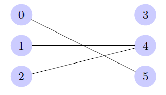
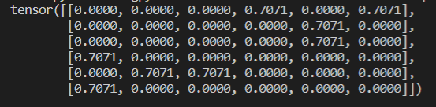

# 参考

[官方文档](https://pytorch.org/docs/stable/index.html)、[中文翻译](https://apachecn.gitee.io/pytorch-doc-zh/#/)、

## numpy操作

[中文文档](https://www.numpy.org.cn/reference/)

### 创建数组

| 创建数组                                                     | 描述                                                        |
| ------------------------------------------------------------ | ----------------------------------------------------------- |
| [array](https://numpy.org/devdocs/reference/generated/numpy.array.html#numpy.array)(object[, dtype, copy, order, subok, ndmin]) | 创建一个数组。                                              |
| [eye](https://numpy.org/devdocs/reference/generated/numpy.eye.html#numpy.eye)(N[, M, k, dtype, order]) | 返回一个二维数组，对角线上1，其他地方为0。                  |
| [full](https://numpy.org/devdocs/reference/generated/numpy.full.html#numpy.full)(shape, fill_value[, dtype, order]) | 返回给定形状和类型的新数组，并用fill_value填充。ones，zeros |
| [full_like](https://numpy.org/devdocs/reference/generated/numpy.full_like.html#numpy.full_like)(a, fill_value[, dtype, order, …]) | 返回形状和类型与给定数组相同的完整数组。                    |
| [arange](https://numpy.org/devdocs/reference/generated/numpy.arange.html#numpy.arange)([start,] stop[, step,][, dtype]) | 返回给定间隔内的均匀间隔的值。                              |
| [linspace](https://numpy.org/devdocs/reference/generated/numpy.linspace.html#numpy.linspace)(start, stop[, num, endpoint, …]) | 返回指定间隔内的等间隔数字。                                |
|                                                              |                                                             |

### 属性

| 属性                                                         | 描述             |
| ------------------------------------------------------------ | ---------------- |
| [ndarray.T](https://numpy.org/devdocs/reference/generated/numpy.ndarray.T.html#numpy.ndarray.T) | 转置数组。       |
| [ndarray.shape](https://numpy.org/devdocs/reference/generated/numpy.ndarray.shape.html#numpy.ndarray.shape) | 数组维度的元组。 |
| [ndarray.ndim](https://numpy.org/devdocs/reference/generated/numpy.ndarray.ndim.html#numpy.ndarray.ndim) | 数组维数。       |
| [ndarray.size](https://numpy.org/devdocs/reference/generated/numpy.ndarray.size.html#numpy.ndarray.size) | 数组中的元素数。 |

### 拼接数组

| 方法                                                         | 描述                                   |
| ------------------------------------------------------------ | -------------------------------------- |
| [concatenate](https://numpy.org/devdocs/reference/generated/numpy.concatenate.html#numpy.concatenate)((a1, a2, …) | 沿现有轴连接一系列数组。               |
| [stack](https://numpy.org/devdocs/reference/generated/numpy.stack.html#numpy.stack)(arrays[, axis, out]) | 沿新轴连接一系列数组。                 |
| [column_stack](https://numpy.org/devdocs/reference/generated/numpy.column_stack.html#numpy.column_stack)(tup) | 将一维数组作为列堆叠到二维数组中。     |
| [dstack](https://numpy.org/devdocs/reference/generated/numpy.dstack.html#numpy.dstack)(tup) | 沿深度方向（沿第三轴）按顺序堆叠数组。 |
| [hstack](https://numpy.org/devdocs/reference/generated/numpy.hstack.html#numpy.hstack)(tup) | 水平（按列）顺序堆叠数组。             |
| [vstack](https://numpy.org/devdocs/reference/generated/numpy.vstack.html#numpy.vstack)(tup) | 垂直（行）按顺序堆叠数组。             |
| [block](https://numpy.org/devdocs/reference/generated/numpy.block.html#numpy.block)(arrays) | 从块的嵌套列表中组装一个nd数组。       |

### 切分数组

| 方法                                                         | 描述                                     |
| ------------------------------------------------------------ | ---------------------------------------- |
| [split](https://numpy.org/devdocs/reference/generated/numpy.split.html#numpy.split)(ary, indices_or_sections[, axis]) | 将数组拆分为多个子数组，作为ary的视图。  |
| [array_split](https://numpy.org/devdocs/reference/generated/numpy.array_split.html#numpy.array_split)(ary, indices_or_sections[, axis]) | 将一个数组拆分为多个子数组。             |
| [dsplit](https://numpy.org/devdocs/reference/generated/numpy.dsplit.html#numpy.dsplit)(ary, indices_or_sections) | 沿第3轴（深度）将数组拆分为多个子数组。  |
| [hsplit](https://numpy.org/devdocs/reference/generated/numpy.hsplit.html#numpy.hsplit)(ary, indices_or_sections) | 水平（按列）将一个数组拆分为多个子数组。 |
| [vsplit](https://numpy.org/devdocs/reference/generated/numpy.vsplit.html#numpy.vsplit)(ary, indices_or_sections) | 垂直（行）将数组拆分为多个子数组。       |

### 增删

| 方法                                                         | 描述                                             |
| ------------------------------------------------------------ | ------------------------------------------------ |
| [delete](https://numpy.org/devdocs/reference/generated/numpy.delete.html#numpy.delete)(arr, obj[, axis]) | 返回一个新的数组，该数组具有沿删除的轴的子数组。 |
| [insert](https://numpy.org/devdocs/reference/generated/numpy.insert.html#numpy.insert)(arr, obj, values[, axis]) | 沿给定轴在给定索引之前插入值。                   |
| [append](https://numpy.org/devdocs/reference/generated/numpy.append.html#numpy.append)(arr, values[, axis]) | 将值附加到数组的末尾。                           |
| [resize](https://numpy.org/devdocs/reference/generated/numpy.resize.html#numpy.resize)(a, new_shape) | 返回具有指定形状的新数组。                       |
| [trim_zeros](https://numpy.org/devdocs/reference/generated/numpy.trim_zeros.html#numpy.trim_zeros)s(filt[, trim]) | 修剪一维数组或序列中的前导和/或尾随零。          |
| [unique](https://numpy.org/devdocs/reference/generated/numpy.unique.html#numpy.unique)(ar[, return_index, return_inverse, …]) | 查找数组的唯一元素。                             |

### 改变形状

| 方法                                                         | 描述                                   |
| ------------------------------------------------------------ | -------------------------------------- |
| [reshape](https://numpy.org/devdocs/reference/generated/numpy.reshape.html#numpy.reshape)(a, newshape[, order]) | 在不更改数据的情况下为数组赋予新的形状 |
| [ravel](https://numpy.org/devdocs/reference/generated/numpy.ravel.html#numpy.ravel)(a[, order]) | 返回一个连续的扁平数组                 |
| [ndarray.flatten](https://numpy.org/devdocs/reference/generated/numpy.ndarray.flatten.html#numpy.ndarray.flatten)([order]) | 返回折叠成一维的数组副本               |
| [squeeze](https://numpy.org/devdocs/reference/generated/numpy.squeeze.html#numpy.squeeze)(a[, axis]) | 从数组形状中删除一维条目               |
| [expand_dims](https://numpy.org/devdocs/reference/generated/numpy.expand_dims.html#numpy.expand_dims)(a, axis) | 扩展数组的形状。                       |
| [swapaxes](https://numpy.org/devdocs/reference/generated/numpy.swapaxes.html#numpy.swapaxes)(a, axis1, axis2) | 互换数组的两个轴。                     |
| [transpose](https://numpy.org/devdocs/reference/generated/numpy.transpose.html#numpy.transpose)(a[, axes]) | 排列数组的尺寸                         |
| [repeat](https://numpy.org/devdocs/reference/generated/numpy.repeat.html#numpy.repeat)(a, repeats[, axis]) | 重复数组的元素                         |

### 索引切片

一般的切片都支持，data[index_list]

| 方法                                                         | 描述                                                         |
| ------------------------------------------------------------ | ------------------------------------------------------------ |
| [choose](https://numpy.org/devdocs/reference/generated/numpy.choose.html#numpy.choose)(a, choices[, out, mode]) | 从索引数组和一组数组中构造一个数组以供选择。                 |
| [take](https://numpy.org/devdocs/reference/generated/numpy.take.html#numpy.take)(a, indices[, axis, out, mode]) | 沿轴从数组中获取元素。                                       |
| [compress](https://numpy.org/devdocs/reference/generated/numpy.compress.html#numpy.compress)(condition, a[, axis, out]) | 沿给定轴返回数组的[选定](https://numpy.org/devdocs/reference/generated/numpy.select.html#numpy.select)切片。 |

### 广播

整个NumPy使用广播来决定如何处理不同形状的数组。


## tensor操作


# 深度学习框架PyTorch：入门与实践

项目地址：https://github.com/chenyuntc/pytorch-book

## 2 快速入门

### 2.2 PyTorch 入门第一步

+ `Tensor`是PyTorch中重要的数据结构，可以是一个数（标量）、一维数组（向量）、二维数组（矩阵）以及更高维的数组。

+ `autograd`：自动微分，autograd.Variable是Autograd中的核心类，它简单封装了Tensor，并支持几乎所有Tensor有的操作。Tensor在被封装为Variable之后，可以调用它的.backward实现反向传播，自动计算所有梯度，Variable主要包含三个属性。 

  - data：保存Variable所包含的Tensor 
  - grad：保存data对应的梯度，grad也是个Variable，而不是Tensor，它和data的形状一样。 在反向传播过程中是累加的，这意味着每一次运行反向传播，梯度都会累加之前的梯度，所以反向传播之前需把梯度清零。
  - grad_fn：指向一个Function对象，这个Function用来反向传播计算输入的梯度。

+ 小试牛刀：CIFAR-10分类

  ```python
  import torch as t
  import torchvision as tv
  import torchvision.transforms as transforms
  from torchvision.transforms import ToPILImage
  import torch.nn as nn
  import torch.nn.functional as F
  from torch import optim
  #模型
  class Net(nn.Module):
      # 把网络中具有可学习参数的层放在构造函数__init__中。如果某一层(如ReLU)不具有可学习的参数，
      # 则既可以放在构造函数中，也可以不放，但建议不放在其中，而在forward中使用nn.functional代替。
      def __init__(self):
          super(Net, self).__init__()
          self.conv1 = nn.Conv2d(3, 6, 5) 
          self.conv2 = nn.Conv2d(6, 16, 5)  
          self.fc1   = nn.Linear(16*5*5, 120)  
          self.fc2   = nn.Linear(120, 84)
          self.fc3   = nn.Linear(84, 10)
      # 只要在nn.Module的子类中定义了forward函数，backward函数就会自动被实现(利用autograd)。
      # 在forward 函数中可使用任何tensor支持的函数，还可以使用if、for循环、print、log等Python语法，
      # 写法和标准的Python写法一致。
      def forward(self, x): 
          x = F.max_pool2d(F.relu(self.conv1(x)), (2, 2)) 
          x = F.max_pool2d(F.relu(self.conv2(x)), 2) 
          x = x.view(x.size()[0], -1) 
          x = F.relu(self.fc1(x))
          x = F.relu(self.fc2(x))
          x = self.fc3(x)        
          return x
      # 网络的可学习参数通过net.parameters()返回，net.named_parameters可同时返回可学习的参数及名称。
  # 训练    
  def train(trainloader,net):
      # 交叉熵损失函数
      criterion = nn.CrossEntropyLoss() 
      # 在反向传播计算完所有参数的梯度后，还需要使用优化方法来更新网络的权重和参数，
      optimizer = optim.SGD(net.parameters(), lr=0.001, momentum=0.9)
  
      t.set_num_threads(8)  #设置线程
      for epoch in range(2):      
          running_loss = 0.0
          for i, data in enumerate(trainloader, 0): #0表示从0开始
              inputs, labels = data # 输入数据
  
              optimizer.zero_grad() # 梯度清零
              outputs = net(inputs)            
              loss = criterion(outputs, labels) # 计算损失
              loss.backward()   #反向传播
              optimizer.step()  # 更新参数 
  
              running_loss += loss.item() # loss 是一个scalar,需要使用loss.item()来获取数值，不能使用loss[0]
              if i % 2000 == 1999: # 每2000个batch打印一下训练状态
                  print('[%d, %5d] loss: %.3f' % (epoch+1, i+1, running_loss / 2000))
                  running_loss = 0.0
      print('Finished Training')
  
  # 测试    
  def test(testloader,net):
      correct,total = 0,0
      # 由于测试的时候不需要求导，可以暂时关闭autograd，提高速度，节约内存
      with t.no_grad():
          for data in testloader:
              images, labels = data
              outputs = net(images)
              _, predicted = t.max(outputs, 1)
              total += labels.size(0)
              correct += (predicted == labels).sum()
  
      print('10000张测试集中的准确率为: %d %%' % (100 * correct / total))    
      
  def main():
      #数据加载
      transform = transforms.Compose([  # 定义对数据的预处理
              transforms.ToTensor(), # 转为Tensor
              transforms.Normalize((0.5, 0.5, 0.5), (0.5, 0.5, 0.5)),]) # 归一化
      # 训练集
      trainset = tv.datasets.CIFAR10(root='./',train=True, download=True,transform=transform)
      trainloader = t.utils.data.DataLoader(trainset, batch_size=4,shuffle=True, num_workers=2)
      # 测试集
      testset = tv.datasets.CIFAR10('./',train=False, download=True, transform=transform)
      testloader = t.utils.data.DataLoader(testset,batch_size=4, shuffle=False, num_workers=2)
      
      net=Net()    
      train(trainloader,net)
      test(testloader,net)
  ```


## 3 Tensor and Autograd

### 3.1 tensor

+ 从接口的角度来讲，对tensor的操作可分为两类：

  + torch.function，如torch.save等。
  + tensor.function，如tensor.view等

+ 函数名以`_`结尾的都是inplace方式, 即会修改调用者自己的数据，在实际应用中需加以区分。

+ Numpy和Tensor共享内存，当numpy的数据类型和Tensor的类型不一样的时候，数据会被复制，不会共享内存。

+ 小试牛刀：线性回归

  ```python
  import torch as t
  from matplotlib import pyplot as plt
  
  device = t.device('cpu') #如果你想用gpu，改成t.device('cuda:0')
  
  def get_fake_data(batch_size=8):
      ''' 产生随机数据：y=x*2+3，加上了一些噪声'''
      global device
      x = t.rand(batch_size, 1, device=device) * 5
      y = x * 2 + 3 +  t.randn(batch_size, 1, device=device)
      return x, y
  
  def main():
      global device
      t.manual_seed(1000) # 设置随机数种子，保证在不同电脑上运行时下面的输出一致
      w = t.rand(1, 1).to(device) # 随机初始化参数
      b = t.zeros(1, 1).to(device)
      lr =0.02  # 学习率
      for ii in range(50):
          x, y = get_fake_data(batch_size=4)
          # forward：计算loss
          y_pred = x.mm(w) + b.expand_as(y) # x@W等价于x.mm(w);for python3 only
          loss = 0.5 * (y_pred - y) ** 2 # 均方误差
          loss = loss.mean()
          # backward：手动计算梯度
          dloss = 1
          dy_pred = dloss * (y_pred - y)
          dw = x.t().mm(dy_pred)
          db = dy_pred.sum()
          # 更新参数
          w.sub_(lr * dw)
          b.sub_(lr * db)
          # 可视化
          plt.ion() # 打开交互模式
          if ii%10 ==0:
              plt.cla() #清除原有图像
              x = t.arange(0, 6).view(-1, 1)
              y = x.float().mm(w) + b.expand_as(x)
              x2, y2 = get_fake_data(batch_size=32) 
              # 画图
              plt.plot(x.cpu().numpy(), y.cpu().numpy()) # 预测线
              plt.scatter(x2.numpy(), y2.numpy()) # 真实散点图，与训练的不是一批数据
              plt.xlim(0, 5)
              plt.ylim(0, 13)
              plt.pause(0.5)
      print('w: ', w.item(), 'b: ', b.item())
  ```

### 3.2 autograd

+ torch.autograd就是为方便用户使用，而专门开发的一套自动求导引擎，它能够根据输入和前向传播过程自动构建计算图，并执行反向传播。计算图(Computation Graph)是现代深度学习框架如PyTorch和TensorFlow等的核心，其为高效自动求导算法——反向传播(Back Propogation)提供了理论支持。

+ 可以认为需要求导(requires_grad)的tensor即Variable。autograd记录对tensor的操作记录用来构建计算图。Variable提供了大部分tensor支持的函数，但其不支持部分inplace函数，因这些函数会修改tensor自身，而在反向传播中，variable需要缓存原来的tensor来计算反向传播梯度。如果想要计算各个Variable的梯度，只需调用根节点variable的backward方法，autograd会自动沿着计算图反向传播，计算每一个叶子节点的梯度。`variable.backward(gradient=None, retain_graph=None, create_graph=None)`

+ 如果想要修改tensor的数值，但是又不希望被autograd记录，那么我么可以对tensor.data进行操作

+ 扩展autograd：写一个Function，实现它的前向传播和反向传播代码，Function对应于计算图中的矩形， 它接收参数，计算并返回结果。

+ 小试牛刀: 用Variable实现线性回归

  ```python
  import torch as t
  from matplotlib import pyplot as plt
  import numpy as np
  …… 
  def main():
      ……
      # 随机初始化参数
      w = t.rand(1,1, requires_grad=True)
      b = t.zeros(1,1, requires_grad=True)
      losses = np.zeros(500)
      lr =0.02 # 学习率
      for ii in range(500):
          ……
          losses[ii] = loss.item()
          # backward：手动计算梯度
          loss.backward()
          # 更新参数
          w.data.sub_(lr * w.grad.data) # w.data
          b.data.sub_(lr * b.grad.data)
          # 梯度清零
          w.grad.data.zero_()
          b.grad.data.zero_()
          ……
      plt.cla() 
      plt.ioff() # 关闭交互模式
      plt.plot(losses)
      plt.show()
  ```

## 4 神经网络工具箱nn

+ torch.nn的核心数据结构是Module，它是一个抽象概念，既可以表示神经网络中的某个层（layer），也可以表示一个包含很多层的神经网络。在实际使用中，最常见的做法是继承nn.Module，撰写自己的网络/层。

  + 自定义层必须继承nn.Module，并且在其构造函数中需调用nn.Module的构造函数，`super(Linear, self).__init__()`
  + 在构造函数`__init__`中必须自己定义可学习的参数，并封装成Parameter之类的，
  + `forward`函数实现前向传播过程。

+ PyTorch实现了神经网络中绝大多数的layer，这些layer都继承于nn.Module，封装了可学习参数parameter，并实现了forward函数，且很多都专门针对GPU运算进行了CuDNN优化，其速度和性能都十分优异。**注意**：输入的不是单个数据，而是一个batch。输入只有一个数据，则必须调用tensor.unsqueeze(0) 或 tensor[None]将数据伪装成batch_size=1的batch

+ 将每一层的输出直接作为下一层的输入，这种网络称为前馈传播网络（feedforward neural network）。对于此类网络如果每次都写复杂的forward函数会有些麻烦，在此就有两种简化方式，ModuleList和Sequential。其中Sequential是一个特殊的module，它包含几个子Module，前向传播时会将输入一层接一层的传递下去。ModuleList也是一个特殊的module，可以包含几个子module，可以像用list一样使用它，但不能直接把输入传给ModuleList，当在Module中使用它的时候，就能自动识别为子module。

+ 小试牛刀：搭建ResNet

  ```python
  from torch import  nn
  import torch as t
  from torch.nn import  functional as F
  
  class ResidualBlock(nn.Module):
      '''
      实现子module: Residual Block
      '''
      def __init__(self, inchannel, outchannel, stride=1, shortcut=None):
          super(ResidualBlock, self).__init__()
          self.left = nn.Sequential(
                  nn.Conv2d(inchannel,outchannel,3,stride, 1,bias=False),
                  nn.BatchNorm2d(outchannel),
                  nn.ReLU(inplace=True),
                  nn.Conv2d(outchannel,outchannel,3,1,1,bias=False),
                  nn.BatchNorm2d(outchannel) )
          self.right = shortcut
  
      def forward(self, x):
          out = self.left(x)
          residual = x if self.right is None else self.right(x)
          out += residual
          return F.relu(out)
  
  class ResNet(nn.Module):
      '''
      实现主module：ResNet34
      ResNet34 包含多个layer，每个layer又包含多个residual block
      用子module来实现residual block，用_make_layer函数来实现layer
      '''
      def __init__(self, num_classes=1000):
          super(ResNet, self).__init__()
          # 前几层图像转换
          self.pre = nn.Sequential(
                  nn.Conv2d(3, 64, 7, 2, 3, bias=False),
                  nn.BatchNorm2d(64),
                  nn.ReLU(inplace=True),
                  nn.MaxPool2d(3, 2, 1))
          
          # 重复的layer，分别有3，4，6，3个residual block
          self.layer1 = self._make_layer( 64, 64, 3)
          self.layer2 = self._make_layer( 64, 128, 4, stride=2)
          self.layer3 = self._make_layer( 128, 256, 6, stride=2)
          self.layer4 = self._make_layer( 256, 512, 3, stride=2)
  
          #分类用的全连接
          self.fc = nn.Linear(512, num_classes)
      
      def _make_layer(self,  inchannel, outchannel, block_num, stride=1):
          '''
          构建layer,包含多个residual block
          '''
          shortcut = nn.Sequential(
                  nn.Conv2d(inchannel,outchannel,1,stride, bias=False),
                  nn.BatchNorm2d(outchannel))
          
          layers = []
          layers.append(ResidualBlock(inchannel, outchannel, stride, shortcut))
          
          for i in range(1, block_num):
              layers.append(ResidualBlock(outchannel, outchannel))
          return nn.Sequential(*layers)
          
      def forward(self, x):
          x = self.pre(x)
          
          x = self.layer1(x)
          x = self.layer2(x)
          x = self.layer3(x)
          x = self.layer4(x)
  
          x = F.avg_pool2d(x, 7)
          x = x.view(x.size(0), -1)
          return self.fc(x)
  ```

  

##  5. PyTorch常用工具模块

`from torch.utils import data` ，`from torchvision import transforms as T`

+ 加载数据：自定义的数据集对象需要继承Dataset。实现两个方法：`__getitem__`：返回一条数据，或一个样本。`obj[index]`等价于`obj.__getitem__(index)`；`__len__`：返回样本的数量。`len(obj)`等价于`obj.__len__()`。如果所有的文件按文件夹保存，每个文件夹下存储同一个类别的图片，文件夹名为类名，可用`ImageFolder(root, transform=None, target_transform=None, loader=default_loader)`；label是按照文件夹名顺序排序后存成字典，即{类名:类序号(从0开始)}。
  + 批处理： `DataLoader(dataset, batch_size=1, shuffle=False, sampler=None, num_workers=0, collate_fn=default_collate, pin_memory=False, drop_last=False)`
+ 数据处理：`transform = T.Compose()`
  + 计算机视觉工具包torchvision：models、datasets、transforms
  + 转GPU，`.cuda()`

## 6.文件组织结构

```
- `checkpoints/`： 用于保存训练好的模型，可使程序在异常退出后仍能重新载入模型，恢复训练
- `data/`：数据相关操作，包括数据预处理、dataset实现等
- `models/`：模型定义，可以有多个模型，例如上面的AlexNet和ResNet34，一个模型对应一个文件
- `utils/`：可能用到的工具函数，在本次实验中主要是封装了可视化工具
- `config.py`：配置文件，所有可配置的变量都集中在此，并提供默认值
- `main.py`：主文件，训练和测试程序的入口，可通过不同的命令来指定不同的操作和参数
- `requirements.txt`：程序依赖的第三方库
- `README.md`：提供程序的必要说明
```


# 结果可视化tensorboard

使用命令`tensorboard --logdir logs`进行可视化

```python
# 使用自带的，需要安装 pip install tensorboard
from torch.utils.tensorboard import SummaryWriter

writer = SummaryWriter()
writer.add_image('images', grid, 0)
writer.add_graph(model, images)
writer.add_scalar('Loss/train', np.random.random(), n_iter)

writer.close()
```

函数原型

- [ ] `torch.utils.tensorboard.writer.SummaryWriter`(*log_dir=None*, *comment=''*, *purge_step=None*, *max_queue=10*, *flush_secs=120*, *filename_suffix=''*)

- [ ] `.add_scalar`(*tag*, *scalar_value*, *global_step=None*, *walltime=None*)

  `.add_scalars`(*main_tag*, *tag_scalar_dict*, *global_step=None*, *walltime=None*)

- [ ] `.add_histogram`(*tag*, *values*, *global_step=None*, *bins='tensorflow'*, *walltime=None*, *max_bins=None*)

- [ ] `.add_image`(*tag*, *img_tensor*, *global_step=None*, *walltime=None*, *dataformats='CHW'*)

  `.add_images`(*tag*, *img_tensor*, *global_step=None*, *walltime=None*, *dataformats='NCHW'*)

- [ ] `.add_figure`(*tag*, *figure*, *global_step=None*, *close=True*, *walltime=None*)


# 图Torch_geometric

[官方文档](https://pytorch-geometric.readthedocs.io/en/latest/)

## 构造图数据

torch_geometric通过.data.Data描述一个图，

+ `data.x`：节点特征矩阵[num_node, feature_dim]。
+ `data.edge_index`：边，由两个节点表示，[2,num_edges]。第一个为source，第二个为target
+ `data.edge_attr`：边的特征表示。
+ `data.y`：目标，输出，如节点分类[num_nodes, num_labels]。
+ `data.pos`：节点位置矩阵。

```python
edge_index=torch.tensor([[边起始点列表],[边终点列表]],dtype=torch.long)
#如果边的表示为[num_edges,2],可以使用t()进行转置，由于转置等操作会使数据在内存的分布变得不连续
#可以继续使用contiguous。将不连续的存储方式变为连续的内存存储方式
edge_index=torch.tensor([边的列表],dtype=torch.long).t().contiguous() #.t()转置
x=torch.tensor([每个节点的特征表示列表],dtype=torch.float)。
data=Data(x=x,edge_index=edge_index)
```

## message passing network

第k-1层到第k层，节点特征的更新可表示为：

$$
\mathbf{x}_i^{(k)} = \gamma^{(k)} \left( \mathbf{x}_i^{(k-1)}, \square_{j \in \mathcal{N}(i)} \, \phi^{(k)}\left(\mathbf{x}_i^{(k-1)}, \mathbf{x}_j^{(k-1)},\mathbf{e}_{j,i}\right) \right)
$$

+ Messagepassing：定义aggregation模式。`MessagePassing(aggr="add",flow="source_to_target",node_dim=-2)`；node_dim沿着那个维度传播
+ `MessagePassing.propagate(edge_index,size=None,**kwargs)`：首次调用，开始传播信息message，交互信息不一定限制与对称连接矩阵，**也可在二分图bipartite上进行，需设定size=(N,M)**。对于两个不同节点集合和下标索引的二分图，可以通过以二元组方式进行传递x=(x_N,x_M)，以区分两者。
+ `MessagePassing.message(...)`：作用类似$\phi$，构造传递给`中心节点i`（接受信息的节点，j邻域节点）的信息（**边的表示为**`(j,i)`,flow="source_to_target"）。可以接收所有传给propagate的参数，即传递propagate的参数可以通过添加`_i,_j`的方式映射到`i节点`和`j节点`。
+ `MessagePassing.update(aggr_out,...)`：作用类似$\gamma$，更新节点embedding，将aggregation的输出作为输入，可以接收传递给propagate的所有参数，然后根据聚合方式更新节点表示。



```python
import torch as t
from torch_geometric.nn import MessagePassing
from torch_geometric.utils import degree

class GCN(MessagePassing):
    def __init__(self):
        super(GCN, self).__init__(aggr="add")

    def forward(self, x, edge_index):
        source, target = edge_index
        # degree工具统计边两端的节点的出现次数，从而得到度，所以有重复的边会被当做不同的边。
        deg_s = degree(target, x.size(0), dtype=x.dtype)#出度，如果是无向图，则入度和出度相等
        deg_t = degree(target, x.size(0), dtype=x.dtype)#入度，
        deg_sqrt_s = deg_s.pow(-0.5)
        deg_sqrt_t = deg_t.pow(-0.5)
        deg_sqrt_s[t.isinf(deg_sqrt_s)] = 1
        deg_sqrt_t[t.isinf(deg_sqrt_t)] = 1
        norm = deg_sqrt_s[source] * deg_sqrt_t[target]

        return self.propagate(edge_index, x=x, norm=norm)

    def message(self, x_j, norm):
        return norm.view(-1, 1) * x_j


if __name__ == "__main__":
    edge_index = t.tensor([[0,5],[0,3],[5,0],[3,0],[1,4],[4,1],[2,4],[4,2]], dtype=t.long)
    edge_index = edge_index.t().contiguous()
    x = t.tensor([[1,0,0,0,0,0],[0,1,0,0,0,0],[0,0,1,0,0,0],
                  [0,0,0,1,0,0],[0,0,0,0,1,0],[0,0,0,0,0,1]], dtype=t.float)
    mode = GCN()
    x = mode.forward(x, edge_index)
    print(x)
```



