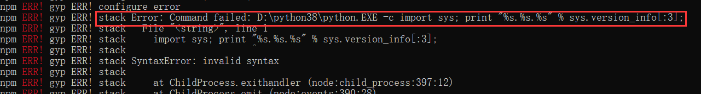
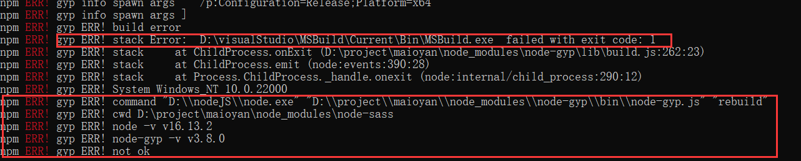
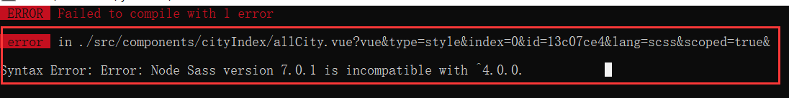
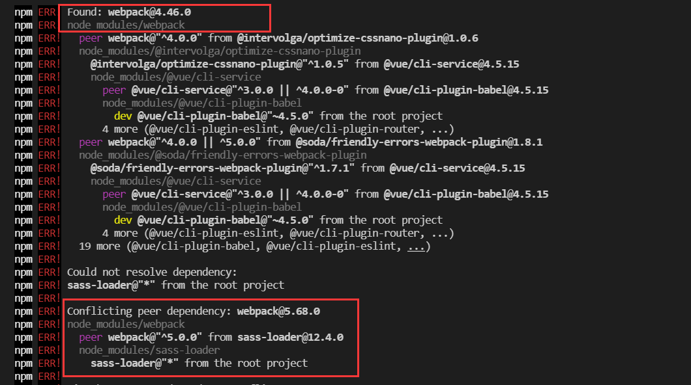
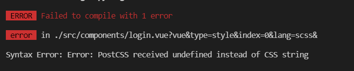

# HTML

## 基本格式

```html
<!DOCTYPE html>      							<!-- 告诉浏览器 HTML版本 -->
<html>

<head>
    <meta charset="utf-8">
    <title>菜鸟教程(runoob.com)</title> 		 <!-- 工具栏标题 -->
    <style type="text/css">						
        h1 {color:red;}
        p {color:blue;}
    </style>									<!-- 格式 -->
</head>
        
<body>
    <h1>标题</h1> 							   <!--  h1-h6级 -->
    <p>段落</p>
    <a href="https://www.runoob.com">这是一个链接</a>  
    
    <br>  										<!-- 自闭合标签 换行 -->
    <hr>										<!-- 水平线 -->
</body>
        
</html>
```

+ 图片

> `<map>` 标签用于客户端图像映射。图像映射指带有可点击区域的一幅图像。
>
> ```html
> 
> 
> <map name="planetmap">
>       <area shape="rect" coords="0,0,82,126" href="sun.htm" alt="Sun">
>       <area shape="circle" coords="90,58,3" href="mercur.htm" alt="Mercury">
>       <area shape="circle" coords="124,58,8" href="venus.htm" alt="Venus">
> </map>
> ```

+ 表格

> ```html
> <table border="1" cellpadding="10">
>     <caption>表说明</caption>
>     <tr>
>         <th colspan="2">头</th>     <!-- 跨表格，标题，rowspan -->
>     <tr>    						<!-- 行 -->
>         <td>row 1, cell 1</td>      <!-- 列 -->
>         <td>row 1, cell 2</td>
>     </tr>
> </table>
> ```

+ 列表

> ```html
> <ol type="A">  						<!-- 有序ol 无序ul style="list-style-type:disc" -->
>        <li>Coffee</li>
>        <li>Milk</li>
> </ul>
> <!-- dl dt dd 自定义列表 -->
> ```

+ 区块

> ```html
> <!-- <div> 元素是块级元素，它可用于组合其他HTML元素的容器。可用来布局 -->
> <!-- <span> 用于对文档中的行内元素进行组合。 -->
> <div style="color:#0000FF">
>   <h3>这是一个在 div 元素中的标题。</h3>
>   <p>这是一个在 div 元素中的文本。</p>
>   <p>我的母亲有 <span style="color:red">蓝色</span> 的眼睛。</p>
> </div>
> ```

+ 表单

> ```html
> <!-- 文本text、密码password、单选radio、复选框checkbox、提交按钮submit、文本框textarea、按钮button
> select option下拉列表-->
> <form action="">											<!-- 表单是一个包含表单元素的区域。 -->
> First name: <input type="text" name="firstname"><br>		<!-- 表单元素是允许用户在表单中输入内容 -->
> Last name: <input type="text" name="lastname">
> </form>
> ```

+ 框架

> ```html
> <iframe loading="lazy" src="demo_iframe.htm" width="200" height="200"></iframe>
> ```

+ 脚本

> ```html
> <script>
> document.write("Hello World!")
> </script>
> ```

## html5

+ 绘图

> ```html
> <!-- 图像 -->
> <canvas id="myCanvas" width="200" height="100"
> style="border:1px solid #000000;">
> </canvas>
> 
> <!-- 矢量图 -->
> <svg xmlns="http://www.w3.org/2000/svg" version="1.1" height="190">
>   <polygon points="100,10 40,180 190,60 10,60 160,180"
>   style="fill:lime;stroke:purple;stroke-width:5;fill-rule:evenodd;">
> </svg>
> 
> <!-- 公式 -->
> <math xmlns="http://www.w3.org/1998/Math/MathML">           
>     <mrow>
>         <msup><mi>a</mi><mn>2</mn></msup>
>         <mo>+</mo>         
>         <msup><mi>b</mi><mn>2</mn></msup>
>         <mo>=</mo>              
>         <msup><mi>c</mi><mn>2</mn></msup>
>     </mrow>
> </math>
> ```


# CSS

### 块级元素

等式：`内外边距+边框+width(height)==包含块的width(height)`。设置的width和height都是容器**内容区**的高宽。

**水平格式化**：，

> + margin和width可以为auto，以便满足该等式，
> + 如果width设置为auto，边距再设置为auto，则边距的值为0，
> + 外边距可以为负值（等式不成立时，重置右外边距）。

**垂直格式化**：

> + **默认由元素的内容确定。**
> + 如果设置值小于内容显示高度。添加滚动条(overflow)。
> + 如果上下边距设为auto，则值为0.

**替换块**，只有宽度或高度设置为auto时，会根据替换块内容的高宽比等比例缩放。

**重置外边距合并**：相邻上下外边距会合并，取较大的值。

### 行内元素

**高度：line-height**，**字体大小，font-size**，边框由font-size确定，取line-height与内部子元素高度的较大值。

块元素可以包含行内元素，反之不可。

display改变的只是显示角色，没有本质，

行内块，内部没有行分割符。

百分比相对的基准是包含块（父容器）。

## 浮动

1. 从文档的正常流中删除，空出位置。
2. 外边距不会合并。
3. 生成块级框，变为块级元素。

## 格式

**语法**：`选择器`和`声明块`组成。


## 添加方式

1. 内联样式（元素属性）
2. 内部样式（style标签，head标签内）
3. 外部引用（外部文件，head标签内）

**（内联样式）Inline style > （内部样式）Internal style sheet >（外部样式）External style sheet > 浏览器默认样式**

```css
/*1.在p标签内部的属性style设置格式*/
<p style="color:red;">这是一个段落。</p>

/*2. 在head中的添加style元素*/
<style>
	p {color:red;}
</style>

/*3. head元素中添加link元素*/
<head>
	<link rel="stylesheet" type="text/css" href="mystyle.css">
</head>
```

## 选择器

+ **元素选择器**，根据元素名称来选择 HTML 元素。`p {color:red;}`。

+ **分组选择器**，选取所有具有相同样式定义的 HTML 元素。`p,h1 {color:red;}`。

+ **通用选择器**（*），选择页面上的所有的 HTML 元素。`* {color:red;}`。

+ **id选择器**，使用 HTML 元素的 id 属性来选择特定元素。`#xid {color:red;}`。作用`<p id='xid'>`。

+ **类选择器**，选择有特定 class 属性的 HTML 元素。`.xclass {color:red;}`，作用`<p class='xclass yclass'>`。

  还可结合元素选择器，`p.xclass {color:red;}`。

  **伪类**用于定义元素的特殊状态。`selector:pseudo-class {property: value}`。

+ **属性选择器**，选择有某个属性的元素。`*[title] {color:red;}`，作用`<a title='xxx'>`。`元素[属性][属性]...`。

+ **后代选择器**，选择元素的所有子元素。`div p {color:red;}`，作用`<div>[...]<p>`。

+ **子元素选择器**，只能选择作为某元素子元素的元素。`div > p {color:red;}`，作用`<div><p>`。


## 布局

`display` 属性规定是否/如何显示元素。`none block inline` 

+ **块级元素**（block element）：块级元素总是从新行开始，并占据可用的全部宽度（尽可能向左和向右伸展）。

  如：div h1 p form header footer section 

+ **行内元素**（inline element）：内联元素不从新行开始，仅占用所需的宽度。

  如：span、a、img、input、button

> `visibility:hidden`也可以隐藏元素，但仍将占用与之前相同的空间。

### 定位

position 属性规定应用于元素的定位方法的类型（static、relative、fixed、absolute 或 sticky）。结合 top、bottom、left 和 right 属性进行定位。

+ static：正常位置，不受top等位置影响，

+ **relative**：相对于其正常位置进行定位。

+ **fixed**：相对于视口定位的，这意味着即使滚动页面，它也始终位于同一位置。

+ **absolute**：相对于最近的定位祖先元素进行定位。

+ sticky：根据用户的滚动位置进行定位。

  > 先它会被相对定位，直到在视口中遇到给定的偏移位置为止 - 然后将其“粘贴”在适当的位置。

**溢出overflow** ：内容超出显示框怎么处理，可设置为visible，hidden，scroll，auto。

**浮动float **：用于定位和格式化内容，可设置为left，right，inherit，none。

### 边框

+ 默认情况下，元素的宽度：width + padding + border = 元素的实际宽度。**显示的宽度不等于width**。

+ **box-sizing: border-box;** 属性允许我们在元素的总宽度和高度中包括内边距和边框。**显示宽度等于width**。

+ **外边距margin**：`margin:[上下] [左右] [下] [右]`，auto使其在容器中居中。

+ outline轮廓：`outline:[颜色] [风格] [宽度]`，绘制于元素周围的一条线，位于边框边缘的外围，可起到突出元素的作用。

+ box-shadow：`box-shadow:投影方式 X轴偏移量 Y轴偏移量 [阴影模糊半径] [阴影扩展半径] [阴影颜色]`。

  投影方式：insert内部，

# javascript

编写网页行为，交互。语句以`;`结束

## 添加方式

1. 内联样式（元素属性，引号内编写）
2. 内部样式，script标签，**任意地方**。`<script >....</script>`。
3. 外部引用，script标签，**任意地方**。`<script src='xxx.js'></script>`。

```html
<!-- 1.内联代码  -->
<button type="button" 
        onclick='document.getElementById("demo").innerHTML = "Hello JavaScript!";'>点击我！
</button>

<!-- 2.内部代码 任意位置，任意数量 把脚本置于 <body> 元素的底部，可改善显示速度，因为脚本编译会拖慢显示。-->
<script>
    document.getElementById("demo").innerHTML = "Hello JavaScript!";
</script>

<!-- 3.外部代码 .js文件，直接写代码，不需加<script>标签 -->
<script src="myScript.js"></script>
```

## 变量

输出

- 使用 `window.alert()` 写入警告框
- 使用 `document.write()` 写入 HTML 输出
- 使用 `innerHTML` 写入 HTML 元素
- 使用 `console.log()` 写入浏览器控制台

```javascript
var 变量名=值;
var 对象={名称:值}  //键值对被称为属性。访问 对象.属性 对象['属性']
function 函数名(){ //JavaScript 函数有一个名为 arguments 的内置对象。包含函数调用时使用的参数数组。
    //代码;
}
//箭头函数
() => { //没有this,查找函数外面的this
  //代码
}
```

### 箭头函数简写

```javascript
//正常
fname = (参数) => {函数体}
//1. 参数只有一个，省掉参数括号
fname = 参数 => {函数体}
//2. 函数体只有一句，省略大括号和return
fname = 参数 => 函数体

```

### 模板字符串

> 模板字符串使用反引号 () 来代替普通字符串中的用双引号和单引号。模板字符串可以包含特定语法（`${expression}`）的占位符。占位符中的表达式和周围的文本会一起传递给一个默认函数，该函数负责将所有的部分连接起来，
>
> 如果一个模板字符串由表达式开头，则该字符串被称为带标签的模板字符串，该表达式通常是一个函数，它会在模板字符串处理后被调用，在输出最终结果前，你都可以通过该函数来对模板字符串进行操作处理。
>
> 在模版字符串内使用反引号（`）时，需要在它前面加转义符（\）。

```javascript
`string text ${expression} string text`

function tag(strings) {
  console.log(strings.raw[0]);
}
tag`string text line 1 \n string text line 2`;  #带标签的模板字符串
```


## 调试

+ console.log() 在浏览器的调试窗口输出变量，设置对象。
+ *debugger* 关键词会停止 JavaScript 的执行，并调用（如果有）调试函数。


## 对象模型

### dom对象

> 当网页被加载时，浏览器会创建页面的文档对象模型（*D*ocument *O*bject *M*odel）。
>
> 获取对象元素：document.getElement[xxx]，xxx可为byId、byTagName、byClassName。
>
> 属性样式：innerHTML 、attribute、setAttribute(*attribute*, *value*)、.style.property。

### Window 对象

> 代表浏览器的窗口。所有全局 JavaScript 对象，函数和变量自动成为 window 对象的成员。包括dom
>
> window.screen 对象包含用户屏幕的信息。
>
> window.location 对象可用于获取当前页面地址（URL）并把浏览器重定向到新页面。
>
> window.history 对象包含浏览器历史。
>
> **弹出框：警告框window.alert、确认框window.confirm和提示框window.prompt。**
>
> **定时事件**window.setTimeout(function, milliseconds);重复执行setInterval(function,milliseconds)
>
> document.cookie 属性创建、读取、删除 cookie。

## RegExp

[更多参考](https://www.w3school.com.cn/jsref/jsref_obj_regexp.asp)、[MDN](https://developer.mozilla.org/zh-CN/docs/Web/JavaScript/Guide/Regular_Expressions)

```javascript
var patt=new RegExp(pattern,modifiers);
//或者更简单的方式:
var patt=/pattern/modifiers;
```

- pattern（模式） 描述了表达式的模式。
- modifiers(修饰符) 用于指定全局匹配、区分大小写的匹配和多行匹配。

| 修饰符 | 描述                                                     |
| :----- | :------------------------------------------------------- |
| i      | 执行对大小写不敏感的匹配。                               |
| g      | 执行全局匹配（查找所有匹配而非在找到第一个匹配后停止）。 |
| m      | 执行多行匹配。                                           |

| 模式     | 描述                                    |
| -------- | --------------------------------------- |
| 方括号[] | 方括号用于查找某个范围内的字符          |
| ^        | 取反、开头                              |
| 元字符   | .所有、\w数字字母、\d数字、\s空白字符、 |
| 量词     | +至少一个、*0个以上、?0或1个、{n}n个、  |
| $        | 末尾，$n，捕获括号里的                  |

### 例子

```javascript
"John Smith".replace(/(\w+)\s(\w+)/, "$2, $1");   //输出smith John，
```


# JQuery

简化 HTML DOM 操作、事件处理、动画和 Ajax。

```javascript
$(document).ready(function(){})	//防止文档在完全加载（就绪）之前运行 jQuery 代码。
//简写 
$(function(){})

var myElement = document.getElementById("id01");
var myElement = $("#id01");							//jquery的写法
```

## 选择器

```javascript
//和html选择器类似
$('#xid').			//选择id=xid的元素
$('p')				//选择所有p元素
$('.xclass')		//选择类为xclass的元素
$('[href]')			//选择所有带herf属性的元素
$("[href='#']") 	//选取所有带有 href 值等于 "#" 的元素。
```

## 事件

|              事件               |                      说明                      |
| :-----------------------------: | :--------------------------------------------: |
|   $(document).ready(function)   | 将函数绑定到文档的就绪事件（当文档完成加载时） |
|   $(selector).click(function)   |      触发或将函数绑定到被选元素的点击事件      |
| $(selector).dblclick(function)  |      触发或将函数绑定到被选元素的双击事件      |
|   $(selector).focus(function)   |    触发或将函数绑定到被选元素的获得焦点事件    |
| $(selector).mouseover(function) |    触发或将函数绑定到被选元素的鼠标悬停事件    |

## 自带函数

+ hide(speed,callback) 、 show()、toggle() 显示隐藏切换
+ fadeIn()、fadeOut()、fadeToggle()、fadeTo()
+ slideDown()、slideUp()、slideToggle()。
+ animate({params},speed,callback); params样式参数
+ stop() 方法用于停止动画或效果，在它们完成之前。

## html设置

+ 获得内容 ：text()、html() 、val()、attr()。

+ 节点关系：parent()使用可选参数来过滤对祖先元素的搜索、children()、siblings()

+ 设置内容：text(内容)、html(内容) 、val(内容)、attr(key,内容)。

  回调函数：由两个参数：被选元素列表中当前元素的下标，以及原始（旧的）值。然后以函数新值返回您希望使用的字符串。

+ 追加内容：

  - append() - 在被选元素的结尾插入内容，$("p").append("Some appended text.");
  - prepend() - 在被选元素的开头插入内容
  - after() - 在被选元素之后插入内容
  - before() - 在被选元素之前插入内容

+ CSS。

  - addClass() - 向被选元素添加一个或多个类
  - removeClass() - 从被选元素删除一个或多个类
  - toggleClass() - 对被选元素进行添加/删除类的切换操作
  - css() - 设置或返回样式属性

## http请求

load() 方法是简单但强大的 AJAX 方法。

+ `$(selector).load(URL,data,callback);`。
+ `$.get(URL,callback);`：从指定的资源请求数据
+ `$.post(URL,data,callback);`：向指定的资源提交要处理的数据

# vue.js

## 入门

### 例子

**dom容器和vue实例一一关联。**,`dom（视图）<—>vue（视图模型）<—>javascript（模型数据）`

[追踪变化](https://cn.vuejs.org/v2/guide/reactivity.html#如何追踪变化)：修改数据模型中的数据，视图会进行更新。

> - 每个 Vue 应用都是通过用 Vue 函数创建一个新的 Vue 实例开始的，然后**将实例挂载到 DOM 并在数据变化时更新 DOM 等**。
> - **初始时**，Vue 将遍历data中所有的 property，并使用 **Object.defineProperty** 把这些 property 全部转为 getter/setter。	
> - 每个组件实例都对应一个 watcher 实例，它会在组件渲染的过程中把“接触”过的数据 property 记录为依赖。之后当依赖项的 setter 触发时，会通知 watcher，从而使它关联的组件重新渲染。
> - property 必须在 data 对象上存在才能让 Vue 将它转换为响应式的。如vm.newobj=x，newobj不是响应式的。
> - 可使用`Vue.set(对象,键/数组下标,值)`，对象必须为data中已经存在的对象。
> - 通过数组下标进行修改不会导致响应，使用数组修改函数进行修改操作，

```html
<!DOCTYPE html>
<html>
    <head>
        <!-- vue是一个js文件，开发版vue.js 压缩版vue.min.js，直接使用 -->
        <script src="../js/vue.min.js"></script> 										
    </head>
    <body>
        <!-- dom 容器 -->
        <div id='app'>
            <p>{{msg}}</p>
        </div>
    </body>
    
    <script>
        // vue实例
        var vm = new Vue({
            el:'#app',  	//提供一个在页面上已存在的 DOM 元素作为 Vue 实例的挂载目标。等价于 vm.$mount('#app')
            data:{			//数据，对象式。Vue 会递归地把 data 的 property(msg) 转换为 getter/setter，
                msg:'hello',
            }
            // 函数式：data:function(){return {msg:'hello'}} 组件的定义只接受函数式。
        }) 
        
    </script>
</html>
```

### vue属性

> + el：提供一个在页面上已存在的 DOM 元素作为 Vue 实例的挂载目标。
> + data：Vue 实例的数据对象。为其中的变量增加settera/getter
> + props：**用于接收来自父组件的数据**。props 可以是简单的数组，或者使用对象作为替代，
> + methods：Vue 实例的函数对象。
> + computed：**计算属性的结果会被缓存**，除非依赖的响应式 property 变化才会重新计算。
> + watch：一个对象，键是需要观察的表达式，值是对应回调函数。
> + filters：过滤器，函数，通过管道`|`接收前面的输出作为第一个参数。
> + directives：自定义指令，1.函数：模板变化，指令会重新调用；2.对象：bind、insert、update
>

```html
<script>
new Vue({
    el:'#app',
	data:{
		x:'',
		y:'',
        change:true,
	},
    methods:{
    	clickfunc:function(event,args){
 			console.log('clickfunc')
		}
	},
	computed:{
		xxx:{
			get(){
				return x+y		//x或y改变后才会调用
			},
			set(){
				this.x='修改x'	//需要修改依赖的属性变量
			},
		}
	},
    watch:{
        change:{
            deep:true  //修改变量对象里的数据
            handler(){console.log('change修改了')} //handler()函数
        },
        x:function(){console.log('x修改了')}
    },
    directives:{
      mydrt:function(ele,bind){ele.innerText=bind.value}  
    }
    
})
</script>
```

### 指令

|          指令           |                        解释                        |                             例子                             |
| :---------------------: | :------------------------------------------------: | :----------------------------------------------------------: |
|        {{变量 }}        |                      变量输出                      |                          {{ 变量 }}                          |
|       **v-bind**        | 为属性绑定变量，单项数据绑定，修改变量->影响属性， | `<div v-bind:属性="变量"></div>`，<br>缩写`<a :属性="变量">...</a>` |
|         v-model         |     双向数据绑定，变量和属性值的修改会相互影响     |                   `<input v-model="变量">`                   |
|        **v-on**         |               监听dom事件，绑定事件                | `<a v-on:[事件]="函数"> ... </a>`，<br>缩写`<a @事件="函数">...</a> |
| v-if、v-else、v-else-if |                        判断                        |                `<div v-if="判断语句"></div>`                 |
|          v-for          |                        循环                        | `<div v-for="遍历元素 of 数组">`<br>`<div v-for="(遍历元素,下标) in 数组">` |

+ 列表渲染

  ```html
  <li v-for="item in items" :key="item.message">
      {{ item.message }}
  </li>
  ```

  

### 事件

+ 鼠标：click、
+ 按键：keyup、keydown
+ 自定义事件：

### 修饰符

+ 事件修饰符：prevent（阻止默认行为）、once、stop、self、capture、passive。
+ 键盘修饰符：键盘行为，enter、tab、delete。
+ 系统修饰符：按键按下时才触发事件，ctrl、alt，
+ v-model修饰符：lazy推迟同步变化、number数字、trim去掉首尾空格。

### 函数

+ 普通函数：`var 函数名称 = function(参数列表){函数体}`。this=调用者。
+ 箭头函数：`var 函数名称 = (参数列表){函数体}`，向外查找。

### 生命周期

钩子函数，

> + **beforeCreate ：**
> + **created：**
> + **beforeMount：**判断el或vm.$mount(el)（绑定vue实例与html容器）、将html或template变为模板
> + **mounted：**编译成真实dom，
> + **beforeUpdate：**数据data发生变化，生成新的虚拟dom，
> + **updated：**
> + **beforeDestroy：** 
> + **destroyed：**

## 组件

1. 定义组件：没有el，data必须为函数，
2. 注册组件：关联组件名称和组件。
   + 全局注册：`Vue.component('组件名':组件)`。
   + 局部注册：Vue.components属性
3. 组件使用：在html中当作标签`<组件名称 属性列表/>`

```html
<body>
    <组件名称 属性列表/>
</body>
<script>
    var comp = Vue.extend({
        template:'<div>html代码</div>', //只能为单root节点，如<p></p><p></p>出错
		data(){			//必须为函数，组件是共享的，如果是对象，则会出现共享问题
        	return {
        		{键:值}
        	}
        }
    })
    
    Vue.component('组件名称':组件)	//全局注册组件
    new Vue({
        el:'#app',
        components:{				//局部注册组件
            '组件名称':组件,
        }
        //渲染app，
        render: function (createElement) {
        	return createElement(App)
    	}
    	//简写，render: h => h(App) 
    })
</script>
```

### 单文件组件

vue文件，使用webpack或脚手架将vue变为js文件，文件名和组件名一致，分为三部分：

> + template，模板，vue绑定的html容器
> + script，vue实例，
> + style，样式

```vue
<template>  <!-- html代码-->
	<div>...</div>
</template>

<script>	//脚本代码
    import 引入模块 from '路径'
    export default{				  //导出模板 export default 文件名.extend({...})
        name:"文件名",
        data(){return {...}},
        components:{引入模块}		//注册组件
    }
</script>

<style>		/*样式 最终汇聚到一起，添加scope阻止冲突*/
    div {...}
</style>
```

### 数据传送

+ 父组件`->`子组件，**使用子组件的props属性**，父组件使用模板时，以属性传递进来。
+ 子组件`->`父组件，父组件监听事件，子组件触发事件，
+ 全局数据通信：`Vue.prototype.$bus=this`。

```html
<!--父组件使用,绑定监听事件-->
<blog-post v-on:事件="[代码][函数名]"></blog-post>

<script>
    //子组件
    Vue.component('blog-post', {
      props: ['post'],
      template: `
        <div class="blog-post">
          <h3>{{ post.title }}</h3>
          <button @click="$emit('事件',参数)">
            Enlarge text
          </button>
          <div v-html="post.content"></div>
        </div>
      `
    })
    
    //全局事件总线
    new Vue({
        el:'#app',
        beforeCreate():{
        	Vue.prototype.$bus=this,
        }
    })
    ...
    //接收数据
    mounted(){
        this.$bus.$on('注册事件名',函数(数据))
    }
    ...
    //发送数据 $emit发出的参数会自动作为事件函数的第一个参数，
    this.$bus.$emit('事件',数据)
    
</script>
```

+ v-model在组件中的使用,

```html
<!-- 父组件中的searchText变量 会双向绑定子组件中value-->
<custom-input v-model="searchText"></custom-input>
<script>
    //子组件
    Vue.component('custom-input', {
      props: ['value'],
      template: `
        <input
          v-bind:value="value"
          v-on:input="$emit('input', $event.target.value)"
        >
      `
    })
</script>
```


## 脚手架

### 安装

```shell
# 安装node.js，node.js中包括npm
# npm的安装有两种，其中一种为全局模式，-g，设置全局安装地址
npm config set prefix "D:\nodejs\global"
# 安装脚手架，如果vue命令不起作用，添加vue文件夹目录"D:\nodejs\global"到path路径中
npm install -g @vue/cli

`创建`
# 转到对应的项目文件夹下，创建vue项目
vue create vue-test
# 进入到vue项目，cd vue-test运行vue
npm run serve

`运行他人的项目`
# 删除掉package-lock.json包 其中记录node_modules文件夹中的树状结构和依赖等信息
# 重新安装依赖 可简写npm i
npm install 
# 查看当前项目中包 -g 全局包
npm list 
# npm run serve 实际执行的是package.json 中的script脚本 
npm run serve
# 查看版本号
npm view xxx versions
# 检查可更新的模块 使用第三方模块npm install -g npm-check-updates
ncu   # -u 更新package.json
```

### 错误

+ 编译器错误。修改python解释器 `npm config set python "D:/python27"`。



+ node和node-sass版本依赖错误, 版本依赖关系`node 16——node-sass 6+`，**将package.json中的`"node-sass": "^4.9.0", "sass-loader": "^7.1.0",`中的node-sass版本号更新为最新`7.0.1`。**



+ 运行错误，**使用`npm i -D sass`，增加`sass": "^1.48.0"`，错误解除。**



### 文件结构

index.html引入main.js文件，main.js负责创建vue实例，关联index.html中的dom容器（或vue实例中包含模板），vue实例利用rander渲染其他组件（比如app.vue）。

```shell
xxx
├─node_modules				#存放包的目录
│  .gitignore
│  babel.config.js
│  package-lock.json		#包依赖
│  package.json				#命令行，依赖包等
│  README.md
├─public
│ |  favicon.ico
│ └─ index.html				#项目入口 待挂载dom容器 <div id='app'></div>,
└─src
  │  App.vue				#根组件，使用components中的组件
  │  main.js				#入口文件 创建Vue实例，new Vue(...)，并挂载到index中的app容器
  ├─ assets					#资源
  │  └─ logo.png
  └─ components				#组件
     └─ HelloWorld.vue
```

### render

```javascript
import Vue from 'vue'  //引入的为精简版的vue.runtime.xxx.js 没有模板解析器，需要使用render进行渲染
import App from './App.vue' //import语句属于vue，需要脚手架的帮助变为浏览器认识的js、html等

new Vue({
	el:'#app',
  	render: h => h(App), //render函数完成了这个功能：将App组件放入容器中
	
    //使用以下方法无法显示的原因：在脚手架中从node_modules引入的Vue只包含核心功能，没有模板解析器的vue.runtime.xxx.js
    //所以无法解析Vue实例的模板。因此为了使用render进行渲染
    //template:`<h1>你好啊</h1>`,
	//components:{App},
})
```


## vue-router

单页面，我们可以在任何组件内通过 `this.$router` 访问路由器，也可以通过 `this.$route` 访问当前路由：


## 第三方包

### scss

使用element-ui可能会用到scss，利用npm安装`sass-loader`包，直接`npm i sass-loader`报错



错误提示为依赖包冲突，已有的webpack@4与sass-loader@12依赖的webpack@5冲突。降低sass-loader版本为@10以便满足webpack，`npm i sass-loader@10`，运行还是报错，



缺少node-sass包，安装node-sass包，sass-loader@10依赖范围`"node-sass": "^4.0.0 || ^5.0.0 || ^6.0.0",`

# tips

```javascript
...{对象}    //展开对象
```

# js框架

## requirejs

**JS模块化工具。**`import` 是静态编译的，而 `require` 可以动态加载，也就是说你可以通过判断条件来决定什么时候去 `require` ，而 `import` 则不行，

1. 防止js加载阻塞页面渲染。
2. 使用程序调用的方式加载js，防出大量script标签的场景。

使用方法：

- require 加载依赖模块，并执行加载完后的回调函数。require(模块，回调函数)。

export default命令，为模块指定默认输出。

```javascript
//定义
// d.js
export default function() {}

// 等效于：
function a() {};
export {a as default};

//导入
import a from './d'; //无默认 则需import {a} from './d'

// 等效于，或者说就是下面这种写法的简写，是同一个意思
import {default as a} from './d';
```

## process

`process` 对象提供有关当前 Node.js 进程的信息并对其进行控制。 虽然它作为全局可用，vue-cli3使用DefinePlugin方式帮你把`process.env.NODE_ENV`配置好了，[参考](https://blog.csdn.net/weixin_42288182/article/details/114738140)

# css扩展

## scss

**CSS预处理器**，提供的变量、嵌套、混合、继承等特性。
