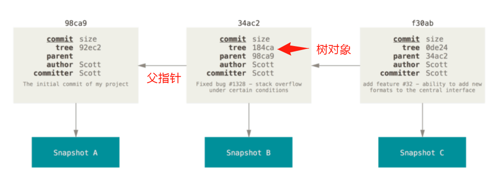
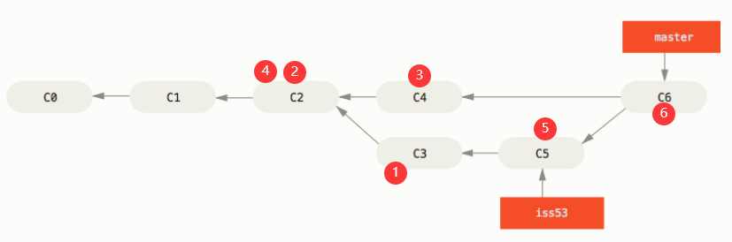

# git

版本控制：本地$\longrightarrow$集中$\longrightarrow$分布式。[官方文档](https://git-scm.com/book/zh/v2)

## 配置

1. `gitconfig`文件——对应`--system`：

1. `.gitconfig`文件——对应`--global`：`core.editor、user.name、user.email`
2. 仓库里的`config`文件——对应`--local`：

```shell
git config --list --show-origin  #显示所有配置信息和文件
git config --global <key> [val]  #将某个key的值设为val，无val表示获取key的值
```

+ 获取帮助

```shell
git help <verb>  #获取vecb命令的在线帮助文档manpage
git <verb> -h    #获取简洁的帮助
```

+ 忽略文件，使用`.gitignore`文件 ，格式规范如下：
  + 注释：所有空行或者以 `#` 开头的行都会被 Git 忽略。
  + 可以使用标准的 glob 模式匹配（**正则表达式**），它会递归地应用在整个工作区中。
  + 匹配模式可以以（`/`）开头防止递归。
  + 匹配模式可以以（`/`）结尾指定目录。
  + 取反：要忽略指定模式以外的文件或目录，可以在模式前加上叹号（`!`）取反。

```shell
# 忽略所有的 .a 文件
*.a
# 但跟踪所有的 lib.a，即便你在前面忽略了 .a 文件
!lib.a
# 只忽略当前目录下的 TODO 文件，而不忽略 subdir/TODO
/TODO
# 忽略任何目录下名为 build 的文件夹
build/
# 忽略 doc/notes.txt，但不忽略 doc/server/arch.txt
doc/*.txt
# 忽略 doc/ 目录及其所有子目录下的 .pdf 文件
doc/**/*.pdf
```

+ 其他配置

```shell
git config --global --unset http.proxy      #取消代理，
git config --global http.sslVerify "false"  #取消ssl验证
git config --global credential.helper store #保存密码
```


## 操作


1. 初始化：1）本地：`git init`，2）克隆：`git clone`本地master分支跟踪远程master分支。
2. **记录操作**：Git 保存的不是文件的变化或者差异，而是一系列不同时刻的 **快照** 。

```shell
git status  #查看状态 --short(-s)简短信息
git diff    #查看未暂缓文件的修改的地方  --staged(--cached) 暂存和上一次提交间的差别
git log     #查看提交日志 --patch(-p)显示每次提交所引入的差异 --stat统计信息 -n前n次提交
   
git add <file>   	     #跟踪（暂存）文件, git add .跟踪所有修改了文件
git commit -m "提交说明"  #提交暂存的修改  -a提交所有修改（包括未暂存的） --amend补交，覆盖刚刚的提交
git reset HEAD <file>    #取消暂存文件
git checkout -- <file>   #撤销文件的修改
   
git rm <file>  			 #记录删除文件的操作  -f强制从暂存中删除  --cached从暂存中删除，文件保留
git mv <name> <newname>  #更改暂存区里文件的名字
```

3. **远程操作**：

```shell
git remote #查看已经配置的远程仓库服务器 -v简写与其对应的URL；show <remote> 显示remote远程仓库信息
git remote add <shortname> <url>  #添加一个新的远程Git仓库
   
git fetch <remote>            #从remote远程中 拉取所有你还没有的数据 只会将数据下载到你的本地仓库 不合并
git pull                      #本地分支跟踪了远程分支， 拉取
git push <remote> <branch>    #将本地分支推送到remote的branch分支

git remote rename <remote> <newname> #修改一个远程仓库的简写名
git remote remove <remote>           #移除远程仓库
```

## 分支

分支意味着你可以把你的工作**从开发主线上分离开来**，以免影响开发主线。 

+ 在进行提交操作时，Git 会保存一个提交对象（commit object），计算每个目录的校验和，并把**校验和保存为树对象**。
  + 包含一个指向暂存内容快照（*blob* 对象）的指针。
  + 包含了作者的姓名和邮箱、提交时输入的信息。
  + 包含指向它的父对象的指针
  + 包含指向树对象（项目根目录，blob 对象索引）的指针，



Git 的默认分支名字是 `master`，有一个名为 `HEAD` 的特殊指针，**指向当前所在的本地分支**。

### 新建、合并

对不同分支进行不同的操作，时机成熟时可将它们合并起来。

```shell
git log --oneline --decorate  				#查看各分支当前所指对象
git log --oneline --decorate --graph --all  #查看分叉历史

git branch <branch>   		  #创建<branch>分支 -d删除分支 -v每一个分支的最后一次提交
git checkout <branch>   	  #切换到branch分支 -b新建分支并切换到新分支 -d
git merge <branch>            #将branch分支合并到当前分支
git mergetool
```

真实生产中的例子

  1. 切换到新分支iss53处理新问题。
  2. 线上有bug需要处理，切回master分支，
  3. 新建hotfix分支处理bug，
  4. 切回master分支，将hotfix合并到master，并删除hotfix分支。
  5. 切回iss53分支继续开发。
  6. 切回master分支，将iss53合并到master分支。删除iss53分支



可以将各分支是为流水线，这样更好理解。


### 合并冲突

如果两个分支修改了文件的同一处地方。会产生冲突，等待我们处理后，再合并

```shell
<<<<<<< HEAD:index.html  #head所指的当前分支所作的修改
<div id="footer">contact : email.support@github.com</div>
======= #分割符
<div id="footer">
 please contact us at support@github.com
</div>
>>>>>>> iss53:index.html #iss53分支所做的修改。
```

选择其中一部分，然后使用`git add`标记冲突已解决

