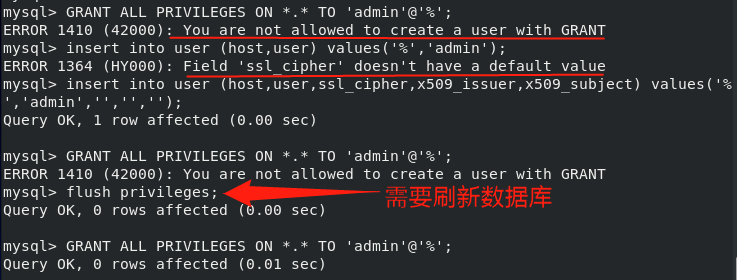
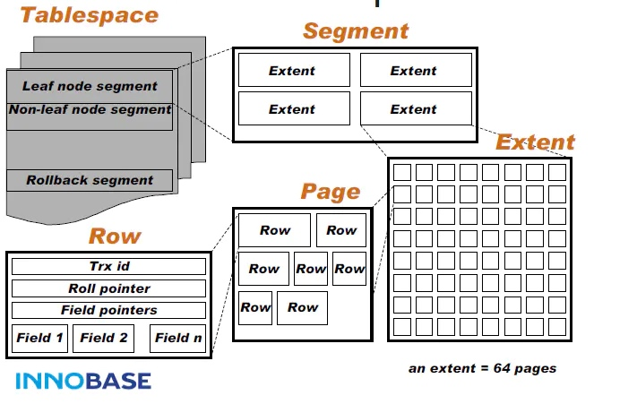
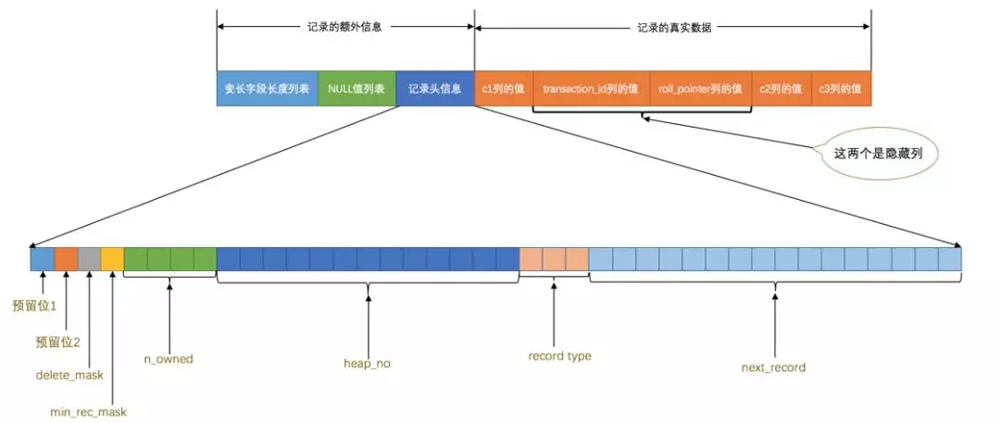

# mysql

## 启动服务

centOS使用`systemctl`启动、关闭、重启服务`mysqld`。然后会自动取调用mysqld.service

```shell
systemctl enable mysqld   #允许mysql自启动，start\stop\restart
systemctl list-unit-files |grep mysql  #查看自启动程序列表
mysql -u root -h localhost -p  #登录mysql
```

## 用户管理

+ 新增用户：`insert into user (host,user,ssl_cipher,x509_issuer,x509_subject) values('%','admin','','','');`;
  + `ssl_cipher,x509_issuer,x509_subject`这三个字段必须有。取消了`password`字段。
  + 不支持`grant`添加用户。
+ 修改权限：新增用户后，需要刷新数据库`flush privileges;`后，再进行`GRANT ALL PRIVILEGES ON *.* TO 'admin'@'%';`



+ 远程连接：需要修改用户的host为客户端的ip或者`%`，同时还要让防火墙开通3306端口。

  ```shell
  firewall-cmd --zone=public --add-port=3306/tcp --permanent  #开通3306端口
  firewall-cmd --list-ports  #查看开通的端口
  ```

## 知识点

+ 索引是关系数据库中对某一列或多个列的值进行预排序的数据结构。通过使用索引，可以让数据库系统不必扫描整个表，而是直接定位到符合条件的记录，这样就大大加快了查询速度。

## 表操作

+ DQL：查询语句，select
+ DML：修改语句，insert、delete、update。表数据。
+ DDL：定义语句，create、drop、alter。表结构。
+ TCL：事务控制，commit、rollback，
+ DCL：数据控制，grant、revoke。

### 基本查询

```mysql
SELECT 列名称 FROM 表名称									#查询
SELECT DISTINCT 列名称 FROM 表名称						#去重
SELECT 列名称 FROM 表名称 WHERE 条件					   #条件查询	不等于<> BETWEEN LIKE AND OR
SELECT 列名称 FROM 表名称 ORDER BY 列	  				    #顺序		  降序 DESC ASC
SELECT 列名称 FROM 表名称 GROUP BY 列						#分组
INSERT INTO 列名称 (列1, 列2,...) VALUES (值1, 值2,....)	#插入 不声明列，则表示所有列
UPDATE 表名称 SET 列名称 = 新值 WHERE 列名称 = 某值			#更新
DELETE FROM 表名称 WHERE 列名称 = 值						#删除
SELECT 列名称 FROM 表名称	LIMIT M OFFSET N				 #分页 每页M条数据，第N页 offset x表示跳过x条语句
```

### 高级

- [ ] 通配符：% 任意字符，_ 单个字符，[] 列表， [^] 取反
- [ ] 关联：输出优先级。
- `[INNER] JOIN`: 如果两表中有至少一个匹配，则返回行，
- `LEFT JOIN`: 即使右表中没有匹配，也从左表返回所有的行
- `RIGHT JOIN`: 即使左表中没有匹配，也从右表返回所有的行
- `FULL JOIN`: 只要其中一个表中存在匹配，就返回行

|       关键字       |                作用                 |                             例子                             |
| :----------------: | :---------------------------------: | :----------------------------------------------------------: |
|       LIMIT        |        要返回的记录的数目。         |                SELECT * FROM Persons LIMIT 5                 |
|        LIKE        | 在 WHERE 子句中搜索列中的指定模式。 |          SELECT * FROM Persons WHERE City LIKE 'N%'          |
|         IN         |              列表范围               |  SELECT * FROM Persons WHERE LastName IN ('Adams','Carter')  |
|  BETWEEN ... AND   |              两值之间               | SELECT column_name(s) FROM table_name WHERE column_name BETWEEN value1 AND value2 |
|         AS         |                别名                 |     SELECT column_name(s) FROM table_name AS alias_name      |
|       COUNT        |              统计行数               |              SELECT COUNT(*) num FROM students;              |
| SUM、AVG、MAX、MIN |      列求和、平均、最大、最小       | SELECT AVG(score) average FROM students WHERE gender = 'X';  |
|      GROUP BY      |                分组                 |     SELECT COUNT(*) num FROM students GROUP BY class_id;     |
|         ON         |            确定连接条件             | SELECT * FROM students s INNER JOIN classes cON s.class_id = c.id; |

- [ ] 数据类型
- 整数：integer(size)、smallint、int 
- 浮点数：decimal(size,d)、numeric
- 字符：char(size)、varchar
- 时间：date(yyyymmdd)
- @是用户变量，@@是系统变量。

```mysql
CREATE DATABASE database_name			#创建数据库
CREATE TABLE 表名称					  #创建表
(
    列名称1 数据类型 NOT NULL,							# 不接受 NULL 值
    列名称2 数据类型 DEFAULT 'Sandnes',				# 默认值
    列名称3 数据类型 AUTO_INCREMENT,					# 在新记录插入表中时生成一个唯一的数字。
    ....
    PRIMARY KEY(Id_p)								# 主键 唯一值
    UNIQUE (idx) 									# 唯一值
    FOREIGN KEY (Id_P) REFERENCES Persons(Id_P)		# 外键约束，用于预防破坏表之间连接的动作。
    CONSTRAINT chk_Person CHECK (Id_P>0 AND City='Sandnes') # 检查
)
CREATE INDEX index_name ON table_name (column_name) # 创建索引
ALTER TABLE table_name DROP INDEX index_name		# 删除索引、表和数据库。
ALTER TABLE table_name ADD column_name datatype  	# 已有的表中添加、修改或删除列。

CREATE VIEW view_name AS 		# 视图包含行和列，就像一个真实的表。
SELECT column_name(s)
FROM table_name
WHERE condition
```

## 函数

```mysql
IFNULL(expression, alt_value)		#判断是否为null,不为null返回本来的值，否则alt_value
```


## 事务

数据库事务具有ACID：

- A：Atomic，原子性，将所有SQL作为原子工作单元执行，要么全部执行，要么全部不执行；
- C：Consistent，一致性，事务完成后，所有数据的状态都是一致的，即A账户只要减去了100，B账户则必定加上了100；
- I：Isolation，隔离性，如果有多个事务并发执行，每个事务作出的修改必须与其他事务隔离；
- D：Duration，持久性，即事务完成后，对数据库数据的修改被持久化存储。

```mysql
BEGIN;   #显示事务
UPDATE accounts SET balance = balance - 100 WHERE id = 1;
UPDATE accounts SET balance = balance + 100 WHERE id = 2;
COMMIT;

#可以用ROLLBACK回滚事务，
```

## 深入

+ 现代数据库大体可以分为三层：
  + 最上层用于连接、线程处理等；
  + **中间层**提供数据库的核心功能，包括 SQL 解析、分析、优化、视图等；
  + 底层就是数据库的**存储引擎**，负责数据的存储与提取。
+ MySQL 的存储引擎主要分为两大类：**事务型、非事务型**，只有 InnoDB 引擎支持事务。
+ InnoDB 是最广泛使用的存储引擎。支持事务，满足 ACID 约束。支持行级锁，崩溃恢复和多版本并发控制（MVCC）。是唯一支持外键引用完整性约束的存储引擎。
  + InnoDB 将表结构存储在 `.frm` 文件中，数据和索引存储在 `.idb` 文件中。`.idb` 文件是由 InnoDB 管理的特殊格式的数据文件，表示每一个表独有的**表空间（tablespace）**。

  + **表空间**中，所有的数据记录都被**逻辑地**存放在表空间中。表空间被进一步划分为段（segment）、区（extent）、页（page）。页是 InnoDB 管理数据的最小磁盘单位，每个 16KB 大小的页中可以存放 2-200 行的记录。

    

    + 页：File Header、Page Header（状态）、Infimum + Supremum（最小记录和最大记录）、User Records（用户空间）、Free Space（空闲空间）、Page Directory、File Trailer。
    + 记录行格式：额外信息+数据信息。heap_no（在页中位置），next_record（从当前记录的真实数据到下一条记录的真实数据的地址偏移量）。

    

    + Page Directory：记录页内的分组：
      + 将所有正常的记录（包括最大和最小记录，不包括标记为已删除的记录）划分为几个组。
      + 每个组的最后一条记录的头信息中的`n_owned`属性表示该组内共有几条记录。
      + 将每个组的最后一条记录的**地址偏移量**按顺序存储起来，页中存储地址偏移量的部分也被称为`Page Directory`。
      + 对于最小记录所在的分组只能有 **1** 条记录，最大记录所在的分组拥有的记录条数只能在 **1~8** 条之间，剩下的分组中记录的条数范围只能在是 **4~8**条之间。**满8平分**。
    + File Trailer：校验和，写回磁盘时，先写file header里的校验和，最后写File Trailer里的校验和。判断数据写回是否**完整**。

  + InnoDB 的行记录在物理存储上**并不是顺序的**。通过行记录中的 `next_record` 指针表示它们之间的逻辑顺序（主键值由小到大）。

  + InnoDB 在查找某条记录时，并不能直接找到对应的行记录，而是只能获取到记录所在的页，然后**将整个页面加载到内存中**，在内存中遍历找到具体行。

  + **根据数据与索引的存储关联性划分**：区别就是索引的存储顺序和数据的存储顺序是否是关系的，有关就是聚簇索引，无关就是非聚簇索引

    + InnoDB 存储引擎的数据存储方式是**聚集索引**。InnoDB 的每个表有且仅有一个聚集索引。InnoDB 默认会使用每个表的主键顺序，为表格中所有行记录构建一棵 **B+ 树**，其叶节点**以页面为单位，存放完整的行记录**，所有叶节点存放了整张表的数据。
    + **非聚集索引**也称为辅助索引。非聚集索引同样是一棵 B+ 树，但是叶节点仅存储索引列的所有键，和对应行记录的主键。

  + 根据是否是在主键上建立的索引进行划分：

    + **主键索引**：主键索引的叶子节点存储了完整的数据行。
    + **辅助索引**：二级索引，而非主键索引的叶子节点存储的则是主键索引值，


# 高性能MYSQL

## 逻辑框架

连接管理与安全性、

### 优化与执行：

并发控制、读写锁、锁粒度（锁开销）：表锁、行级锁。

**事务**：一组具有原子性的SQL操作（原子单元）。mysql默认将每个查询都当作一个事务提交。

+ 原子性atomicity：不可分割的最小单元，要么成功，要么失败。
+ 一致性consistency：数据库的状态始终是从一个一致性状态转为另一个一致性状态。（事务执行过程中崩溃，操作将不会保存到数据库中）。
+ 隔离性isolation：一个事务提交前，对其他事务是不可见的，（事务执行中间，其他事务进来，当前操作不可见）。
+ 持久性durability：一旦提交，修改永久保存到数据库中。

**隔离级别**：一个事务的修改，那些在事务内和事务间是可见的。

```mysql
SET TRANSACTION ISOLATION LEVEL READ COMMITTED;     #修改隔离级别
```

+ **未提交读**read uncommitted：数据修改，即使没有提交，对其他事务都是可见的，读取未提交的数据（**脏读**）。
+ **提交读**read committed：提交前所作的修改，对其他事务都不可见。**不可重复读**（两次读结果可能不一样）。
+ **可重复度**repeatable read（mysql默认隔离机制）：解决脏读，同一事务中的多次读取结果一样。**幻读**（某事务读取某个范围时，另一个事务在该范围插入了新数据，再次执行该事务，产生了幻行）。
+ **可串行化**serializable：强制事务串行执行。避免了幻读。读取的每一行数据都加锁。

**死锁**：

+ 多事务同时锁定同一个资源时，可能发生死锁。

**事务日志**：

+ 存储引擎在修改数据时，只需要修改其内存里的拷贝数据，再将修改行为记录到硬盘上的事务日志中，采用追加的方式，写到磁盘某小块区域内的顺序io，无需移动磁头。事务持久化后，内存中被修改的数据，可以在后台慢慢写回磁盘。

**多版本并发控制**MVCC：

+ 行级锁的变种，多数情况下，避免了加锁操作。

### 存储引擎


# redis

+ 在服务器中常用来存储一些需要频繁调取的数据，这样可以大大节省系统直接读取磁盘来获得数据的I/O开销，

+ Redis支持五种数据类型：**string（字符串），hash（哈希），list（列表），set（集合）及zset**(sorted set：有序集合)。是一个灵活的高性能 **key-value 数据结构存储**。

+ 单个 Redis 命令的执行是**原子性**的，但 Redis 没有在事务上增加任何维持原子性的机制，所以 Redis 事务的执行并不是原子性的。

+ 因为Redis的存储分为内存存储、磁盘存储和log文件三部分，重启后，Redis可以从磁盘重新将数据加载到内存中，

```shell
redis-cli -h host -p port -a password			#连接redis服务器
SET key value		   							#写 GET读 DEL删
HMSET hash value								#哈希映射，HGET读取 HDEL删
LPUSH list value								#向列表list的头插入value  RPUSH尾
SADD set value									#向集合中添加value 集合中最大的成员数为2^32 – 1 SMEMBERS所有成员 SISMEMBER判断是否在集合中
ZADD zset level value							#向有序集合中添加value 
PFADD key value									#向key里添加元素
XGROUP CREATE 									#创建消费者组 
XADD ID field value 							#添加消息到末尾
SUBSCRIBE key									#订阅频道key
PUBLISH key value								#向频道key里发布消息value
EVAL script numkeys key [key ...] arg [arg ...] #redis脚本
```

+ Redis HyperLogLog 是用来做基数统计的算法，比如数据集 {1, 3, 5, 7, 5, 7, 8}， 那么这个数据集的基数集为 {1, 3, 5 ,7, 8}, 基数(不重复元素)为5。 基数估计就是在误差可接受的范围内，快速计算基数。
+ Redis GEO 主要用于存储地理位置信息，并对存储的信息进行操作，
+ Redis Stream ：主要用于消息队列（MQ，Message Queue）：
  + Consumer Group：一个消费组有多个消费者。
  + last delivered id ：游标，每个消费组会有个游标 last delivered id，读取信息，游标向前移动。
  + pending ids ：消费者的状态变量，维护消费者的未确认的 id，


+ Redis 事务可以一次执行多个命令：

  + 批量操作在发送 EXEC 命令前被放入队列缓存。`MULTI` 用来组装一个事务，`EXEC` 用来执行一个事务；
  + 收到 EXEC 命令后进入事务执行，事务中任意命令执行失败，其余的命令依然被执行。
  + 在事务执行过程，其他客户端提交的命令请求不会插入到事务执行命令序列中。`WATCH` 用来监视一些 key，`DISCARD` 用来取消一个事务；
  + watch一旦发现某个 key 被修改了，**再执行 EXEC 时就会返回 nil**，表示事务无法触发。

  对于事务的执行来说，如果 redis 开启了 AOF 持久化的话，那么一旦事务被成功执行，事务中的命令就会通过 write 命令一次性写到磁盘中去，如果在向磁盘中写的过程中恰好出现断电、硬件故障等问题，那么就可能出现只有部分命令进行了 AOF 持久化，这时 AOF 文件就会出现不完整的情况，这时，我们可以使**用 redis-check-aof 工具来修复这一问题**，这个工具会将 AOF 文件中不完整的信息移除，确保 AOF 文件完整可用。

+ redis 提供了两种持久化的方式，分别是**RDB**（Redis DataBase）和**AOF**（Append Only File）：**采用先写临时文件，全部完成后再替换的流程**。

  + RDB，简而言之，就是在不同的时间点，将 redis 存储的数据生成快照并存储到磁盘等介质上；
    + 会先将数据写入到一个**临时文件**中，待持久化过程都结束了，才会用这个临时文件替换上次持久化好的文件。
    + 适用场合：对于数据恢复的完整性不是非常敏感。
  + AOF，则是换了一个角度来实现持久化，那就是将 redis 执行过的**所有写指令记录下来**，在下次 redis 重新启动时，只要把这些写指令从前到后再重复执行一遍，就可以实现数据恢复了。
    + 如果有写操作（如 SET 等），redis 就会被追加到 AOF 文件的末尾。默认的 AOF 持久化策略是每秒钟 fsync 一次。
    + redis 提供了 **AOF 文件重写**（rewrite）机制，即当 AOF 文件的大小超过所设定的阈值时，redis 就会启动 AOF 文件的内容压缩，只保留可以恢复数据的最小指令集。

+ 


# 《高性能mysql》

+ 架构：
  + 1）连接、线程处理，每个连接对应一个线程，服务完后不会销毁，服务器会缓存线程。
  + 2）查询解析、优化，跨存储引擎，
  + 3）存储引擎，数据的存储与提取。
+ 并发问题：多个请求同时要求写数据，
  + 读写锁：读（共享）、写（独占）。
  + 锁粒度：锁定的数据量，越小，并发程度越高。
  + 锁策略：锁的开销（加解锁消耗的资源）与数据安全的平衡。1）表锁：锁定整张表，2）行级锁：存储引擎实现。
+ 事务：一组原子性的SQL查询，mysql默认一条mysql语句为一个事务。由存储引擎提供。
  + 原子性atomicity：最小不可分割的工作单元。
  + 一致性consistency：一个一致性状态转为另一个一致性状态。
  + 隔离性isolation：最终提交前，所做修改对其他事务不可见。
  + 持久性：durability：一旦提交，则修改永远保留到数据库中。
+ 隔离级别：
  + 未提交读read uncommitted：不同事务中，即使未提交，修改其他事务不可见。
  +  提交读read committed：不同事务中，提交前，修改其他事务可见。
  + 可重复读repeatable read：同一事务中，多次读取同样的数据，结果一致。解决脏读。
  + 可串行化serialization：会在读取的每行数据都加锁。解决幻读，幻读：同一个事务中，两次范围操作间，有其他事务插入，导致后一次操作出现幻读（与之前结果不同）。
+ 事务日志：存储引擎修改表的数据时，只修改其内存中的拷贝，再把修改记录持久化（追加，不需要多次移动磁头）到硬盘上的事务日志中，持久化后，可在后台将修改的数据写回磁盘。
+ 多版本控制MVCC：一种行级锁的变种。乐观锁。
+ innodb：每行记录多了两个字段，行的创建时间和过期时间（版本号），每增加一个事务，系统版本号会自增。
  + 默认级别为可重复读，**使用间隙锁防止幻读**，
+ MYISAM：提供全文索引，不支持事务和行级锁，将表存储为数据文件和索引文件。
+ 基准测试：1）集成测试，2）单组件测试，
  + 指标：吞吐量、响应时间、并发量、可扩展性、


## 索引

索引类型：

+ B-Tree：范围，值比较，排序。
+ hash：全值匹配，查找块。
+ 伪哈希索引：将键值比较大的，自定义哈希函数，然后以哈希值建立索引。
+ 全文索引：查找文本中的关键词。
+ 前缀索引：使索引更小，更快。但无法group by，order by，覆盖扫描。


索引策略：

+ 长字符串索引：可以先索引前部分字符，要平衡较高的选择性（不重复索引值的占比）和较短的长度（节约空间和比较时间）。

