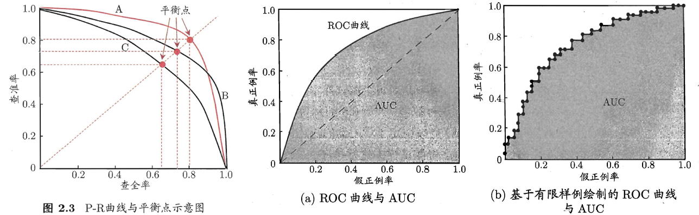
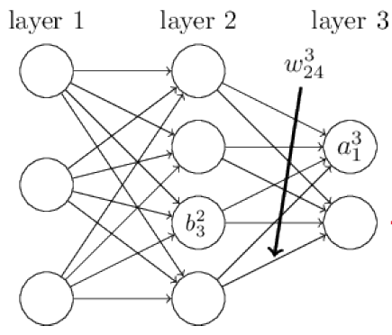
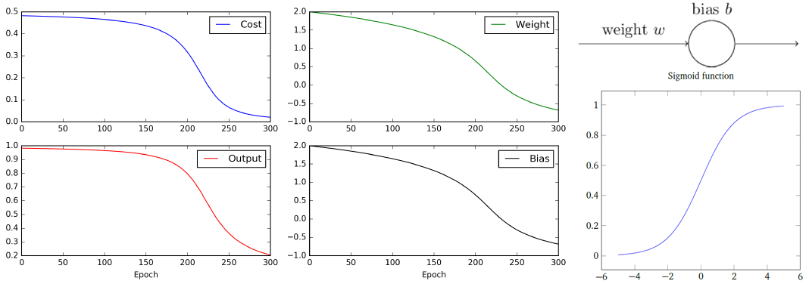
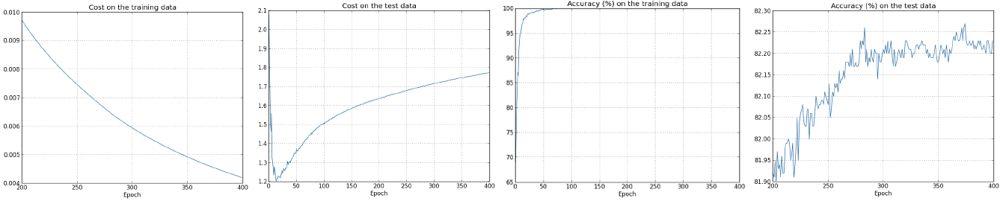
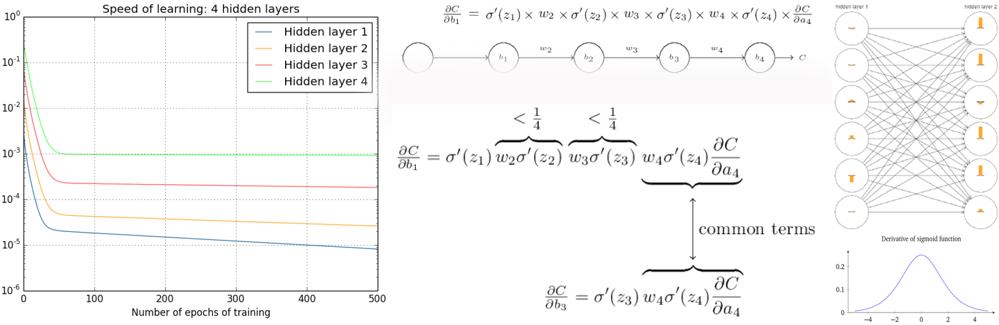
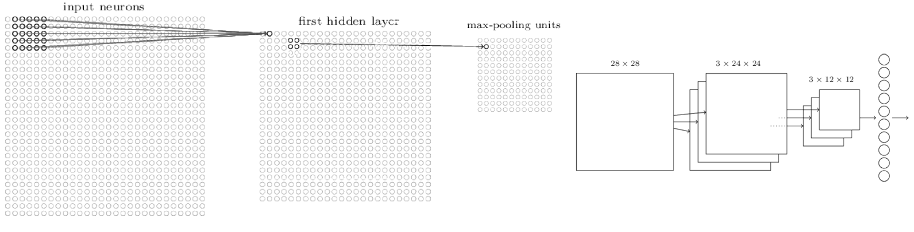

# 机器学习

## 评估方法

+ `错误率(error rate)`：m个样本中有a个样本分类错误，$ERR=\frac{a}{m}$。
+ `精度(accuracy)`：分类正确的`样本数`占总样本数的比例，$ACC=1-ERR$。
+ `误差(error)`：学习器的实际预测输出与样本的真实输出之间的差异。
+ `训练误差(training error)`：训练集上的误差。
+ `泛化/测试误差(generalization/testing error)`：新样本\测试集上的误差；用测试误差可近似泛化误差。
+ `过拟合(overfitting)`：，训练误差低，泛化误差高；反之则`欠拟合(underfitting)`。
+ 将一个**数据集划分**为训练集和测试集(`应保证数据集与子集的数据分布一致性`）：
  + `留出法(hold-out)`：将数据集划为两个互斥的集合。一般随机划分多次，取平均值。
  + `交叉验证法(cross validation)`：数据集划分为k 个大小相似的互斥子集，再取k-1个作训练集，剩下一个作测试集；进行k次训练测试后取平均值。一般也会随机划分，然后再取平均值，如`n次k折交叉验证`。
  + 留一法：交叉验证法的特例，每个样本作为 一个子集。
  + `自助法(bootstrapping)`：每次从数据集随机取一个，然后放回，进行m`(=数据集样本数)`次训练，获得训练集，原始数据集作为测试集。**会导致数据发布不一致**。
+ **调参(parameter  tuning)**`(训练阶段)`：不同参数导致模型性能不一样，设置变化`范围`和`步长`来决定最佳性能。使用训练集里的部分作为**验证集**`(validation set)`来评估模型性能。

## 性能度量

+ 二值分类结果根据`真实`类别被`预测`的类别划分：`真正例TP、假正例FP、真反例TN、假反例FN`。

  + `混淆矩阵(confusion matrix)`：一行为真实类别，每一列为预测类别，每一格表示某真实类被预测为某类的样例数或概率。
  + `查准率(precision)`：预测正例(TP+FP)中真正例的比例：==$P=\frac{TP}{TP+FP}$==，表示预测正例中有多少正例，越高表示提高正例判断的标准。
  + `查全率(recall)`：真实正例(TP+FN)中预测正例的比例：==$R=\frac{TP}{TP+FN}$==，表示正例中有多少被预测为正例，越高表示降低正例判断的标准。
  + `P-R图`：查准率为纵轴，查全率为横轴；曲线越向外表示性能越好。
  + `平衡点(Break-Event Point)`：查准率=查全率的点。

  + `ROC曲线(Receiver operating Characteristic)`：
    + 纵轴为真正例率==$TPR=\frac{TP}{TP+FN}$==，正例中多少正例被预测正确。
    + 横轴为假正例率==$FPR=\frac{FP}{TN+FP}$==，反例中多少被预测为正例。
    + AUC(ROC曲线下面积)：

  

[如何理解误识率（FAR）拒识率（FRR），TPR,FPR以及ROC曲线](https://blog.csdn.net/u014696921/article/details/74435229?utm_medium=distribute.pc_relevant.none-task-blog-BlogCommendFromMachineLearnPai2-1.nonecase&depth_1-utm_source=distribute.pc_relevant.none-task-blog-BlogCommendFromMachineLearnPai2-1.nonecase)、[人脸识别算法评价指标——TAR，FAR，FRR，ERR](https://blog.csdn.net/liuweiyuxiang/article/details/81259492?utm_medium=distribute.pc_relevant.none-task-blog-BlogCommendFromMachineLearnPai2-2.nonecase&depth_1-utm_source=distribute.pc_relevant.none-task-blog-BlogCommendFromMachineLearnPai2-2.nonecase)


# 卷积神经网络

## 卷积层

+ 卷积核的channel与输入特征的channel相同，如一张RGB图像，输入特征通道为3，则一个卷积核的深度为应该也为3，一个卷积核参数`3*k*k`，k为核的大小。
+ 输出的特征矩阵channel与卷积核个数相同，如有两个卷积核，输出的特征深度为2；
+ 激活函数，添加非线性能力。卷积核参数可加偏置。
+ 步长`stride`：卷积核移动的像素点个数，
+ 填补`padding`：在输入特征周围补零的宽度，扩展输入特征，如使得输出特征大小不变。
+ 卷积后特征的大小计算：$N=(W-F+2P)/S+1$；W为原特征大小，F为卷积核大小，P为填补大小，S为步长大小，

## 池化层

+ 对特征层进行稀疏处理，减少计算量（维度），
+ 最大池化，平均池化，没有参数，改变特征矩阵宽度和高度，不改变深度(channel)
+ 池化大小poolsize一般和步长stride一样。


# neural networks and deep learning

项目地址：https://github.com/mnielsen/neural-networks-and-deep-learning.git

## 1.使用neural nets识别手写字

+ 感知机(perceptron)，阶跃函数，$\varepsilon(z)=\begin{cases} 1 & \text{z>0}\\ 0 & \text{z<0} \end{cases} $：

  + n个二进制输入x~i~，一个二进制输出y，$y(x)=\varepsilon(w\cdot x+b)$；可模拟基本逻辑函数。
  + ==原理是：通过加权证据做出决策==。
  + 偏置bias：度量感知机激活的难易程度。
  + **组成的网络在权重和偏置的微小变化可能导致输出的剧烈变化**。

+ 主要使用的神经元模型为sigmoid neuron，$\sigma(z)=\frac{1}{1+e^{-z}}$：

  + ==学习原理：权重和偏置的微小变化可导致输出的微小变化==。

+ 数据集MNIST，训练集6万（包括1万验证集），测试集1万；大小28*28、灰度图

+ 二次损失函数，均方误差(MSE)：$C(w,b)=\frac{1}{2n}\sum_x ||y(x)-a||^2$，衡量预测与真值的近似程度，应尽可能的小。1/2方便求导。

+ 梯度下降(gradient descent)：

  + $\Delta C=\nabla C \cdot \nabla v=(\frac{\partial C}{\partial w },\frac{\partial C}{\partial b })^T\cdot(\nabla w,\nabla b)$。

  + 令$\nabla v=-\eta \nabla C$；则$\nabla C$一直为负值，持续迭代则可使$C$最小，$\eta$为**学习率**。

  + 所以分类问题变为最优化问题：

    > 1. 求梯度$\nabla C$。
    > 2. 计算$v\to v^,=v-\eta \nabla C$，使$w,b$向梯度的反方向移动，使$C$降低。
    > 3. 重复1，2使$C$最小。

  + ==注意：$\nabla C$是在整个训练集上进行求解的，如果每次迭代都在整个集合上进行，则非常慢。==

+ 随机梯度下降(stochastic gradient descent)：**用随机抽取的一小样本集上的梯度$\nabla C_x$估计总体梯度$\nabla C$**。即$\nabla C \approx \frac{1}{m} \sum_{j=1}^m \nabla C_{x_j}$。小样本集即为**mini-batch**。

+ 将整个训练集分为n个互斥mini-batch，对每个mini-batch执行后，称为一个**epoch**。

+ w、b迭代公式为：$\begin{aligned}w_k \to w_k^,=w_k-\frac{\eta}{m}\sum_j \frac{\partial C_{x_j}}{\partial w_k} \\ b_l\to b_l^,=b_l-\frac{\eta}{m}\sum_j \frac{\partial C_{x_j}}{\partial b_l}\end{aligned}$

+ 以上的$w,b$代表网络中所有的参数，是矩阵。

+ ==整个算法流程==：

  > 1. 参数$w,b$随机初始化；
  > 2. mini-batch里的每个样本$x_i$作为输入，通过前向传播(feedforward)计算输出值$y(x_i)$；
  > 3. 计算损失函数(cost function)，根据链式法则、反向传播(backpropagation)计算所有参数的变化值。
  > 4. 求mini-batch上的平均值，并更新所有$w,b$参数。重复2-4，直到完成规定的epoch或者，损失函数小于一定值。


  准确率95%左右，增加隐藏层到100，达96%左右。增大学习率，准确率明星降低。

## 2.backpropagation如何工作的

+ 符号表示：

  + $w_{jk}^l$：表示连接$l-1$层的第$k$个神经元与$l$层的第$j$个神经元的权重。

  + $b_j^l$：表示$l$层的第$j$个神经元的偏置。

  + $a_j^l$：表示$l$层的第$j$个神经元的激励，这个神经元向下一层的输出。

    

  + 三者间的关系：
    $$
    \begin{equation*}a_j^l=\sigma(\sum_k w_{jk}^l a_k^{l-1}+b_j^l) \\ a^l=\sigma(w^la^{l-1}+b^l)=\sigma(z^l)\end{equation*}
    $$
    其中$w^l\in R^{M\times K}$，$b\in R^M$；M为l层的神经元个数，K为l-1层的神经元个数。

+ `The four fundamental equations behind backpropagation`：

  + 定义l层第j个神经元的误差`error`：$\delta_j^l=\frac{\partial C}{\partial z_j^l}$，表示l层第j个神经元上发生$\Delta z_j^l$的变化，导致C的变化程度，则：

$$
\begin{gather*}  \delta_j^L = \frac{\partial C}{\partial a_j^L}\odot\sigma'(z_j^L) & \tag{BP1} \\  \delta^l =((w^{l+1})^T\delta^{l+1})\odot\sigma'(z^l) & \tag{BP2} \\  \frac{\partial C}{\partial b_j^l} = \delta_j^l & \tag{BP3} \\  \frac{\partial C}{\partial w_{jk}^l}=a_k^{l-1}\delta_j^l & \tag{BP4}\end{gather*}
$$

+ 证明：==链式求导法则：$z=f(u,v),u=\varphi(x,y),v=\psi(x,y)$，则$\frac{\partial z}{\partial x}=\frac{\partial z}{\partial u}\frac{\partial u}{\partial x}+\frac{\partial z}{\partial v}\frac{\partial v}{\partial x}$==。

  + $\delta_j^L=\frac{\partial C}{\partial z_j^L}=\sum_k \frac{\partial C}{\partial a_k^L}\frac{\partial a_k^L}{\partial z_j^L}\xlongequal{当j\neq k,则后面一项为0}\frac{\partial C}{\partial a_j^L}\sigma'(z_j^L)$。

  + 因为：$z_k^{l+1}=\sum_j w_{kj}^{l+1}\sigma(z_j^l)+b_k^{l+1}\Rightarrow\frac{\partial z_k^{l+1}}{\partial z_j^l}=w_{kj}^{l+1}\sigma'(z_j^l)$，k为下标；

    所以：$\delta_j^l=\frac{\partial C}{\partial z_j^l}=\sum_k\frac{\partial C}{\partial z_k^{l+1}}\frac{\partial z_k^{l+1}}{\partial z_j^l}=\sum_k \delta_k^{l+1}\frac{\partial z_k^{l+1}}{\partial z_j^l}=\sum_k w_{kj}^{l+1}\delta_k^{l+1}\sigma'(z_j^l)$。k为l+1层神经元的个数；

  + 因为：$z_j^l=\sum_k w_{jk}^l a_k^{l-1}+b_j^l \Rightarrow \frac{\partial z_j^l}{\partial b_j^l}=1;\frac{\partial z_j^l}{\partial w_{jk}^l}=a_k^{l-1}$；所以：

    + $\frac{\partial C}{\partial b_j^l}=\sum_k\frac{\partial C}{\partial z_k^l}\frac{\partial z_k^l}{\partial b_j^l}\xlongequal{当j\neq k,则后面一项为0}\delta_j^l$；
    + $\frac{\partial C}{\partial w_{jk}^l}=\sum_i\frac{\partial C}{\partial z_i^l}\frac{\partial z_i^l}{\partial w_{jk}^l}\xlongequal{当i\neq j,则后面一项为0}\delta_j^la_k^{l-1}$。

+ 代码：

  ```python
  class Network(object):
      def __init__(self , sizes):
          self.num_layers = len(sizes)
          self.sizes = sizes
          self.biases = [np.random.randn(y, 1) for y in sizes[1:]] #第一是输入层，没有偏置
          self.weights = [np.random.randn(y, x) for x, y in zip(sizes[:-1], sizes[1:])]
          
      def feedforward(self, a):
          for b, w in zip(self.biases, self.weights):
              a = sigmoid(np.dot(w, a)+b)
          return a
      
      def SGD(self, training_data, epochs, mini_batch_size, eta, test_data=None):
          if test_data: 
              n_test = len(test_data)
          n = len(training_data)
          for j in xrange(epochs):
              random.shuffle(training_data)
              mini_batches = [training_data[k:k+mini_batch_size] for k in xrange(0, n, mini_batch_size)]
              for mini_batch in mini_batches:
                  self.update_mini_batch(mini_batch, eta)  #更新参数
              if test_data:
                  print "Epoch {0}: {1} / {2}".format(j, self.evaluate(test_data), n_test)
              else:
                  print "Epoch {0} complete".format(j)
                  
      def update_mini_batch(self, mini_batch, eta):
          nabla_b = [np.zeros(b.shape) for b in self.biases]
          nabla_w = [np.zeros(w.shape) for w in self.weights]
          for x, y in mini_batch:
              delta_nabla_b, delta_nabla_w = self.backprop(x, y)  #求每个样本参数的梯度，再求和
              nabla_b = [nb+dnb for nb, dnb in zip(nabla_b, delta_nabla_b)]
              nabla_w = [nw+dnw for nw, dnw in zip(nabla_w, delta_nabla_w)]
          self.weights = [w-(eta/len(mini_batch))*nw for w, nw in zip(self.weights, nabla_w)] #更新参数
          self.biases = [b-(eta/len(mini_batch))*nb for b, nb in zip(self.biases, nabla_b)]
          
      def backprop(self, x, y):
          nabla_b = [np.zeros(b.shape) for b in self.biases]
          nabla_w = [np.zeros(w.shape) for w in self.weights]
          # feedforward
          activation = x
          activations = [x] 
          zs = [] 
          for b, w in zip(self.biases, self.weights):
              z = np.dot(w, activation)+b   #每个神经元的输入
              zs.append(z)
              activation = sigmoid(z)  #每个神经元的输出
              activations.append(activation)
          # backward pass
          delta = self.cost_derivative(activations[-1], y) * sigmoid_prime(zs[-1])  #最后一层的delta
          nabla_b[-1] = delta
          nabla_w[-1] = np.dot(delta, activations[-2].transpose())
          for l in xrange(2, self.num_layers):  #依次往前计算delta_w，delta_b
              z = zs[-l]
              sp = sigmoid_prime(z)
              delta = np.dot(self.weights[-l+1].transpose(), delta) * sp  #计算前面一层的delta^(l-1)
              nabla_b[-l] = delta
              nabla_w[-l] = np.dot(delta, activations[-l-1].transpose())
          return (nabla_b, nabla_w)
      
      def evaluate(self, test_data):
          test_results = [(np.argmax(self.feedforward(x)), y) for (x, y) in test_data]
          return sum(int(x == y) for (x, y) in test_results)
  
      def cost_derivative(self, output_activations, y):
          return (output_activations-y)
  
  def sigmoid(z):
      return 1.0/(1.0+np.exp(-z))
  
  def sigmoid_prime(z):
      return sigmoid(z)*(1-sigmoid(z))
  ```

  

## 3. Improving the way neural networks learn

+ 使用sigmoid函数，当输出接近1，变化缓慢；如图右上角最简单的模型，输入1，输出0；对于二次损失函数$C=\frac{(y-a)^2}{2}$，可以求得导数$\frac{\partial C}{\partial w}=(a-y)\sigma'(z)x=a\sigma'(z)$，$\frac{\partial C}{\partial b}=(a-y)\sigma'(z)=a\sigma'(z)$。当w,b初始值为2时，学习会如图一样非常慢。

  

+ `cross-entropy cost function`：
  $$
  C=-\frac{1}{n}\sum_x[y\ln a+(1-y)\ln(1-a)]\tag{eq1}
  $$
  偏导为：
  $$
  \frac{\partial C}{\partial w_j}=\frac{1}{n}\sum_x \frac{\sigma'(z)x_j}{\sigma(z)(1-\sigma(z))}(\sigma(z)-y) \tag{eq2}
  $$
  sigmoid函数的导数为：$\sigma'(z)=\sigma(z)(1-\sigma(z))$；则eq2变为：
  $$
  \frac{\partial C}{\partial w_j}=\frac{1}{n}\sum_x x_j(\sigma(z)-y) \tag{eq3}
  $$
  参数学习的速度正比于输出的偏差，越大变化越快。准确率相比之前提高一点点。

+ `Softmax`：定义一个新的输出层，在输出层不使用sigmoid函数，而是通过以下公式产生输出的概率发布。
  $$
  a_j^L=\frac{e^{z_j^L}}{\sum_k e^{z_k^L}} \tag{eq4}
  $$
  损失函数：$C=-\ln a_j^L$。

+ `Overfitting and regularization`：测试集上的效果并没有像训练集那样好。

  

  + `early stopping`（hold out method）：使用验证集来确定训练过程中，在验证集上出现效果最好的时候作为最终模型，

  + 降低过拟合最简单的办法是增加训练集数量。或者降低网络的规模。

  + 或者正则化(regularization)：如L2正则化，
    $$
    C=C_0+\frac{\lambda}{2n}\sum_w w^2 \tag{eq5}
    $$

  + `Dropout`：通过修改网络结构，通过每次mini-batch随机删掉部分神经元，训练多个网络，然后用如投票的方式组合成更好的网络。

  + `Artificially expanding the training data`：微调数据，增加训练集数量。

+ `Weight initialization`：

+ `rectified linear unit`：$\max(0,z)$，

+ 代码：

  ```python
  class QuadraticCost(object):
      @staticmethod
      def fn(a, y):
          return 0.5*np.linalg.norm(a-y)**2
      
      @staticmethod
      def delta(z, a, y):
          return (a-y) * sigmoid_prime(z)
  
  class CrossEntropyCost(object):
      @staticmethod
      def fn(a, y):
          return np.sum(np.nan_to_num(-y*np.log(a)-(1-y)*np.log(1-a)))
      
      @staticmethod
      def delta(z, a, y):
          return (a-y)
      
  class Network(object):
      ……
      def default_weight_initializer(self):
          self.biases = [np.random.randn(y, 1) for y in self.sizes[1:]]
          # 更改初始化方法，效果好一点
          self.weights = [np.random.randn(y,x)/np.sqrt(x) for x, y in zip(self.sizes[:-1], self.sizes[1:])]
  
      def update_mini_batch(self, mini_batch, eta, lmbda, n):
          ……
          self.weights = [(1-eta*(lmbda/n))*w-(eta/len(mini_batch))*nw #添加了正则项
                          for w, nw in zip(self.weights, nabla_w)]
          self.biases = [b-(eta/len(mini_batch))*nb
                         for b, nb in zip(self.biases, nabla_b)]
  
      def backprop(self, x, y):
          ……
          delta = (self.cost).delta(zs[-1], activations[-1], y)
          nabla_b[-1] = delta
          nabla_w[-1] = np.dot(delta, activations[-2].transpose())
          ……
  ```

  

## 4. A visual proof that neural nets can compute any function


## 5.Why are deep neural networks hard to train?

+ 对于一些函数来说，浅层网络相比深层网络，需要的神经元呈指数级的增长。
+ `unstable gradients`：
  + `vanishing gradient problem`：==前面的隐藏层比后面的隐藏层学得慢==。如图所示，黄色的条表示参数的变化幅度。
  + `exploding gradient problem`：与vanishing相反，



## 6.Deep learning

+ 卷积神经网络的基本概念：

  + `Local receptive fields`：隐藏层的一个神经元只连接**原图的一小部分相邻区域**，
  + `Shared weights and biases`：将局部感受域在整个图上滑动，作为隐藏层不同神经元的输入，连接中的权重和偏置不改变。并将该输入层到隐藏层的映射称为一个`feature map`。一组共享的权重和偏置确定了一个feature map。这组参数也称为`kernel or filter`。
  + `Pooling layers`：简化卷积层输出的信息，如：`L2 pooling`，`Max-pooling`

  

+ 实践：

  + 之前的网络，测试集上的准确率为97.80%。

  + 卷积神经网络：准确率为98.78%。

  + 继续添加卷积池化层，准确率可达99.06%；第二个卷积层的输入为20个12\*12的feature map，设置了40个kernel，每个kernel的参数为20\*5\*5+1，对应将20个feature map上的同一感受野域作为输入。

+ 将sigmoid函数改为rectified linear units(ReLU)，准确率为99.23%。

+ 扩展训练集，准确率为99.37%；再添加一个全连接层，准确率为99.43%；再利用dropout获得99.60%。