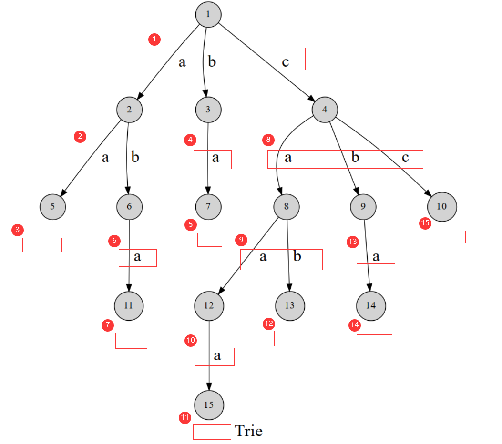
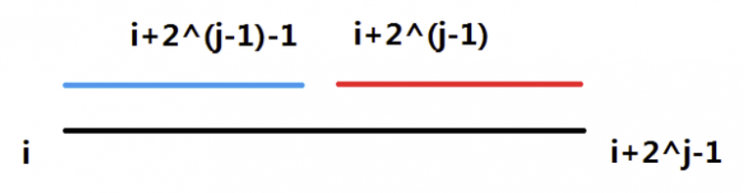
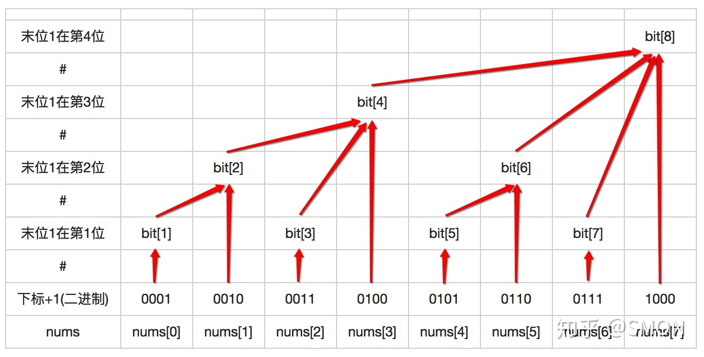
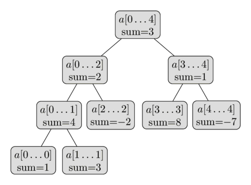

[参考](https://oi-wiki.org/)、

# 排序

- [ ] **选择排序**（selection sort）：每次**找出第$i$小的元素**（也就是$[i,n)$中最小的元素），然后将这个元素与数组第 $i$个位置上的元素交换。

- [ ] **冒泡排序**（bubble sort）：每次**检查相邻两个元素**，如果前面的元素与后面的元素满足给定的排序条件，就将相邻两个元素交换。当没有相邻的元素需要交换时，排序就完成了。
- [ ] **插入排序**（insertion sort）：将待排列元素划分为“已排序”和“未排序”两部分，每次从“未排序的”元素中选择一个**插入到“已排序的”元素中的正确位置**。
- [ ] **计数排序**（Counting sort）：计数排序的工作原理是**使用一个额外的数组$C$** ，其中第$i$个元素是待排序数组$A$中值等于$i$的元素的个数，然后根据数组 $C$来将 $A$中的元素排到正确的位置。可以使用**前缀和**快速得到排名。
- [ ] **基数排序**（Radix sort）：将待排序的元素拆分为$K$个关键字，然后先对第$k$关键字进行稳定排序，再对第$k-1$关键字进行稳定排序，再对第 $k-2$关键字进行稳定排序。

```c++
void counting_sort(int p) {
  memset(cnt, 0, sizeof(cnt));
  for (int i = 1; i <= n; ++i) ++cnt[a[i].key[p]];
  for (int i = 1; i <= w[p]; ++i) cnt[i] += cnt[i - 1];
  // 为保证排序的稳定性，此处循环i应从n到1
  // 即当两元素关键字的值相同时，原先排在后面的元素在排序后仍应排在后面
  for (int i = n; i >= 1; --i) b[cnt[a[i].key[p]]--] = a[i];
  memcpy(a, b, sizeof(a));
}

void radix_sort() {
  for (int i = k; i >= 1; --i) {
    //借助计数排序完成对关键字的排序
    counting_sort(i);
  }
}

```

- [ ] **快速排序**（quick sort）：1）将数列划分为两部分（**要求保证相对大小关系**）；2）递归到两个子序列中分别进行快速排序。

```c++
while (left < right) {
      while (arr[left] < mid && left < right) left++;
      while (arr[right] >= mid && left < right) right--;
      std::swap(arr[left], arr[right]);
}

```

- [ ] **归并排序**（merge sort）：1）将数列划分为两部分；2）递归地分别对两个子序列进行归并排序；3）合并两个子序列。

```c++

void merge(int ll, int rr) {
  // 用来把 a[ll.. rr - 1] 这一区间的数排序。 t 数组是临时存放有序的版本用的。
  if (rr - ll <= 1) return;
  int mid = ll + (rr - ll >> 1);
  merge(ll, mid);
  merge(mid, rr);
  int p = ll, q = mid, s = ll;
  while (s < rr) {
    if (p >= mid || (q < rr && a[p] > a[q])) {
      t[s++] = a[q++];
      // ans += mid - p;  //求逆序对 前一段第[p,mid)的数大于a[q];
    } else
      t[s++] = a[p++];
  }
  for (int i = ll; i < rr; ++i) a[i] = t[i];
}
//关键点在于一次性创建数组，避免在每次递归调用时创建，以避免对象的无谓构造和析构。
```

- [ ] **堆排序**（Heap sort）：对所有待排序元素建堆，然后依次取出堆顶元素，就可以得到排好序的序列。

```c++

void max_heapify(int arr[], int start, int end) {
  // 建立父结点指标和子结点指标
  int dad = start;
  int son = dad * 2 + 1;
  while (son <= end) {  // 子结点指标在范围内才做比较
    if (son + 1 <= end &&
        arr[son] < arr[son + 1])  // 先比较两个子结点大小，选择最大的
      son++;
    if (arr[dad] > arr[son])  // 如果父结点比子结点大，代表调整完毕，直接跳出函数
      return;
    else {  // 否则交换父子内容，子结点再和孙结点比较
      swap(arr[dad], arr[son]);
      dad = son;
      son = dad * 2 + 1;
    }
  }
}

void heap_sort(int arr[], int len) {
  // 初始化，i 从最后一个父结点开始调整
  for (int i = len / 2 - 1; i >= 0; i--) max_heapify(arr, i, len - 1);
  // 先将第一个元素和已经排好的元素前一位做交换，再重新调整（刚调整的元素之前的元素），直到排序完毕
  for (int i = len - 1; i > 0; i--) {
    swap(arr[0], arr[i]);
    max_heapify(arr, 0, i - 1);
  }
}
```

- [ ] **桶排序**（Bucket sort）：1）设置一个定量的数组当作空桶；2）遍历序列，并将元素一个个放到对应的桶中；3）对每个不是空的桶进行排序；4）从不是空的桶里把元素再放回原来的序列中。类似于分块处理。
- [ ] **希尔排序**（Shell sort）：排序对**不相邻**的记录进行比较和移动：1）将待排序序列分为若干子序列（每个子序列的元素在原始数组中间距相同）；2）对这些子序列进行插入排序；3）减小每个子序列中元素之间的间距，重复上述过程直至间距减少为 1。

```c++

template <typename T>
void shell_sort(T array[], int length) {
  int h = 1;
  while (h < length / 3) {
    h = 3 * h + 1;
  }
  while (h >= 1) {
    for (int i = h; i < length; i++) {
      for (int j = i; j >= h && array[j] < array[j - h]; j -= h) {
        std::swap(array[j], array[j - h]);
      }
    }
    h = h / 3;
  }
}
```

- [ ] **锦标赛排序**（Tournament sort）：1）两两进行比较，胜者进入下一轮比赛。2）一次＂锦标赛＂可以选出一组元素中最小的那一个。3)重复进行2，前一轮确定的优胜者之外的组可以继续使用。

```c++
int n, a[maxn], tmp[maxn << 1];

int winner(int pos1, int pos2) {
  int u = pos1 >= n ? pos1 : tmp[pos1];
  int v = pos2 >= n ? pos2 : tmp[pos2];
  if (tmp[u] <= tmp[v]) return u;
  return v;
}

void creat_tree(int &value) {
  for (int i = 0; i < n; i++) tmp[n + i] = a[i];
  for (int i = 2 * n - 1; i > 1; i -= 2) {
    int k = i / 2;
    int j = i - 1;
    tmp[k] = winner(i, j);
  }
  value = tmp[tmp[1]];
  tmp[tmp[1]] = INF;
}

void recreat(int &value) {
  int i = tmp[1];
  while (i > 1) {
    int j, k = i / 2;
    if (i % 2 == 0 && i < 2 * n - 1)
      j = i + 1;
    else
      j = i - 1;
    tmp[k] = winner(i, j);
    i = k;
  }
  value = tmp[tmp[1]];
  tmp[tmp[1]] = INF;
}

void tournament_sort() {
  int value;
  creat_tree(value);
  for (int i = 0; i < n; i++) {
    a[i] = value;
    recreat(value);
  }
}
```

# 搜索

## DFS深度优先

利用递归函数方便地实现暴力枚举的算法，将要搜索的目标分成若干“层”，每层基于前几层的状态进行决策，直到达到目标状态。

```c++
int dfs(int k,/*其他条件*/){
    for(/*第k层可能的情况*/){
        ans[i]=dfs(k+1,/*条件*/);
    }
    return sum(ans)/*总结*/;
}
```

## BFS宽度优先

宽度优先。就是每次都尝试访问同一层的节点。 如果同一层都访问完了，再访问下一层。

```c++
int bfs(){
    que.push(start);
    while(que.empty()){
        x=que.top(),que.pop();
        for(i/*x点可行的情况*/){
            que.push(i);
        }
    }
}
```

## 双向搜索

双向同时搜索的基本思路是从状态图上的**起点和终点同时**开始进行 [广搜](https://oi-wiki.org/search/bfs/) 或 [深搜](https://oi-wiki.org/search/dfs/)。如果发现搜索的两端相遇了，那么可以认为是获得了可行解。

## 启发式搜索

在普通搜索算法的基础上引入了**启发式函数**，该函数的作用是基于已有的信息对搜索的**每一个分支选择都做估价**，进而选择分支。简单来说，启发式搜索就是对取和不取都做分析，从中**选取更优解或删去无效解**。可行性剪枝、最优性剪枝。

## A*搜索算法

对于有多个节点的路径求出**最低通过成本**的算法。Dijkstra计算每一个节点**距离起点**的总移动代价（每次取最小值）。最佳优先搜索计算每个节点**到达终点**的代价。A*算法考虑两者：优先级为：
$$
f(n)=g(n)+h(n)
$$
$g(n)$节点n距离起点的代价；$h(n)$节点n距离终点的**预计代价**。执行过程类似Dijkstra，

启发函数：

1. 当启发函数$h(n)$始终为0，则将由$g(n)$决定节点的优先级，此时算法就退化成了Dijkstra算法。
2. 如果$h(n)$始终小于等于节点n到终点的代价，则A*算法保证一定能够找到最短路径。值越小，算法将遍历越多的节点，也就导致算法越慢。
3. 如果$h(n)$的值比节点n到终点的代价要大，则A*算法不能保证找到最短路径，不过此时会很快。


## 回溯法

其本质是：走不通就回头。

## 剪枝

去掉一些没有必要的搜索分支，记忆化搜索、最优性剪枝、可行性剪枝。

- [ ] 记忆化搜索：**相同的传入值**往往会带来相同的解，那我们就可以用数组来记忆。
- [ ] 最优性剪枝：当**前解已经比已有解差**时，停止搜索。
- [ ] 可行性剪枝：在搜索中**当前解已经不可用**了。

# 动态规划

Dynamic programming，把原问题分解为相对简单的**子问题**，适用于有重叠子问题和最优子结构性质的问题。解其不同部分（即子问题），再根据子问题的解以得出原问题的解。仅仅**解决每个子问题一次**，从而减少计算量，一旦某个给定子问题的解已经算出，则将其**记忆化存储**。

动态规划应用于子问题重叠的情况：

1. 要去刻画最优解的结构特征；
2. 尝试递归地定义最优解的值（就是我们常说的考虑从$i-1$转移到$i$ ）；
3. 计算最优解；
4. 利用计算出的信息构造一个最优解。

## 记忆化搜索

对于**相同一组参数**，dfs **返回值总是相同**的。**答案以返回值**的形式存在。

## 背包 DP

每个物体只有2种可能的状态（取与不取），正如二进制中的1和 0。

设 DP 状态$f_{i,j}$为在只能放前 $i$个物品的情况下，容量为 $j$的背包所能达到的最大总价值。
$$
f_{i,j}=max(f_{i-1,j},f_{i-1,j-w_i}+v_i)
$$
第一项为不取第i个物品，第二项为取第i个物品。

# 并查集

处理一些不交集的 **合并** 及 **查询** 问题。

```c++
//初始化
void makeSet(int size) {
	for (int i = 0; i < size; i++) fa[i] = i;  // i就在它本身的集合里
}
//查找
int fa[MAXN];  // 记录某个人的爸爸是谁，特别规定，祖先的爸爸是他自己
int find(int x) {
	if (x != fa[x])  // x不是自身的父亲，即x不是该集合的代表
		fa[x] = find(fa[x]);  // 查找x的祖先直到找到代表,于是顺手路径压缩
	return fa[x];
}
//合并
vector<int> size(N, 1);  // 记录并初始化子树的大小为 1
void unionSet(int x, int y) {
	int xx = find(x), yy = find(y);
	if (xx == yy) return;
	if (size[xx] > size[yy])  // 保证小的合到大的里
		swap(xx, yy);
	fa[xx] = yy;
	size[yy] += size[xx];
}
```

# 堆

孩子节点值大于（小于）父亲节点的完全二叉树。

+ 插入，末尾加数，向上调整，与父亲节点比较。
+ 弹出堆顶元素，将末尾的数放在堆顶，向下调整，取孩子较大（较小）的进行比较。

```c++
void up(int x) {
	while (x > 1 && h[x] > h[x / 2]) {
		swap(h[x], h[x / 2]);//不进行交换操作，过程相当于查找其对应的位置，不过需要在循环外增加一次赋值。
		x /= 2;
	}
}
void down(int x) {
	while (x * 2 <= n) {
		t = x * 2;
		if (t + 1 <= n && h[t + 1] > h[t]) t++;
		if (h[t] <= h[x]) break;
		swap(h[x], h[t]);
		x = t;
	}
}
```

# 单调栈、单调队列

求下一个更大元素，将栈顶的元素与当前元素相比，如果当前大，则表示前面元素的下一个更大元素为当前值。

```c++
while(stack.empty()&&a[stack.top()]<a[i]){//单减
    int id=stack.top(); 
    stack.pop();
    ans[id]=a[i];
}
stack.push(i);
```

求一个窗口内的最小值，使用单调增队列，存储可能的最小值，左边界达到队列头时，从头删除，最小值为队列头作为下标对应的值。

```c++
while(!deque.empty()&&a[deque.back()]>a[i])deque.pop_back();
deque.push_back(i);
if(deque.front()==i-K)deque.pop_front();
```

# 字符串

## 字典树Trie



字典树用**边来代表字母**，而从根结点到树上某一结点的路径就代表了一个字符串。exist[p]表示以p结尾的字符串存在。

```c++
//如图所示依次添加 "aa","ba","aba","caaa","cab","cba","cc";exist[3,5,7,11,12,14,15]=1;分别对应各字符串
struct trie {
	int nex[100000][26], cnt;  //cnt 一排长度为26的新空间，
	bool exist[100000];  // 该结点结尾的字符串是否存在

	void insert(char* s, int l) {  // 插入字符串
		int p = 0;
		for (int i = 0; i < l; i++) {
			int c = s[i] - 'a';
			if (!nex[p][c]) nex[p][c] = ++cnt;  // 如果没有，就添加结点
			p = nex[p][c];
		}
		exist[p] = 1;
	}
	bool find(char* s, int l) {  // 查找字符串
		int p = 0;
		for (int i = 0; i < l; i++) {
			int c = s[i] - 'a';
			if (!nex[p][c]) return 0;//提前截至了，说明没有匹配的字符串
			p = nex[p][c];
		}
		return exist[p];
	}
};
```


# 范围查询操作

操作：对于一个数组，长度n，1）求某个区间的和，2）更新某个值。

思路：将区间分块，记录每个子块的和，某个区间的和等于**该区间包括的子块之和**，更新某个值，只需要**更新相关块的和**。

## ST表

最大最小查询

+ 求区间的最大\最小值。$f(i,j)$表示区间$[i,i+2^j-1]$的最大值，状态转移方程：$f(i,j)=max(f(i,j-1),f(i+2^{j-1},j-1))$。

  则给定$[l,r]$，分为$f[l,l+2^s-1],f[r-2^s+1,r]$两个区间，其中$s=log_2(r-l+1)$。



```c++
const int logn = 21;
const int maxn = 2000001;
int f[maxn][logn + 1], Logn[maxn + 1];
void pre() { //求出每个数i对应的log2(i)值
	Logn[1] = 0;
	Logn[2] = 1;
	for (int i = 3; i < maxn; i++) {
		Logn[i] = Logn[i / 2] + 1;
	}
}
for (int i = 1; i <= n; i++) f[i][0] = read();

for (int j = 1; j <= logn; j++){//逐层求出每个位置长度为2^j区域的最大值
    for (int i = 1; i + (1 << j) - 1 <= n; i++)
      f[i][j] = max(f[i][j - 1], f[i + (1 << (j - 1))][j - 1]);
}
```


## 树状数组（Binary Indexed Tree）

用一个大节点表示一些小节点的信息，进行查询的时候只需要查询一些大节点而不是更多的小节点。大节点是为2的整数幂次方的位置。

+ 树状数组：长度n，如下图所示，$2^i$的位置存储之前所有的和。**查询前缀和，单点增加**。



```c++
// 算出x二进制的从右往左出现第一个1以及这个1之后的那些0组成数的二进制对应的十进制的数
int lowbit(int x) {  
  return x & -x;  //x的负数为每位取反+1，所以x&-1得x最右端1的位置
}
// 求前缀和，a[1]……a[x]的和 如[1,7]区间：可以划分成[1,4], [5,6]和[7,7]
int getsum(int x) {  
  int ans = 0;
  while (x >= 1) { 
    ans = ans + c[x];
    x = x - lowbit(x);  //将最右端的1变为0，下一区间
  }
  return ans;
}
//对下标为x的值增加k
void add(int x, int k) {
  while (x <= n) {  // 不能越界
    c[x] = c[x] + k;
    x = x + lowbit(x);  //更新父亲节点，
  }
}
```

+ 求一个数组的逆序对数，将数组排序，得到每个元素的排名，将问题转化为**排名的前序和**。后面有多少元素比它小。
  1. 从后往前，依次求**元素排名位置的前序和**，表示当前数加进去，对于后面比它较小的元素而言，所产生的新增逆序对数。
  2. 更新树，元素排名位置和他上级加一，表示更新位置i（排名）的前面新增了1比当前排名低（值小）的数。

```c++
int cnt = 0;
for (int i = A.size() - 1; i >= 0; --i) {
    cnt += query(A[i]);
    update(A[i], 1);//排名为A[i]位置上的数个数加一
}
```

## 线段树（Segment Tree）

申请长度为4n的额外数组，构成完全二叉树，叶节点存储当个值，**根节点储存整个区间的和，子节点各存储半个的范围和**。

+ 叶子节点n个，中间节点x；树的边数e=2x，节点数v=e+1；x+n=2x+1；所以**中间节点个数为n-1**。
+ 坐标的最大值，叶节点可能会在最高一层的后几个位置，$1+2+4+\dots+2^{[log_2n]}=2^{[log_2n]+1}<4*n$。



```c++
//根节点为下标为1
class SegmentTree {
    vector<int> rangeSum;
public:
    SegmentTree(int n): rangeSum(n * 4){ }
    //求个区间的和，树的当前节点v覆盖数组arr的左边界tl，和右边界tr。
    void build(vector<int>& arr, int v, int tl, int tr)
    {
        if (tl == tr) { //当前区间只有一个元素
            rangeSum[v] = arr[tl];
        } else {
            int tm = (tl + tr) / 2;
            build(arr, v * 2, tl, tm);
            build(arr, v * 2 + 1, tm + 1, tr);
            rangeSum[v] = rangeSum[v * 2] + rangeSum[v * 2 + 1];
        }
    }
    //查询区间[l,r]的和
    int query(int v, int tl, int tr, int l, int r)
    {
        if (l > r)
            return 0;
        if (l == tl && r == tr) { //当前子区间为需要查询的区间
            return rangeSum[v];
        }
        int tm = (tl + tr) / 2;
        int leftRange = query(v * 2, tl, tm, l, min(r, tm));
        int rightRange = query(v * 2 + 1, tm + 1, tr, max(l, tm + 1), r);
        return leftRange + rightRange;
    }
    //更新值
    void update(int v, int tl, int tr, int pos, int new_val)
    {
        if (tl == tr) {
            rangeSum[v] = new_val;
        } else {
            int tm = (tl + tr) / 2;
            if (pos <= tm) //修改值在左子区间
                update(v * 2, tl, tm, pos, new_val);
            else
                update(v * 2 + 1, tm + 1, tr, pos, new_val);
            rangeSum[v] = rangeSum[v * 2] + rangeSum[v * 2 + 1];
        }
    }
};
```

+ **Range updates (Lazy Propagation)**，一次修改一个区间里的所有值，**记录范围的操作，要查询时，再将操作下沉到具体位置上**。如1）求区间最大值，2）区间每个值加val。

```c++
class SegmentTree {
    vector<int> rangeMax, lazy;

  public:
    SegmentTree(int n) : rangeMax(n * 4), lazy(n * 4) {}
    void push(int v) {
        rangeMax[v * 2] += lazy[v];
        rangeMax[v * 2 + 1] += lazy[v];
        lazy[v * 2] += lazy[v]; //操作下沉到子区间
        lazy[v * 2 + 1] += lazy[v];
        lazy[v] = 0;
    }
    //树的当前节点v覆盖数组arr的左边界tl，和右边界tr。
    void build(vector<int> &arr, int v, int tl, int tr) {
        if (tl == tr) { //当前区间只有一个元素
            rangeMax[v] = arr[tl];
        } else {
            int tm = (tl + tr) / 2;
            build(arr, v * 2, tl, tm);
            build(arr, v * 2 + 1, tm + 1, tr);
            rangeMax[v] = fmax(rangeMax[v * 2], rangeMax[v * 2 + 1]);
        }
    }
    //更新区间[l,r]里所有元素值
    void update(int v, int tl, int tr, int l, int r, int addend) {
        if (l > r)//区间外不更新
            return;
        if (l == tl && tr == r) { //当前区间的元素都要操作
            rangeMax[v] += addend;
            lazy[v] += addend;
        } else {
            push(v); //该区间大于操作区间[l,r]，下沉之前累积的操作，
            int tm = (tl + tr) / 2;
            update(v * 2, tl, tm, l, min(r, tm), addend);
            update(v * 2 + 1, tm + 1, tr, max(l, tm + 1), r, addend);
            rangeMax[v] = max(rangeMax[v * 2], rangeMax[v * 2 + 1]);
        }
    }
    //查询区间[l,r]的大值
    int query(int v, int tl, int tr, int l, int r) {
        if (l > r) 
            return INT_MIN;
        if (l <= tl && tr <= r)
            return rangeMax[v];
        push(v); //
        int tm = (tl + tr) / 2;
        int leftMax = query(v * 2, tl, tm, l, min(r, tm));
        int rightMax = query(v * 2 + 1, tm + 1, tr, max(l, tm + 1), r);
        return fmax(leftMax, rightMax);
    }
};
```

## 后缀数组

  

