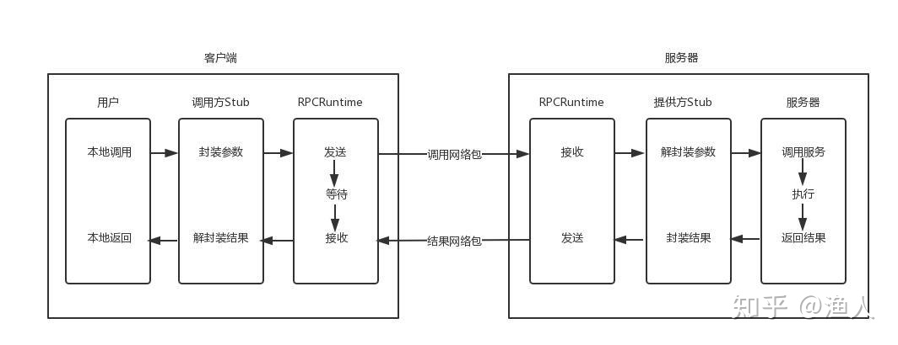

# c语言网络编程

# RPC

- 需要事先约定调用的语义(接口语法)
- 需要网络传输
- 需要约定网络传输中的内容格式

gRPC 一开始由 google 开发，是一款语言中立、平台中立、开源的远程过程调用(RPC)系统。

+ gRPC可以通过protobuf来定义接口，从而可以有更加严格的接口约束条件。
+ 通过protobuf可以将数据序列化为二进制编码，这会大幅减少需要传输的数据量，