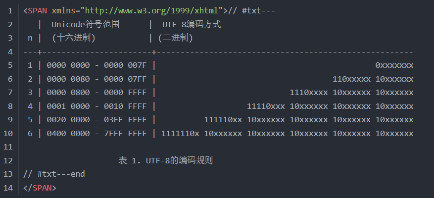
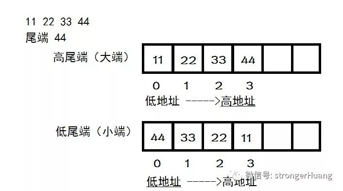
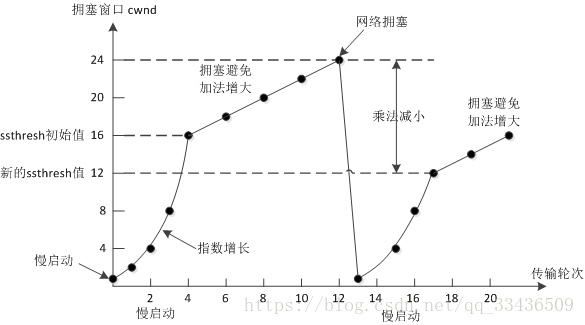
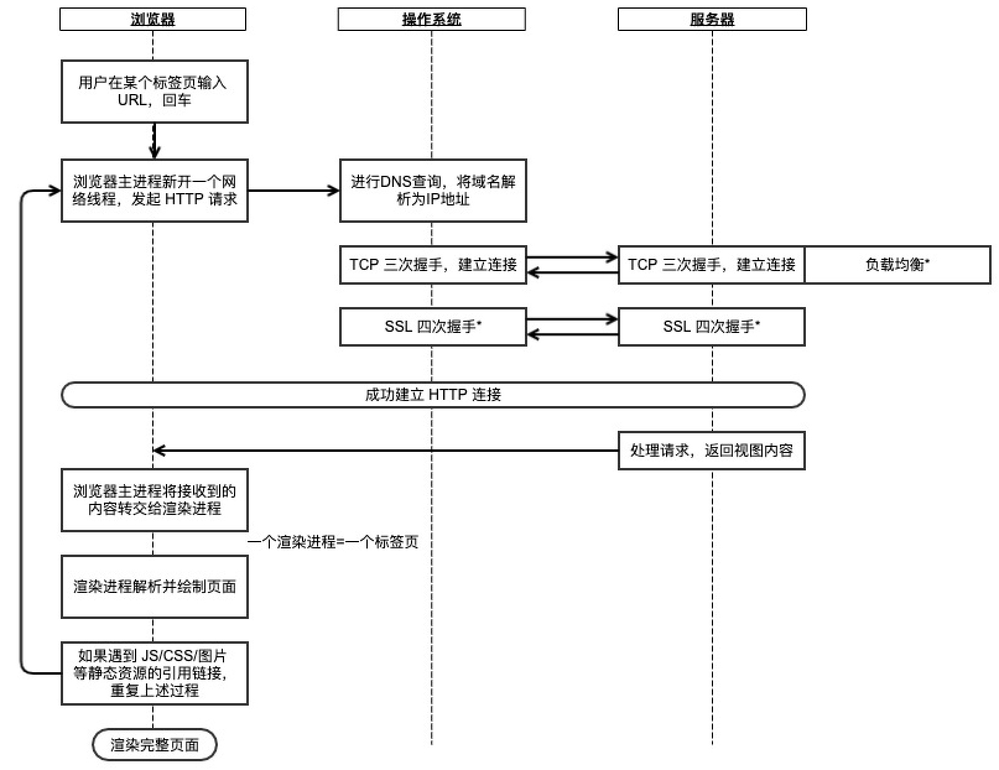

# 操作系统

## 快速入门

### 程序

+ 状态，根据权限可分为：用户态、内核态。一些特殊操作，IO、申请资源等，需要特殊的权限。切换：系统调用、异常、外设中断。

+ **陷阱**（软中断）的主要作用是实现**系统调用**。每个系统调用有一个唯一的整数号，对应于内核中一个跳转表的偏移量。

+ **中断**由处理器**外部**的**硬件**产生，不是执行某条指令的结果，也无法预测发生时机。操作系统使用**中断描述符表**（Interrupt Descriptor Table，IDT）来保存每个中断的中断处理程序的地址。

  + 中断向量表（interrupt vector table，IVT）（IDT）：每个中断向量都是一个中断处理程序的入口地址。
  
+ 异常是一种错误情况，异常处理程序的地址也保存在中断描述符表（IDT）中。

+ 信号是一种**更高层的**软件形式的异常，**通知进程**发生了某种系统事件。产生：键盘、kill程序、kill函数、alarm函数。

  + 每个进程有一个待处理信号的集合（未决信号集），屏蔽信号集。
  + 任何时刻同一类型的待处理信号最多只有一个，
  + 处理时机：当内核把进程**从内核态切换到用户态时**。
  + 处理方法：默认操作、忽略信号（不做操作，处理了）、处理信号（具体函数）。

### 内存

+ 内存分配：
  + 等长固定分区法：分区大小相同，不能改变，每次给进程分配一整块区域，内部碎片多，
  + 不等长固定分区法：根据进程的大小在空闲分区中选择一个大小合适的分区
  + 动态分区法：通过空闲分区链表进行组织。
  + **页式内存管理**：将内存分为很多小块，逻辑上通过页表关联。
  + **段式内存管理**：按照逻辑意义将程序分成若干个段。
  + 段页式内存管理：先段后页。

+ 在系统中**为每个程序定义一个虚拟地址空间**，虚拟地址空间中的地址都是连续的。
+ 实现：
  1. 虚拟地址空间被分割成多个块，每块称为一个页或者**页面**；
  2. 物理内存被分成和页面大小相同的多个区域，称作**页框**。
  3. CPU 的**硬件**负责将虚拟地址映射到物理内存中的地址（页面 -> 页框）。需要时（**缺页中断**），将虚拟页面加载到物理内存的页框中。
  4. 页表：每个进程有一个页表，描述该进程**每个页面对应的页框号**，以及该页面是否已经被载入内存（“在/不在”位）。
     + 页框号、存在位、访问位、修改位，页面号
  5. 针对大内存的页表：多级页表，
+ 每次执行语句时都需要先查找页表，消耗大，解决方法：转换检测缓冲区TLB， MMU（内存管理单元）的一部分。它提供一个缓冲区，记录虚拟页面号到物理页框号的映射，
+ 页面淘汰：内存空间已被占满而又要调入新的页面时，修改需要写回。
  + 最佳置换算法 / 最优策略（OPT）：评测标准，选择那些再次使用的时间距离现在最远的页面淘汰。
  + 先进先出法（FIFO）：直接换出最早装入的页面。
  + 第二次机会置换法（SCR：Second Chance Replacement）：每个页面访问 2 次后再淘汰。列表，
  + 时钟置换法（Clock）：而时钟置换法将页面保存在环形链表中，只需要后移队头指针。
  + 最近最少使用法（LRU：Least Recently Used）：优先淘汰最久未被访问的页面。**hashmap和双向链表**
  + 最近最不经常使用法（LFU：Least Frequently Used）：优先淘汰最近访问频率最少的数据。

### 进程
+ 进程是一个**拥有资源**和**执行任务**的单元体。资源包括：内存空间中的代码、数据等；I/O 资源；文件；处理机等。
+ 线程是一个**执行任务**的单元体。线程只需要切换处理机执行的上下文，都是用 `task_struct` 结构表示的。

  + 线程有自己的寄存器和栈，
  + 共享同一进程：内存空间（代码、公共数据、堆），文件描述符，信号处理器
  + 独享资源：线程 ID、寄存器、栈、错误返回码、信号屏蔽码。
+ 进程调度：
  + 1）就绪：进程已获得除处理机以外的所需资源，等待分配处理机资源，2）执行：进程正在占用处理机资源执行，3）阻塞：进程等待某种条件，在条件满足之前无法执行。4）挂起：将暂不执行的进程换出到外存，节省内存空间。
  + 调度算法：CPU分配方式：抢占式、非抢占式；饥饿：某个进程无限等待，无法被调度。目标：吞吐量（每小时最大作业数）、周转时间（每作业最小时间）、CPU 利用率（CPU 始终忙碌）。
  + 批处理调度算法：
    + 先来先服务（First Come First Serverd，FCFS）：按照请求 CPU 的顺序使用 CPU，非抢占式。
    + 最短作业优先（Shortest Job First，SJF）：预知作业的运行时间，选择最短时间的优先运行。可能导致饥饿。
    + 最短剩余时间优先（Shortest Remaining Time Next，SRTN）：最短作业优先的抢占式版本，可能导致饥饿。
    + 最高响应比优先算法（Highest Response Ratio Next，HRRN）：响应比的定义=作业等待时间/作业运行所需时间
  + 交互系统（分时系统）的调度算法：响应时间：要快速响应交互请求、
    + 时间片轮转（Round Robin，RR）：将所有就绪进程排成一个队列，按照时间片轮流调度，属于抢占式。
    + 优先级调度算法（Priority）：优先级高的进程先运行，同优先级的进程轮转。**当高优先级队列中没有进程后**，再调度下一级队列。
    + 多级反馈队列（Multilevel Feedback Queue，MFQ）：优先级高的队列先执行；优先级越高，时间片越短；如果一个进程在当前队列规定的时间片内无法执行完毕，则移动到下一个队列的队尾
+ 僵尸进程：进程会保持在一种“已终止”的状态中，等待它的父进程回收。终止但还未被回收，

  + 父进程调用`wait()` 或 `waitpid()` 来回收，
  + 内核会发生 `SIGCHLD` 信号给父进程，父进程可以注册一个信号处理函数，在该函数中调用 waitpid，等待所有结束的子进程；也可以用 signal(SIGCLD, SIG_IGN) 忽略 SIGCHLD 信号，那么子进程结束后，内核会进行回收
  + 杀死父进程，僵尸进程就会变成孤儿进程，由 Init 进程接管并处理
+ 孤儿进程：某个进程的父进程先结束了，用 Init 进程（pid = 1）接管，做回收工作。
+ 守护进程：一种在**后台执行**的电脑程序。
+ **写时复制（Copy-on-write，COW）**：将复制操作推迟到第一次写入时进行：在创建一个新副本时，不会立即复制资源，而是共享原始副本的资源；当修改时再执行复制操作。如fork，先父子进程共享内存，如果发生写，则触发一个保护故障（缺页异常），复制新副本。

### 进程间通信

+ 信号：操作系统提供发送信号的系统调用，
  + 发送：该系统调用会将信号放到目标进程的信号队列中，如果目标进程未处于执行状态，则该信号就由内核**保存**起来，直到该进程恢复执行并传递给它为止。如果一个信号被进程设置为阻塞，则该信号的传递被**延迟**，直到其阻塞被取消时才被传递给进程。
  + 接收：每个进程有一个信号队列，放其他进程发给它、等待它处理的信号，**进程在执行过程中的特定时刻**，检查并处理自己的信号队列。如从系统空间返回到用户空间之前。
  + 处理：默认操作、忽略信号（不做操作，处理了）、处理信号（具体函数）。
+ 管道：一种**半双工**的通信方式，数据只能单向流动，管道发送的内容是以字节为单位的，没有格式的字节流。
  + 创建：pipe()，只能用于具有**亲缘关系的进程**之间。管道就是一个文件，是一种**只存在于内存中的特殊的文件系统**。
  + 访问：操作系统会保证读写进程的同步，下游进程或者上游进程需要等另一方释放锁后才能操作管道。当管道为空时，下游进程读阻塞；当管道满时，上游进程写阻塞，管道不再被任何进程使用时，自动消失。
+ 命名管道：没有亲缘的进程间，mknode() 系统调用或者 mkfifo() 函数建立命名管道。会在磁盘中创建一个索引节点，命名管道实质上也是通过内核缓冲区来实现数据传输。过磁盘的索引节点来读写这块缓冲区。
+ 信号量：是一种特殊的变量，对它的操作都是原子的。有两种操作：V（signal()）和 P（wait()）。p为0阻塞，否则减一，v唤醒被阻塞的进程。
+ 共享内存mmap() ：共享同一段物理内存，不同进程可以将同一段共享内存映射到自己的地址空间，然后像访问正常内存一样访问它。不同进程可以通过向共享内存端读写数据来交换信息。**简单且高效**，不需要系统调用（只有读写时需要，管道4次）。
+ 信息队列：消息队列是一个**消息的链表**，保存在内核中。消息队列中的每个消息都是一个数据块，每个消息队列有唯一的 key，称为消息队列标识符。
+ 套接字：

### 协程

+ 协程是一个用户态的**线程**，用户在**堆**上模拟出协程的栈空间。
  + 在`Go`应用程序运行时，每个`goroutine`都维护着一个自己的栈区，这个栈区只能自己使用不能被其他`goroutine`使用。

### 锁

+ 互斥锁：

  + 实现：禁止中断、TLS 指令（锁住内存总线）、

+ 读写锁、

+ 自旋锁：这种持续观察一个变量直到它发生改变的过程叫“自旋”；通过原子操作实现的锁叫自旋锁。

+ 条件锁。

+ 生产/消费：利用两个的信号量full和empty，在加一个对临界区域访问的互斥锁mutex。

  ```c
  semaphore mutex = 1;      // 只能是 0 或 1，实现对临界区的互斥访问
  semaphore full = 0;       // 满槽数
  semaphore empty = N;      // 空槽数
  producer(){                                  consumer(){
      down(&empty);                                down(&full);
      down(&mutex);                                down(&mutex);
      //临界资源                                     //临界资源
      up(&mutex);                                  up(&mutex);
      up(&full);                                   up(&empty);
  }                                            }
  ```

+ 读写：同时读，读不可写，写不可读。**读：先修改锁，然后资源锁**

  ```c
  semaphore database = 1;     // 控制对数据库的互斥访问
  semaphore mutex = 1;        // 控制对 rc 的互斥访问
  int rc = 0;                 // readerCount, 当前数据库中的读者数量
  reader(){                                               writer(){
      down(&mutex);    /*修改读的数量*/                          down(&db);     /*等待可写*/
      rc++;                                                    //写
      if(rc==1)                                                up(&db);       /*写完*/
          down(&db);   /*第一个读，等待可读*/                 }
      up(&mutex);
      //读
      down(&mutex);    /*修改读的数量*/       
      rc--;                              
      if(rc==0)        /*最后一个读者，唤醒写*/
          up(&db);   
      up(&mutex);                                  
  }                                            
  ```

+ 死锁产生条件：

  + 互斥条件，
  + 占有且等待条件：线程占有已经分配给它们的资源（如锁）并且等待其他的资源（也就是说不会主动释放）
  + 不可抢占条件（也就是说不会被动释放）
  + 环路等待条件：每个进程都在等待下一个进程占有的资源

+ 避免死锁：银行家算法，

+ 解除死锁：回退执行、抢占资源、掉进程。


## 字符编码

计算机中储存的信息都是用二进制数表示的。按照何种规则将字符存储在计算机中，称为"**编码**"；将存储在计算机中的二进制数解析显示出来，称为"**解码**"。

**字符集（Charset）**：是一个系统支持的所有抽象字符的集合。字符是各种文字和符号的总称。常见字符集名称：ASCII字符集、GB2312字符集、BIG5字符集、GB18030字符集、Unicode字符集等。

**字符编码（Character Encoding）**：是一套法则，使用该法则能够对自然语言的字符的一个集合（如字母表或音节表），与计算机里的二进制串进行配对。

### ASCII字符集&编码

使用7位（bits）表示一个字符，共128字符；ASCII扩展字符集使用8位（bits）表示一个字符，共256字符。


### GBXXXX字符集&编码

GB2312：将127号之后的奇异符号们（即EASCII）取消掉，规定：一个小于127的字符的意义与原来相同，但**两个大于127的字符**连在一起时，就表示一个汉字，前面的一个字节（他称之为高字节）从0xA1用到 0xF7，后面一个字节（低字节）从0xA1到0xFE，这样我们就可以组合出大约7000多个简体汉字了，及更多符号。这就是常说的"全角"字符，而原来在127号以下的那些就叫"半角"字符了。

GB 18030：则扩展到了4个字节。

### Unicode字符集&UTF编码

Unicode编码系统为表达任意语言的任意字符而设计。它使用4字节的数字来表达每个字母、符号，或者表意文字(ideograph)。每个数字代表唯一的至少在某种语言中使用的符号。

在计算机使用32位二进制表示字符，则称为**UTF-32**编码。缺点是浪费空间。

#### UTF-16

因为Unicode字符集的编码值范围为`0-0x10FFFF`，而**大于等于`0x10000`**的辅助平面区的编码值无法用2个字节来表示，所以Unicode标准规定：基本多语言平面内，**`U+D800..U+DFFF`的值不对应于任何字符，为代理区**。因此，UTF-16利用保留下来的`0xD800-0xDFFF`区段的码位来对辅助平面的字符的码位进行编码。大于等于`0x10000`的可用4个字节表示。20位：`yyyy yyyy yyxx xxxx xxxx`

> 高位代理（high surrogate）：`0xD800..0xDBFF`。**1101 10yy yyyyyyyy**。
>
> 低位代理（low surrogate）：`0xDC00..0xDFFF`。**1101 11xx xxxxxxxx**。

#### UTF-8

编码中的第一个字节与ASCII兼容，其他字符集，UTF-8使用一至四个字节为每个字符编码：

1. 128个US-ASCII字符只需一个字节编码（Unicode范围由U+0000至U+007F）。
2. 带有附加符号的拉丁文、希腊文、西里尔字母、亚美尼亚语、希伯来文、阿拉伯文、叙利亚文及它拿字母则需要二个字节编码（Unicode范围由U+0080至U+07FF）。
3. 其他基本多文种平面（BMP）中的字符（这包含了大部分常用字）使用三个字节编码。
4. 其他极少使用的Unicode辅助平面的字符使用四字节编码。

### 关系

**在计算机内存中，统一使用Unicode编码，当需要保存到硬盘或者需要传输的时候，就转换为UTF-8编码**。

用记事本编辑的时候，从文件读取的UTF-8字符被转换为Unicode字符到内存里，编辑完成后，保存的时候再把Unicode转换为UTF-8保存到文件。

**转换规则**：对于n字节的符号(n>1), **第一个字节的前n位都设为1**, 第n+1位设为0, **后面字节的前两位一律设为10**. 剩下的没有提及的二进制位, 全部为这个符号的unicode码。



### 存储

小端Little endian：**数据的高字节**保存在**内存的高地址**中。

大端big endian：**数据的高字节**保存在**内存的低地址**中。类似于把数据当作字符串顺序处理。**网络字节序**。



Unicode规范中定义, 每一个文件的最前面分别加入一个表示编码顺序的字符, 这个字符的名字叫做"零宽度非换行空格"(ZERO WIDTH NO-BREAK SPACE), 用FEFF表示。则Big Endian(FEFF)  Little Endian(FFFE)


# 网络

## 快速入门

+ 功能
  + 应用层：对应于 OSI 参考模型的应用层，为用户提供所需要的各种服务。定义的是应用进程间的通信和交互的规则，不同的网络应用需要不同的应用层协议。协议包括 SMTP、HTTP、FTP 等
  + 传输层：对应于 OSI 参考模型的传输层，为应用层实体提供端到端的、**通用的**通信功能，保证了数据包的顺序传送及数据的完整性。“通用的”是指不同的应用可以使用同一个运输层服务。协议包括 TCP、UDP 等
  + 网络层（或网际互联层）：对应于 OSI 参考模型的网络层，主要解决主机到主机的路由问题。协议包括 IP、ICMP 等
  + 网络接入层：对应于 OSI 参考模型的物理层和数据链路层，负责相邻的物理节点间的可靠数据传输。协议包括 ARP、IEEE 802.2 等

+ 协议栈

|                                  |                                                              |
| :------------------------------: | :----------------------------------------------------------: |
| 应用层（应用层、表示层、会话层） | http、ftp、smtp(简单邮件传输)、telnet(远程登陆)、dns(域名解析)、ssh、dhcp(动态主机配置) |
|              传输层              |                tcp(传输控制)、udp(用户数据报)                |
|              网络层              | ip(网际协议)、icmp(网络控制消息)、igmp(网络组管理)、rip(路由信息)、osfp(开放式最短路径优先)、bgp(边界网关) |
|            数据链路层            |              *arp(地址解析)、arq(自动重传请求)               |
|              物理层              |                           IEEE802                            |

+ 硬件：
  + 集线器（Hub）是**物理层**的硬件，连接所有的线路，广播所有信息
  + 网桥（Bridge）是**数据链路层**的硬件。网桥隔离两个端口，不同的端口形成单独的冲突域，减少网内冲突。网桥在不同或相同类型的 LAN 之间存储并转发数据帧，根据 MAC 头部来决定转发端口，显然是数据链路层的设备。
  + 交换机（Switch）是**数据链路层**的硬件，相当于多端口的网桥。交换机内部存储 MAC 表，只会将数据帧发送到指定的目的地址。
  + 路由器（Router）是**网络层**的硬件，根据 IP 地址进行寻址，不同子网间的数据传输隔离
+ 时间名词：
  + MSL（Maximum segment lifetime）：报文最大生存时间。TCP 报文在网络上存在的最长时间，30 秒，1 分钟和 2 分钟。
  + TTL（Time to live）：IP 数据报在网络中可以存活的总跳数。取值范围 1-255。
  + RTT（Round trip time）：客户端到服务端往返所花时间。RTT 受网络传输拥塞的变化而变化，由 TCP **动态地估算**。
+ 传输层：
  + TCP：面向连接的、可靠的、基于字节流的传输层通信协议，**面向字节流**：TCP 将要发送的数据视为无结构的字节流，如果发送的数据太长，就拆分发送，如果发送的数据太短，则积累较多的字节后再发送。
  + UDP：无连接的、不可靠的、基于报文的传输层通信协议，**面向报文**：UDP 一次发送一个报文，不管多大，都以报文为发送单位，
  + 一次发送的最大数据量，直接受制于底层数据链路层，MTU=1500（去掉数据链路层的帧头尾，最小46）。因此tcp最大为：1500-20（ip）-20(tcp)，udp最大为：1500-20（ip）-8(tcp)，
  + 如果ip层数据包大小小于1500，则不用分包，否则需要分片。区别在于tcp如果ip出错，则会重发；udp如果ip出错，则失败，丢弃整个包。
  + 用Socket编程时，UDP协议要求包小于64K。
  + Internet编程时，建议将UDP数据控制在548字节以下（MTU值为576字节。

## tcp

+ TCP头格式：


+ 一个TCP连接需要四个元组来表示是同一个连接（src_ip, src_port, dst_ip, dst_port），准确说是五元组，还有一个是协议

+ 状态图


+ **三步握手**：同步序列号。**序列号：解决乱序问题，确认号 / 超时重传机制：解决丢包问题**。
  + 第三次需要的原因：那么服务端向客户端发送 SYN/ACK 报文后，就会认为连接建立。但是如果客户端没有收到报文，那么客户端是没有建立连接的。这就**导致服务端会浪费资源**。
  + SYN 攻击：二次连接后，客户端断开，发送大量的半连接请求，服务器处于 `SYN_RECV`（**等待客户端响应**）状态。

+ **四步分手**；全双工，保证两端都关闭。
  + 发起端接收到对方关闭请求后，等待 2MSL 的原因：1）确保 ACK 报文能够到达服务端，从而使服务端正常关闭连接。2）防止已失效的连接请求报文段出现在之后的连接中。
+ SeqNum和Ack是以**字节数**为单位，所以ack的时候，不能跳着确认，只能确认最大的连续收到的包，

### 流量控制

+ 滑动窗口：发送端和接收端均有一个滑动窗口，对应一个缓冲区，记录当前发送或接收到的数据。
  + 接收端会在返回的 ACK 报文中包含自己**可用于接收数据的缓冲区的大小**，在 TCP 的报文首部里用 `window` 表示（或者叫 `AdvertisedWindow`，16 bit，最多 65535 字节）。
  + 零窗口：window 可能变为 0，发送端停止发送， ZWP（Zero Window Probe，零窗口探针）技术：发送端引入定时器，收到零窗口启动定时器，隔一段时间主动发报文。
  + DDoS攻击：一些攻击者会在和HTTP建好链发完GET请求后，就把Window设置为0，然后服务端就只能等待进行ZWP，于是攻击者会并发大量的这样的请求，把服务器端的资源耗尽。


+ Nagle 算法：如果窗口小，字节浪费在tcp/ip首部上，因此，累计要发送的小数据，直到`window >= MSS` 时再一并发送。

+ 拥塞控制：等待接收端的 ACK 超时、或者收到乱序包时，说明网络出现了拥塞。发送端维持一个叫做拥塞窗口 `cwnd`（congestion window）的状态变量。拥塞窗口的大小取决于网络的拥塞程度，并且动态地在变化。

  + MSS：Max Segment Size，TCP 报文段一次可传输的最大分段大小。

  + **慢启动**：初始化 cwnd = 1，每收到一个 ACK 包，cwnd++；每经过一个 RTT，cwnd 会翻倍（指数增长）；当 cwnd >= ssthresh (slow start threshold) 时，进入拥塞避免阶段。
  + **拥塞避免**：每收到一个 ACK 包，cwnd = cwnd + 1/cwnd；每经过一个 RTT，cwnd = cwnd + 1（加性增）。
  + **超时重传**：发送端超时还未收到 ACK 包，就可以认为网络出现了拥塞，需要解决拥塞：1）把 sshthresh 设为原来的一半（乘性减）；2）cwnd 重置为 1，重新开始慢启动过程。
  + **快速重传 / 快速恢复**：接收端收到乱序包时，会发送 duplicate ACK 通知发送端。当发送端收到 3 个 duplicate ACK 时，就立刻开始重传，而不必继续等待到计时器超时。
    + 1）把 sshthresh 设为cwnd的一半（乘性减）；2）cwnd 重置为 sshthresh，重新开始拥塞避免过程



+ 粘包：1）将多次间隔较小、数据量小的数据包，合并成一个大的数据包一次性发送。2）接收方不能及时读取数据，导致缓冲区中的多个包粘连。
  + 解决方法：应用层定义**消息边界**，最常见的两种解决方案就是基于长度或者基于终结符

### http原理

+ 请求方法：

  + GET：获取服务器的指定资源。

  + HEAD：同get，但服务器只会返回 Header 而不会返回 Body。下载文件，获取长度，分块下载。
  + POST：提交资源到服务器 / 在服务器新建资源
  + PUT：替换整个目标资源，PATCH：替换目标资源的部分内容。
  + DELETE：删除指定的资源
  + OPTIONS。

+ 状态码：200成功，300重定向，客户端错误400，服务器错误500。

+ Cookie：1）存在浏览器里，可以设置过期时间，2）每次访问服务器时，浏览器会自动在 header 中携带 cookie；
  3）如果浏览器禁用了 cookie，可以使用 URL 重写机制，将信息保存在 URL 里。

+ Session:1）存在服务端，由服务器维护，一段时间后 session 就失效了，2）**本质上，session 还是通过 cookie 实现的**。浏览器的 cookie 中只保存一个 `sessionId`，所有其他信息均保存在服务端，由 `sessionId` 标识，3）Session 失效，其实是服务器设置了失效时间。如果用户长时间不和服务器交互（比如 30 分钟），那么 session 就会被销毁；交互的话，就会刷新 session。

+ HTTP/1.0 默认使用的是短连接。浏览器每请求一个静态资源，就建立一次连接，任务结束就中断连接。

+ **HTTP/1.1 默认使用的是长连接**。所有网络请求都使用同一条已经建立的连接。发检测包以维持此连接。

+ **报文格式**：HTTP 协议以 **ASCII 码**传输，请求报文由**请求行、请求头、和消息主体**组成。如果有消息主体，那么请求头之后的空行是必须的，用来表示请求头结束。

+ **响应报文**：HTTP 响应报文也由三部分组成：**状态行、响应头、消息主体**。同样的，消息主体前必须有一个空行，表示请求头结束。

### URL过程



## udp

- 


# 其他

## 正则表达式

| 字符                                         | 说明                                                       |
| -------------------------------------------- | ---------------------------------------------------------- |
| `[]`  枚举，`[^]`  取反， [A-Z] 区间         | 匹配（除了） **[(^)...]** 中的所有字符，如[ABC]，如\[^ABC] |
| `^`起始，`$`终止                             |                                                            |
| `\s`空白符、`\S`非空白符，`\w`字母数字下划线 |                                                            |
| `?`零次或一次，`*`零次或多次，`+`多次        |                                                            |
|                                              |                                                            |
|                                              |                                                            |


# 


