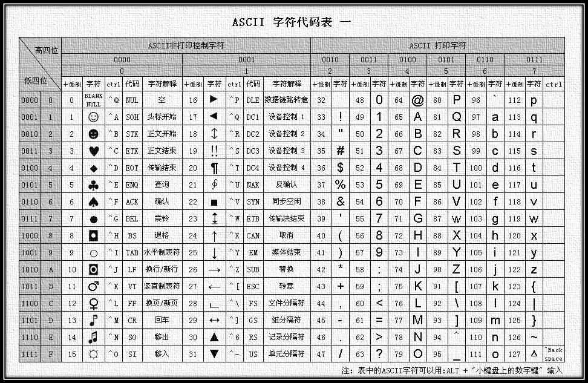

# 字符编码

计算机中储存的信息都是用二进制数表示的。按照何种规则将字符存储在计算机中，称为"**编码**"；将存储在计算机中的二进制数解析显示出来，称为"**解码**"。

**字符集（Charset）**：是一个系统支持的所有抽象字符的集合。字符是各种文字和符号的总称。常见字符集名称：ASCII字符集、GB2312字符集、BIG5字符集、GB18030字符集、Unicode字符集等。

**字符编码（Character Encoding）**：是一套法则，使用该法则能够对自然语言的字符的一个集合（如字母表或音节表），与计算机里的二进制串进行配对。

## ASCII字符集&编码

使用7位（bits）表示一个字符，共128字符；ASCII扩展字符集使用8位（bits）表示一个字符，共256字符。

## GBXXXX字符集&编码

GB2312：将127号之后的奇异符号们（即EASCII）取消掉，规定：一个小于127的字符的意义与原来相同，但**两个大于127的字符**连在一起时，就表示一个汉字，前面的一个字节（他称之为高字节）从0xA1用到 0xF7，后面一个字节（低字节）从0xA1到0xFE，这样我们就可以组合出大约7000多个简体汉字了，及更多符号。这就是常说的"全角"字符，而原来在127号以下的那些就叫"半角"字符了。

GB 18030：则扩展到了4个字节。

## Unicode字符集&UTF编码

Unicode编码系统为表达任意语言的任意字符而设计。它使用4字节的数字来表达每个字母、符号，或者表意文字(ideograph)。每个数字代表唯一的至少在某种语言中使用的符号。

在计算机使用32位二进制表示字符，则称为**UTF-32**编码。缺点是浪费空间。

### UTF-16

因为Unicode字符集的编码值范围为`0-0x10FFFF`，而**大于等于`0x10000`**的辅助平面区的编码值无法用2个字节来表示，所以Unicode标准规定：基本多语言平面内，**`U+D800..U+DFFF`的值不对应于任何字符，为代理区**。因此，UTF-16利用保留下来的`0xD800-0xDFFF`区段的码位来对辅助平面的字符的码位进行编码。大于等于`0x10000`的可用4个字节表示。20位：`yyyy yyyy yyxx xxxx xxxx`

> 高位代理（high surrogate）：`0xD800..0xDBFF`。**1101 10yy yyyyyyyy**。
>
> 低位代理（low surrogate）：`0xDC00..0xDFFF`。**1101 11xx xxxxxxxx**。

### UTF-8

编码中的第一个字节与ASCII兼容，其他字符集，UTF-8使用一至四个字节为每个字符编码：

1. 128个US-ASCII字符只需一个字节编码（Unicode范围由U+0000至U+007F）。
2. 带有附加符号的拉丁文、希腊文、西里尔字母、亚美尼亚语、希伯来文、阿拉伯文、叙利亚文及它拿字母则需要二个字节编码（Unicode范围由U+0080至U+07FF）。
3. 其他基本多文种平面（BMP）中的字符（这包含了大部分常用字）使用三个字节编码。
4. 其他极少使用的Unicode辅助平面的字符使用四字节编码。

## 关系

**在计算机内存中，统一使用Unicode编码，当需要保存到硬盘或者需要传输的时候，就转换为UTF-8编码**。

用记事本编辑的时候，从文件读取的UTF-8字符被转换为Unicode字符到内存里，编辑完成后，保存的时候再把Unicode转换为UTF-8保存到文件。

**转换规则**：对于n字节的符号(n>1), **第一个字节的前n位都设为1**, 第n+1位设为0, **后面字节的前两位一律设为10**. 剩下的没有提及的二进制位, 全部为这个符号的unicode码。

## 存储

小端Little endian：**数据的高字节**保存在**内存的高地址**中。**网络字节序**。

大端big endian：**数据的高字节**保存在**内存的低地址**中。类似于把数据当作字符串顺序处理。

Unicode规范中定义, 每一个文件的最前面分别加入一个表示编码顺序的字符, 这个字符的名字叫做"零宽度非换行空格"(ZERO WIDTH NO-BREAK SPACE), 用FEFF表示。则Big Endian(FEFF)  Little Endian(FFFE)

# 正则表达式

| 字符                                         | 说明                                                       |
| -------------------------------------------- | ---------------------------------------------------------- |
| `[]`  枚举，`[^]`  取反， [A-Z] 区间         | 匹配（除了） **[(^)...]** 中的所有字符，如[ABC]，如\[^ABC] |
| `^`起始，`$`终止                             |                                                            |
| `\s`空白符、`\S`非空白符，`\w`字母数字下划线 |                                                            |
| `?`零次或一次，`*`零次或多次，`+`多次        |                                                            |
|                                              |                                                            |
|                                              |                                                            |

# 加密

对称加密：

非对称加密：