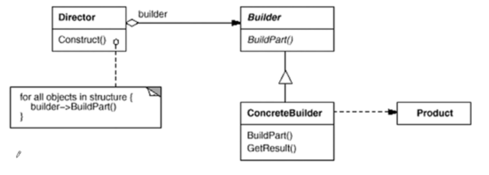

# 设计原则

管理变化，提高复用。分解、抽象，封装、多态。

1. **开闭原则**OCP：对更改封闭，对扩展开放。模块可扩展，不可修改。
2. **依赖倒置原则**DIP：抽象不依赖细节、高层模块（稳定）不依赖低层模块（变化），都应该依赖抽象。
3. **单一职责原则**SRP：一个类应该仅有一个引起它变化的原因。
4. **Liskov替换原则**LSP：子类必须能够替换基类。
5. **接口隔离原则**ISP：不强迫客户程序依赖于它们不用的方法。
6. 优先使用组合，而不是类继承。
7. 封装变化点。封装创建对象间的分解层，让设计者在一侧修改，而不影响另一侧。
8. 针对接口编程：不针对实现编程。


+ 组件协作，框架和应用的划分。

  模板、策略、观察者/事件模式。

+ 单一职责，

  装饰模式、桥模式。

+ 对象创建
+ 对象性能
+ 接口隔离
+ 状态变化
+ 数据结构
+ 行为变化
+ 领域问题

| 紧耦合     | 松耦合     |
| ---------- | ---------- |
| 静态       | 动态       |
| 早绑定     | 晚绑定     |
| 继承       | 组合       |
| 编译时依赖 | 运行时依赖 |

# 基本模式

## 模板模式

流程基本固定（模板），具体的某些子步骤不确定，则可以将流程放入基类中，未来的应用继承该基类，然后实现未确定的子步骤。将变化延迟到子类。


## 策略模式

一种业务有多种具体算法实现，为了未来扩展新的某种具体实现类，设计基类（抽象类）。然后在需要调用的地方，包含一个抽象类指针，实现运行时动态地调用具体业务。


## 观察者模式

通知依赖关系。一个对象发生变化，所有依赖的对象都能收到通知。

抽象+容器。


## 装饰模式

为了扩展功能，而过度的使用继承，导致子类的数量的增多。增加功能而不导致子类的数量的增多。同时组合和继承。解决主体类在多个方向上的扩展功能。

```c++
DecoratorStream: public Stream{
protected:
    Stream* stream;//...
    DecoratorStream(Stream * stm):stream(stm){
    } 
};
```


## 桥模式

运行时拼装。将不同的变化方向的业务划分到不同的基类。子类多维度的变化


## 工厂模式

创建对象导致的紧耦合。为每种类设置一个工厂类（用于new该类），他们都继承自一个抽象工厂类。具体类则通过参数传入（如构成函数等）给抽象工厂对象。


## 抽象工厂

管理多个工厂模式，并且多个对象之间有关联，则可以将相关联的工厂合并到一个工厂中。


## 原型模式

将工厂创建类的方法加入到原类中。


## 构造器

构造对象的过程中，部分是稳定的，部分是变化的。



## 单例模式

只产生一个实例，双检查锁。

```c++
//双检查锁，但由于内存读写reorder不安全
Singleton* Singleton::getInstance() {
    
    if(m_instance==nullptr){
        Lock lock;
        if (m_instance == nullptr) { //防止两进程加入 后分别获得锁后创建多个实例
            m_instance = new Singleton();
        }
    }
    return m_instance;
}
```

## 享元模式

运用共享技术有效地支持大量细粒度的对象。


## 门面模式

接口之间的直接依赖，间接接口。隔离子系统的变化，

## 代理模式

直接使用对象会带来麻烦。增加间接层实现间接控制。

## 适配器

接口的变化，将类的接口转为另一个类的接口，从而达到适配的效果。复用现有的类，

## 中介者

使用中介对象封装一系列对象的交互。从而使之前的交互都变为于中介者的交互。

## 状态模式

操作和状态相关。状态改变，行为也跟着改变。

## 备忘录

程序能够回溯到之前的状态，不破坏原对象的封装性。

## 组合模式

将对象组合成树形结构。使得外部对象将部分或整体对象都是为一样的。

## 迭代器

不暴露内部结构的情况下，能访问对象的内部数据。对象实现的迭代器性能，不及泛型编程：编译时多态。

## 职责链

一个请求被多个对象处理。运行时确定那个对象处理，如将处理对象构成一个链表，运行时逐个判断，能否处理，不能则发送给下一个对象。

## 命令模式

组件行为和组件间的解耦。将请求行为封装为对象，则可形成不同的请求。

## 访问器

需要添加新的行为（函数），运行时添加新的操作。要求基类的操作确定。通过双重分发，两次运行时绑定。

## 解析器

变化可以抽象为某种规则。给定规则（语法），然后接收具体的某种实现（值），经过解析返回值。

